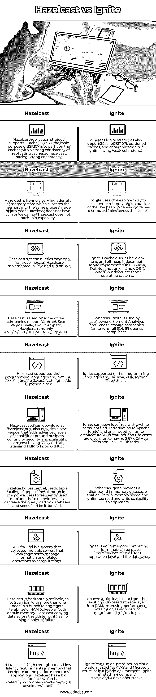

# Hazelcast vs Ignite

> 原文：<https://www.educba.com/hazelcast-vs-ignite/>

## Hazelcast 与 Ignite 的区别

Hazelcast 被定义为一种内存分布式缓存机制，它是一种数据网格，用 Java 编写，用于直接从内存而不是数据库中更快地访问数据。它在拥有自己的映射键值空间的基础上，将数据以键值的形式存储在内存中，并以分布式架构存储数据。只要有新节点加入，它还会进行多播来识别集群。如果您不想进行多播，可以使用 TCP/IP 进行连接。hazelcast 也可以集成到 spring 框架中。而 Ignite 是一个以内存为中心的平台，通过使用 ACID 事务将内存中的键值数据网格与分布式 SQL 数据库相结合，可以在用户的应用层和数据层之间方便地提取该数据库，以获得高性能，并且它还具有高可用性和横向可伸缩性。

### Hazelcast 与 Ignite 的直接对比(信息图)

以下是 Hazelcast 与 Ignite 的顶级对比:

<small>网页开发、编程语言、软件测试&其他</small>

### Hazelcast 与 Ignite 的主要区别

下面提供了这两者之间的主要区别。

#### 可攀登的

Haselcast 是一个高度可扩展的数据分发环境，而 ignite 是一个开源的分布式缓存和处理平台。Hazelcast 拥有各种分布式数据结构、分布式缓存功能、弹性、Memcache 支持和集成，而 ignite 则具有事务性、分析性和流工作负载。Ignite 有不同的 API 来与数据库交互，而 hazelcast 是一个自动数据库工具，允许与现有数据库连接。Haselcast 跨集群复制数据，因为它是可扩展的，我们可以在集群中加入数百个节点，而 ignite 复制在 JV107 的支持下非常弱。

#### 以内存为中心

Hazelcast 是面向 java 的分布式内存数据网格平台，ignite 以内存为中心，分布在数据库平台中。Ignite 具有内存组件和 RAM 用于存储，因为 hazelcast 没有内存组件，所以 ignite 是 hazelcast 的替代产品。Ignite 有离堆内存来分配 java 堆之外的内存区域，在 hazelcast 中，有巨大的内存存储密度，而内存的分配是在 java 堆内部进行的。

#### SQL 支持

另一方面，Hazelcast 的连接是不兼容的，ignite 在缓存中分布连接。Hazelcast 支持键约束，而 ignite 不支持键约束。Hazelcast 有自己的键值空间，数据存储在基于节点的空间中，而 ignite 将数据存储在基于键值的索引中。Ignite 可以通过 JDBC 或 ODBC 与数据库进行交互。

### Hazelcast 和 Ignite 对照表

| **序列号** | **黑兹尔卡斯特** | **点火** |
| **1** | Hazelcast 复制策略支持 JCache(JSR107)，JSR107 的主要目的是用复制缓存的强一致性来划分缓存，使 hazelcast 具有强一致性。 | 而 ignite 策略也支持JCache(JSR107)、部分缓存和数据复制，但 ignite 具有较弱的一致性。 |
| **2** | Hazelcast 拥有非常高密度的内存存储，它将内存分配给 java 堆中的同一个进程。Hazelcast 没有连接，或者我们可以说 hazelcast 没有连接功能。 | Ignite 使用堆外内存来分配 java 堆之外的内存区域。而 ignite 将连接分布在缓存中。 |
| **3** | Hazelcast’s cache queries have only on-heap indexes. Hazelcast was Implemented in Java and run on JVM. | Ignite 的缓存查询既有堆上索引，也有堆外索引。Ignite 以 C++、Java、Dot Net 实现，可在 Linux、OS X、Solaris、Windows 等服务器操作系统上运行。 |
| **4** | Yammer、Seat Pagine Gialle 和 Stormpath 等公司使用 Hazelcast。Hazelcast 仅在 SQL 查询之间和/IN/LIKE/运行。 | Whereas, Ignite is used by LabNetwork, Element Analytics, and Leads Software companies. Ignite runs full SQL-99 queries

合规。

 |
| **5** | Hazelcast 支持的编程语言有，。Net、C#、C++、Clojure、Go、Java、JavaScript(Node js)、python、Scala | Ignite 支持的编程语言有，C#，Java，PHP，Python，Ruby，Scala。 |
| **6** | Hazelcast 也提供了一个新版本，增加了业务连续性、安全性和可扩展性方面的高级功能。Hazelcast 在 GitHub 上有 3.25K GitHub starsand 和 1.18K forks。 | Ignite 可以免费下载题为“Apache Ignite 简介”的白皮书，其中深入介绍了 Ignite 架构、API 特性和用例。Ignite 拥有 2.67K GitHub stars 和 1.3K GitHub forks。 |
| **7** | Hazelcast 通过对经常使用的数据进行内存访问，对应用程序进行集中、可预测的扩展，这些技术可以减少数据库上的查询负载，并提高速度。 | Whereas ignite provides a distributed in-memory data store that delivers in-memory speed and unlimited read and write scalability to applicants. |
| **8** | 数据网格是一个收集了多个服务器的系统，这些服务器协同工作来管理信息和相关的计算操作。 | Ignite 是一个内存计算平台，可以完美地放置在用户的应用层和数据层之间。 |
| **9** | Hazelcast 是水平可伸缩的，因此您可以将多个节点连接在一起，聚合数 TB 的 RAM，以便将所有数据保存在内存中。Hazelcast 跨集群复制数据，因此没有单点故障。 | Apache Ignite loads data from the existing disk-based storage layer into RAM, improving performance by as much as six orders of magnitude (1 million-fold). |
| **10** | Hazelcast is high throughput and low latency requirements in memory that compute on the platform that runs applications. Hazelcast has a big acceptance, which is

在 35 个公司书库中陈述& 81 个开发者书库。

 | Ignite can run on-premises, on cloud platforms such as AWS and Microsoft Azure, or in a hybrid environment. Ignite is listed in 4 company堆栈和 4 个开发者堆栈。 |

### 结论–hazel cast vs Ignite

在本文中，我们得出结论，Hazelcast 和 Ignite 都是开源数据库工具。我们还看到，ignite 得到了广泛使用，并且一直在进步。最重要的是，ignite 索引比 hazelcast 和 Ignite 更有知识，具有如此多的特性和功能，并且非常易于使用。Hazelcast 是 Ignite 的替代品。

### 推荐文章

这是一个关于 Hazelcast vs Ignite 的指南。在这里，我们通过信息图和比较表来讨论 Hazelcast 和 Ignite 的主要区别。您也可以看看以下文章，了解更多信息–

1.  [Zendesk vs Freshdesk](https://www.educba.com/zendesk-vs-freshdesk/)
2.  [OData vs GraphQL](https://www.educba.com/odata-vs-graphql/)
3.  [生育 vs 素描本](https://www.educba.com/procreate-vs-sketchbook/)
4.  [程序 vs 进程](https://www.educba.com/program-vs-process/)

