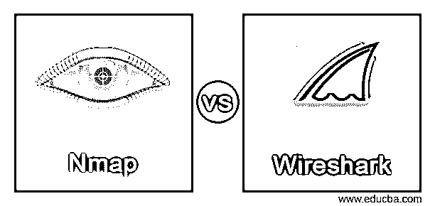

# Nmap 与 Wireshark

> 原文：<https://www.educba.com/nmap-vs-wireshark/>

## Nmap 与 Wireshark 简介

Nmap 和 Wireshark 被定义为网络技术工具，使用户能够以各种形式执行网络故障排除，如网络故障排除、网络分析、通信中的协议开发、发现网络上的主机或服务等。这两种工具都属于各自的网络故障排除子类别。具体来说，Nmap 属于网络扫描器的范畴，反过来有助于网络安全领域，而 Wireshark 属于数据包分析器的子范畴。这两个平台都是跨平台的，即都能够在不同的操作系统上运行，如 Solaris、macOS、Windows、Linux、BSD 或任何其他 Unix 发行版。关于 Wireshark 的更多事实是，它最初被命名为 Ethereal，但后来因为商标问题而更名。在本文中，我们将讨论两者之间的区别，以便开发人员更容易决定哪一个最适合正在解决的用例。

### Nmap 和 Wireshark 的面对面比较(信息图表)

以下是 Nmap 和 Wireshark 之间的 6 大区别:

<small>网页开发、编程语言、软件测试&其他</small>

### Nmap 与 Wireshark 的主要区别

在我们了解 Nmap 和 Wireshark 之间的区别之前，我们首先需要理解为什么需要这篇关于区别的文章。这两种网络技术工具有相似之处，这使得首先讨论这个主题变得更加重要。这两种技术对于任何与网络相关的用例都是不可或缺的工具。Nmap 和 Wireshark 可以互换使用的原因是，在某些情况下，两者一起使用，而在另一些情况下，则使用其中之一。这些相似性给开发人员带来了困惑，他们不知道在什么情况下使用哪一个，因此需要这篇文章，以便每次都能正确识别和获得使用的上下文！

如果需要执行任何网络扫描，我们将需要在这些情况下使用 Nmap，而在需要网络安全的情况下，我们将需要使用 Wireshark。正如网络扫描的名称所表示的那样，它扫描网络，并获取和保存关于网络中计算机的组、共享、服务、用户名的信息以供将来处理。另一方面，Wireshark 嗅探“网络流量”,查看和扫描进出 PC 的数据包。Nmap 允许用户发送数据包，以便扫描和发现所讨论的信息，并了解网络中连接的所有其他 PC 以及网络上运行的服务。另一方面，Wireshark 会查看系统内部并嗅探数据包，而不一定会查看与网络中其他电脑相关的网络流量。这就是 Nmap 的扫描功能和 Wireshark 的安全性。

从前面的讨论中可以得出的另一个特点是，Nmap 是目标扫描，而 Wireshark 是一般扫描。Nmap 中的一些功能包括主机发现、端口扫描、应用程序版本检测、TCP/IP 堆栈指纹识别和 Nmap 的脚本化交互，而 Wireshark 的功能包括捕获不同协议的数据包、解析和显示仅在 pcap 支持的网络类型上捕获的字段。另一个不同点在于提供 Nmap 和 Wireshark 的组织，Nmap 由 insecure.org 提供，而 Wireshark 由 wireshark.org 提供。Nmap 是用 C、C++、Python、Lua 编写的，而 Wireshark 是用 C 和 C++编写的。用户发现使用 Nmap 比使用 Wireshark 相对容易，但这一点同样来自用户的选择和对如何使用 Nmap 和 Wireshark 的理解。

接下来，我们将查看表中的对比研究，以在 2！

### Nmap 与 Wireshark 的对比表

下面是提到的几个比较:

| **比较的热恩** | **Nmap** | **Wireshark** |
| **使用目的** | Nmap 主要被选择用于网络扫描器的使用情形。Network scanner 允许获取和保存网络中计算机的组、共享、服务和用户名等信息，以备将来处理。 | Wireshark 属于数据包扫描器的范畴。其目的类似于网络嗅探，在网络嗅探中，属于整个较大系统网络一部分的网络流量被拦截并记录下来，以备将来处理。 |
| **特性** | Nmap 包含与 Wireshark 完全不同的各种功能，以完成网络扫描任务。其中一些功能包括主机发现、端口扫描、检测应用程序版本、TCP/IP 堆栈指纹识别和脚本化交互。 | Wireshark 确保它包含完成数据包扫描任务所需的功能。这些功能包括捕获不同协议的数据包、解析，以及仅在 pcap 支持的网络类型上显示捕获的字段。 |
| **由**提供 | Nmap 由 insecure.org 提供。 | Wireshark 由 wireshark.org 提供。 |
| **写于** | Nmap 是用 C、C++、Python、Lua 等语言编写的，尽管它是一个跨平台的工具 | 尽管 Wireshark 是一个跨平台工具，但它只使用 C 和 C++编写。 |
| **返回类型** | 由于 Nmap 是目标扫描，因此 Nmap 将仅返回被扫描网络的详细信息。例如，仅网络所连接的 IP 的细节。 | Wireshark 主要是普通扫描，因此会返回网络中每个请求的详细信息。 |
| **允许学习** | Nmap 允许应用程序了解网络上可用的其他计算机。 | Wireshark 允许应用程序了解计算机上正在发送或接收的内容。 |

### 结论

我们理解 Nmap 和 Wireshark 之间的相似之处，这些相似之处会导致用户在要解决的用例中不知道使用哪种工具。通读这篇文章后，大家都清楚地看到了区别的主要指针，这将根据 Nmap 与 Wireshark 之间的使用情形简化选择。简而言之，对于网络安全来说，Wireshark 是显而易见的选择，而对于扫描来说，则是 Nmap！

### 推荐文章

这是 Nmap vs Wireshark 的指南。在这里，我们分别用信息图和比较表来讨论 Nmap 和 Wireshark 的主要区别。您也可以看看以下文章，了解更多信息–

1.  [物化 vs 引导](https://www.educba.com/materialize-vs-bootstrap/)
2.  [PostgreSQL Varchar vs Text](https://www.educba.com/postgresql-varchar-vs-text/)
3.  [DevSecOps vs DevOps](https://www.educba.com/devsecops-vs-devops/)
4.  [Dynatrace vs Splunk](https://www.educba.com/dynatrace-vs-splunk/)

