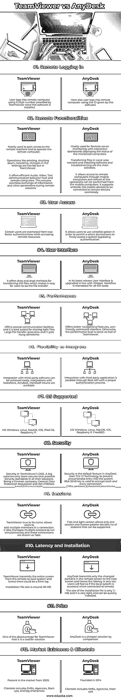

# TeamViewer vs AnyDesk

> 原文：<https://www.educba.com/teamviewer-vs-anydesk/>

## TeamViewer 与 AnyDesk 的区别

TeamViewer 和 AnyDesk 提供了一种远程桌面解决方案，将桌面或笔记本电脑或移动设备与世界上任何地方的另一台远程计算机连接起来，并允许本地计算机控制远程计算机并执行远程计算机的操作；这两款工具支持连接像 Macintosh、Windows、IOS、Android 等所有操作系统的电脑；这些工具的安装消除了对维护工程师的需要，维护工程师访问操作现场以诊断问题并从其工作现场提供解决方案；这些工具由于其实时远程连接性，为任何问题提供了即时解决方案，提高了企业的生产力。

### TeamViewer 简介

该软件由 Rossmanith GmbH 于 2005 年发布，目的是远程安装软件并避免客户访问。除了 Windows，它还支持 Linux 发行版，如 Ubuntu、Red Hat、Debian、Raspberry Pi、Fedora Linux 和所有移动应用程序。AR 和 VR 功能包含在该工具中以增强其使用，并且它与许多协作和 CRM 平台相集成。它对个人使用是免费的，只允许在订阅模式下用于商业用途。

<small>网页开发、编程语言、软件测试&其他</small>

**any desk 上的简报**

由德国 AnyDesk 软件有限公司于 2014 年发布，在美国和中国设有分公司。它在 2018 年和 2020 年获得了良好的资助。专有软件提供高质量的视频，只向另一方传输最少的数据，因此它是轻量级和快速的。

### TeamViewer 与 AnyDesk 的面对面比较(信息图)

以下是 TeamViewer 与 AnyDesk 之间的 12 大区别:

### TeamViewer 与 AnyDesk 对比表

| **TeamViewer** | **AnyDesk** |
| --- | --- |
| **远程登录** |
| 安装该软件后，用户使用 TeamViewer 提供的 9 位数登录远程计算机。 | 这里，用户也可以使用该软件提供的 ID 登录到远程计算机。 |
| **远程功能** |
| 主要用于访问远程机器和操作远程计算机 | 主要用于远程服务器监控，通过交互式仪表板显示受监控计算机的状态。 |
| 打印、关机、重启、更改设置等操作在 TeamViewer 中进行 | 在局域网中传输文件和安装软件和排除故障是主要活动。 |
| It offers efficient Audio, Video, Text communication between host and remote computers. This ensures the seamless exchange of information and other parameters during remote sessions. | It allows access to remote computers through mobile computers and almost all the operations can be performed from the mobile computers. It supports android, IOS mobile devices to be connected to remote devices seamlessly.. |
| **用户访问** |
| 某些用户在访问远程资源时免于双重身份认证 | 它允许用户使用白名单选项，以便允许选定的设备/用户绕过身份验证自由访问系统 |
| **用户界面** |
| 它提供了文件传输的拖放方法，这使得用户可以很容易地进行文件传输。 | 在其最新版本中，用户界面根据 Widget 进行了升级。所有任务都必须有工作流。 |
| **性能** |
| 提供多种通信工具，最适合共享轻量级文件。大型文件传输缓慢，有时会挂起。 | 提供更好的导航功能，用户友好的命令界面。除此之外，性能水平与 TeamViewer 相同。 |
| **整合的灵活性** |
| 可以轻松实现与第三方软件的集成。可以与 Salesforce、Zendesk、Microsoft intune 集成。 | 通过 Rest-API 和适当的认证过程，与第三方应用程序的集成是可能的。 |
| **支持的操作系统** |
| 微软 Windows，Linux，MacOS，IOS，iPad OS，树莓 P | 微软视窗，Linux，MacOS，IOS，树莓 P，FreeBSD |
| **安全** |
| Security in TeamViewer’s DNA. A big cybersecurity team assures best possible security standards in all their solutions.

作为一家德国公司，我们严格遵守一般数据保护法规和标准。

连接是端到端加密的，永远不会泄露。

 | Security is the default feature in AnyDesk.使用 TLS 1.2 技术来防止未经授权进入系统。RSA 2048 密钥用于加密每个连接。Diffie-Hellman 短暂的握手确保会话不能被轻易解密。密码哈希用于保护密码。 |
| **会话** |
| TeamViewer true to its name allows users to add multiple members in a connection.它还管理同时运行的多个会话，这些连接显示为选项卡。 | 免费和轻量级版本只允许一个会话，许可模式决定可以支持的会话数量。 |
| **延迟和安装** |
| TeamViewer 将整个屏幕从远程系统传输到本地系统，因此可能会有时间延迟。 | AnyDesk 仅将远程屏幕中已更改的部分传输到主机屏幕，因此延迟非常低。当连接到远程系统时，用户会感觉好像访问了本地系统。 |
| 安装文件大小约为 28 MB。 | 安装文件的大小只有 1.1 MB，非常轻，可以快速安装。 |
| **价格** |
| One of the disadvantages for TeamViewer that it is a costlier solution | 相比之下，AnyDesk 是一个更便宜的解决方案 |
| **市场存在&客户群** |
| 从 2005 年开始出现在市场上 | 成立于 2014 年 |
| 客户包括中小企业、代理商、初创企业和大企业。 | 客户包括中小企业、代理机构和初创企业。 |

### TeamViewer 与 AnyDesk 的主要对比

**AnyDesk**

*   一个轻量级的，易于安装的应用程序
*   由于其固有的设计，具有最小的延迟
*   为用户提供更简单的导航和强大的用户界面体验
*   提供强大的安全功能

支持 5 种语言

*   更便宜的解决方案
*   用于中型和初创企业
*   主要用于监控应用程序和安装软件
*   新上市的

**TeamViewer**

*   主要部署在远程机器上执行活动
*   小文件传输速度快
*   与第三方软件完美集成
*   支持 10 种语言
*   与所有操作系统和设备兼容
*   允许多个会话和单个会话中有更多用户
*   在过去 16 年中一直存在于市场中
*   广泛应用于大型企业。
*   本地和远程之间的音频、视频、文本通信
*   有良好的支持作为后盾

### 结论

AnyDesk 和 TeamViewer 具备所有功能，满足各种用户群的所有要求。作为一个用户，在决定使用什么工具来满足我们的需求和预算之前，需要做充分的尽职调查。

### 推荐文章

这是 TeamViewer vs AnyDesk 的指南。在这里，我们分别用信息图和比较表来讨论 TeamViewer 和 AnyDesk 的主要区别。您也可以看看以下文章，了解更多信息–

1.  [物化 vs 引导](https://www.educba.com/materialize-vs-bootstrap/)
2.  [PostgreSQL Varchar vs Text](https://www.educba.com/postgresql-varchar-vs-text/)
3.  [合成与聚合](https://www.educba.com/composition-vs-aggregation/)
4.  [B 树 vs B +树](https://www.educba.com/b-tree-vs-b-tree/)

