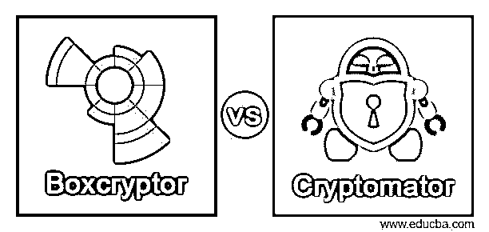
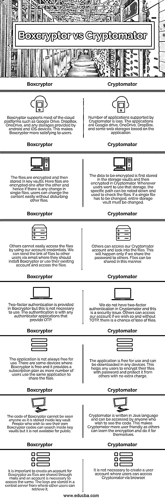

# Boxcryptor vs Cryptomator

> 原文：<https://www.educba.com/boxcryptor-vs-cryptomator/>

## Boxcryptor vs Cryptomator 简介

德国建立的云应用程序为存储在任何类型的存储中的所有文件提供了额外的安全层，其中所有文件都在本地设备中加密以安全存储文件，该应用程序称为 Boxcryptor。这种加密会发生在 Google Drive 或 Box 或 Dropbox 中存储的所有文件上。德国的应用程序为存储在 Dropbox 中的所有文件创建了保险库，这样任何外部用户都无法知道云存储中存储了什么，这种应用程序被称为 Cryptomator。这些文件被加密并储存在保险库里。

### Boxcryptor 与 Cryptomator 的面对面比较(信息图)

以下是 Boxcryptor 与 Cryptomator 之间的 7 大区别:

<small>网页开发、编程语言、软件测试&其他</small>

| **Boxcryptor** | **密码器** |
| Boxcryptor 支持 Google Drive、DropBox、OneDrive 等大部分云平台，以及 android 和 iOS 设备提供的任何存储。这使得 Boxcryptor 更能让用户满意。 | 密码机支持的应用数量较少。应用有 Google drive、OneDrive、DropBox，以及一些基于该应用的网络存储。 |
| 文件被加密，然后存储在密钥库中。在这里，文件被一个接一个地加密，因此，如果单个文件有任何变化，用户可以很容易地改变内容，而不会干扰其他文件。 | 要加密的数据首先存储在存储库中，然后在 Cryptomator 中加密。每当用户想要使用该存储器时，可以记下具体路径并用于检查文件。如果必须更改单个文件，则必须更改整个存储库。 |
| 其他人无法通过使用我们的帐户凭证轻松访问这些文件。我们可以通过电子邮件将文件链接发送给其他用户，他们应该安装 Boxcryptor 或使用他们现有的帐户访问文件。 | 其他人可以进入我们的密码机账户并查看文件。只有当我们与他人共享密码时，才会发生这种情况。文件可以通过这种方式共享。 |
| Boxcryptor 中提供了双因素身份验证，但这不是必须使用的。身份验证使用任何提供 OTP 的身份验证器应用程序。 | 我们在 Cryptomator 中没有双因素认证，这是一个安全问题。其他人可以访问我们的帐户，如果我们希望这样做，没有 TOTP，有一个文件丢失的机会。 |
| 该应用程序并不总是免费的。Boxcryptor 在一些设备上是免费的，它提供了一个订阅计划，因为更多的用户使用同一个应用程序来共享文件。 | 该应用程序是免费使用的，可以在任何设备上下载。这有助于任何用户用密码加密他们的文件，并保护他们免受其他人的攻击，而无需额外付费。 |
| Boxcryptor 的代码不能被任何人看到，因为它存储在密钥库中。希望看到自己的 Boxcryptor 代码的人可以在密钥库中搜索，但公众不能使用。 | Cryptomator 是用 Java 语言编写的，任何想看代码的人都可以访问。这使得 Cryptomator 更加用户友好，因为其他人可以学习加密并自己完成。 |
| 为 Boxcryptor 创建一个帐户很重要，因为文件是通过电子邮件共享的，需要一个帐户才能访问这些文件。密钥存储在中央服务器中，其他用户可以从那里检索它们。 | 没有必要创建一个用户帐户，用户可以通过浏览器访问 Cryptomator。 |

### Boxcryptor 与 Cryptomator 的主要区别

在 Boxcryptor 中，文件用 AES 和 RSA 加密。RSA 是现代计算机用来加密和解密文件的不对称算法，其中一个密钥可以与任何人共享，而另一个密钥对用户来说是安全的。RSA 加密用于不需要太多加密的文件，而 AES 用于大多数私人文件。文件在 Cryptomator 中用 AES 和 256 位密钥长度加密，这是文件的最大位长。高级加密标准用于所有政府和其他文档，以保护其免受外部来源的攻击，这被认为是最强的加密标准之一。

两种应用程序的定价机制不同。如果两台设备上只使用一个云存储，Boxcryptor 是完全免费的。如果设备数量更多或者使用更多云存储，那么必须订阅 Boxcryptor。Boxcryptor 的学生可以享受一些折扣。笔记本电脑免费提供 Cryptomator，但移动版本必须付费。用户可以通过桌面版向 Cryptomator 捐款，但这不是必须的。手机版需要支付一定的费用，这不是捐赠。

Boxcryptor 移动应用程序提供指纹和面部识别解锁机制，而 Cryptomator 只有指纹识别。照片可以通过 Boxcryptor 移动应用程序直接拍摄并上传到云存储中，而 Cryptomator 不提供该功能。此外，离线文件、收藏夹和 thump nails 或任何类型的文件都可以在 Boxcryptor 中上传，但 Cryptomator 中不提供该功能。这些文件在存储到 Cryptomator 之前必须在任何云存储中。

在可以连接和使用云存储或服务器的地方，公司或个人都可以使用 Boxcryptor。如果是为企业，用户界面提供了一个单一的管理员登录，使用户能够轻松地与应用程序连接。任何群组功能或活动目录支持都可以在管理门户中轻松完成，并且可以存储和检索文件。而在 Cryptomator 中，服务器可以与应用程序连接，但云存储不能直接连接。由于这个原因，公司发现很难与 Cryptomator 合作，因为在连接服务器后创建云备份需要时间。

在使用这两种方法之前，了解它们之间的区别是很重要的。个人用户可以使用 Cryptomator，如果文件较小，并且可以很容易地与他人共享。但是对于公司来说，还是用 Boxcryptor 比较好，方便使用。但是重要的是要有一种加密方法。

### 推荐文章

这是一个关于 Boxcryptor vs Cryptomator 的指南。在这里，我们分别用信息图和比较表来讨论 Boxcryptor 和 Cryptomator 的关键区别。您也可以看看以下文章，了解更多信息–

1.  [Dropbox vs iCloud](https://www.educba.com/dropbox-vs-icloud/)
2.  [暹罗 VS 翱翔](https://www.educba.com/siem-vs-soar/)
3.  [汇流 vs SharePoint](https://www.educba.com/confluence-vs-sharepoint/)
4.  [VMware vs Virtualbox](https://www.educba.com/vmware-vs-virtualbox/)

