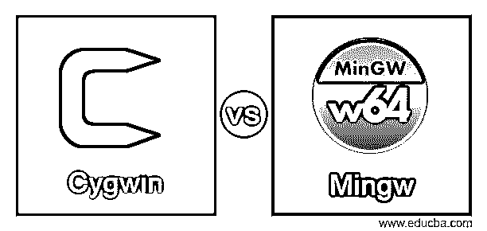
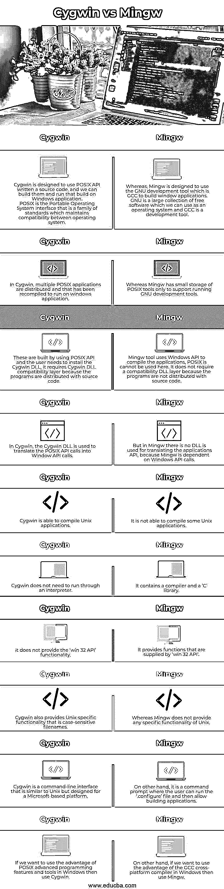

# Cygwin vs Mingw

> 原文：<https://www.educba.com/cygwin-vs-mingw/>

## Cygwin vs Mingw 简介

Cygwin 被定义为 GNU 的集合，GNU 是可以用作操作系统和开源工具的大量自由软件的集合，它类似于 Unix，但它是为基于微软的平台设计的，该平台还提供在诸如 Unix 的平台上开发和测试基于 windows 的应用程序，而 Mingw 被定义为创建微软 windows 应用程序的自由和开源软件开发环境， 它提供了最小的 GNU 编译器环境，也没有类似 Unix 的设计，编写的程序可以在 windows 上运行，也是与链接和制作工具相关的 Microsoft visual C++编译器的替代品。

### Cygwin 与 Mingw 的面对面比较(信息图)

以下是 Cygwin 与 Mingw 的 10 大区别:

<small>网页开发、编程语言、软件测试&其他</small>

### Cygwin 与 Mingw 对比表

| **序号** | **Cygwin** | **Mingw** |
| 1. | Cygwin 设计了使用 POSIX API 编写的源代码，我们可以构建它们并在 Windows 应用程序上运行这个构建。POSIX 是可移植的操作系统接口，是维护操作系统间兼容性的一系列标准。 | Whereas, Mingw is designed to use the GNU development tool which is GCC to build window applications.GNU 是一个自由软件的大集合，我们可以把它用作操作系统，而 GCC 是一个开发工具。 |
| 2. | 在 Cygwin 中，多个 POSIX 应用程序被分发，并且已经被重新编译以在 windows 应用程序上运行。 | 而 Mingw 只有少量的 POSIX 工具来支持运行 GNU 开发工具。 |
| 3. | 这些都是使用 POSIX API 构建的，用户需要安装 Cygwin DLL，它需要 Cygwin DLL 兼容层，因为程序是与源代码一起分发的。 | Mingw 工具使用 Windows API 来编译应用程序，这里不能使用 POSIX。它不需要兼容性 DLL 层，因为程序不随源代码一起分发。 |
| 4. | 在 Cygwin 中，Cygwin DLL 用于将 POSIX API 调用转换为窗口 API 调用。 | 但是在 Mingw 中没有用于翻译应用程序 API 的 DLL，因为 Mingw 依赖于 Windows API 调用。 |
| 5. | Cygwin 能够编译 Unix 应用程序。 | 它不能编译某些 Unix 应用程序。 |
| 6. | Cygwin 不需要通过解释器运行。 | 它包含一个编译器和一个 C 库。 |
| 7. | 它不提供“win 32 API”功能。 | 它提供由“win 32 API”提供的功能。 |
| 8. | Cygwin 还提供了特定于 Unix 的功能，即区分大小写的文件名。 | 而 Mingw 不提供 Unix 的任何特定功能。 |
| 9. | Cygwin 是一个命令行界面，类似于 Unix，但是是为基于微软的平台设计的。 | 另一方面，它是一个命令提示符，用户可以在这里运行。“配置”文件，然后允许生成应用程序。 |
| 10. | 如果我们想在 Windows 中利用 POSIX 高级编程特性和工具的优势，那么就使用 Cygwin。 | 另一方面，如果我们想在 Windows 中利用 GCC 跨平台编译器的优势，那么就使用 Mingw。 |

### Cygwin 与 Mingw 的主要区别

Cygwin 和 Mingw 之间有一些关键的区别，根据它进行区分是有用的。

**特性:**

Cygwin 允许许多接口可用和兼容，这意味着 Cygwin 允许接口使用它，并且它与 UNIX 接口兼容。Cygwin 通过系统提供的可移植操作系统接口，win32 在内部调用 Windows。Linux 有 UTF-8，Windows 有 UTF-16 init，它们可以透明地相互转换，而 Mingw 提供了最少的 GNU 特性，它是一个可以移植到 Windows 的 GNU 编译器集合。Mingw 有一个跨平台的编译器，允许开发人员从 Linux 操作系统为 Windows 编译程序。

**平台依赖:**

Cygwin 是一个开放源代码的大型工具集，它允许 Unix 或 Linux 应用程序在一个类似 Linux 的界面中在 Windows 操作系统上编译和运行。而 Mingw 是专门为创建 Windows 应用程序而设计的，用户不需要安装额外的软件来运行应用程序。Mingw 与 Windows 配合使用效果更好。它是免费的，这意味着我们不需要付费来使用它和开源软件开发环境来创建微软的 Windows 应用程序。其中 Mingw 要么运行在 Microsoft Windows 平台上，要么运行在 Cygwin 上。它是与 Linux 或 UNIX 交叉托管的。我们可以同时使用 Cygwin 和 Mingw 以及它们都可用的“cmd.exe”来安装，而无需任何原因，但是如果我们在一个系统上同时使用它们，就像在同一个磁盘上有两组文件一样，它的环境仅对“cmd.exe”有效。

**功能:**

Cygwin 有一个类似于 Unix 的命令行界面，它是为基于微软的平台设计的，允许在 Unix 这样的平台上开发和测试基于 windows 的应用程序，它有类似于 Unix 或 Linux 的功能，它有 Unix 特有的区分大小写的文件名的功能，我们可以在其中很好地使用 Cygwin。它并不完全依赖于“Win32 应用程序”,因为它具有 POSIX 功能，POSIX 功能是具有 IEEE 计算机协会规定的一系列标准的可移植操作系统接口，并且它保持操作系统之间的兼容性。而 Mingw 具有用于 Windows 操作系统的最小 GNU 特性，并且它具有像“Win32 API”这样的最小功能，Win32 API 是微软操作系统中可用的一组核心应用编程接口。此外，它还提供了一种在 Windows 上使用 GNU 开发工具的方法。它有一个编译器的集合，可以移植到有移植库的 Windows 上。

### 结论

在本文中，我们得出结论，Cygwin 在运行应用程序时增强了 Linux 的性能，Mingw 是开发人员友好的，由 Cygwin 编译的应用程序只能在 Windows 操作系统上工作，但 Cygwin 具有兼容层，Mingw 也是一个最小系统，它是 MSYS，具有由 GNU 实用程序组成的相关包。

### 推荐文章

这是 Cygwin vs Mingw 的攻略。这里我们分别用信息图和比较表来讨论 Cygwin 和 Mingw 的主要区别。您也可以看看以下文章，了解更多信息–

1.  [堆栈 vs 队列](https://www.educba.com/stack-vs-queue/)
2.  数组列表与链接列表
3.  [Haskell 诉 OCaml](https://www.educba.com/haskell-vs-ocaml/)
4.  [Cygwin 替代方案](https://www.educba.com/cygwin-alternative/)

