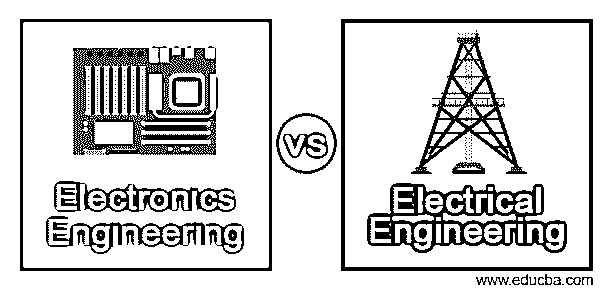
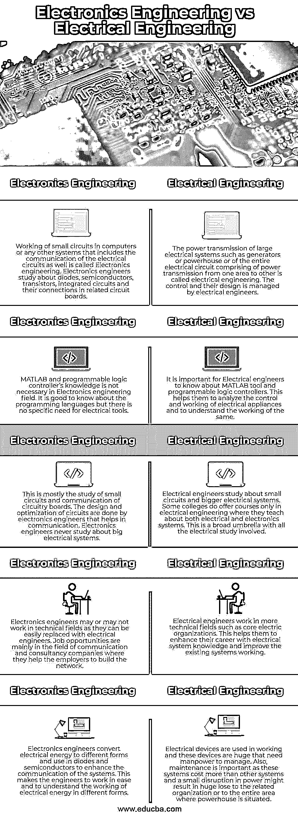

# 电子工程 vs 电气工程

> 原文：<https://www.educba.com/electronics-engineering-vs-electrical-engineering/>

## 电子工程与电气工程的区别

电子工程是电气工程的一个分支，涉及电路及其系统的设计和维护，有助于制造电路板。任何非线性或有源电子元件都被用于设计电路，使得通信系统被开发成向其他系统广播信息。任何与电能有关的设备的设计和应用都称为电气工程。任何电气系统，包括飞机发动机、雷达和导航系统、发电机等。是由电气工程师设计和开发的。电气和电子的所有类别都属于电气工程。

### 电子工程与电气工程的直接比较(信息图表)

以下是电子工程与电气工程之间的 5 大区别:

<small>网页开发、编程语言、软件测试&其他</small>

### 电子工程与电气工程的主要区别

电子工程与电气工程的主要区别如下:

*   电气工程也包括电子工程，他们将学习通信和二极管的工作，如何连接电路，并了解他们所做的通信。这通常包括研究大的和小的电气系统，并理解小系统的通信特征。但电子工程师不研究电子元件，他们更深入地研究电路板的通信方面和相关的编程研究。电气工程师将在电力从一个村庄或城镇的一个区域传输到另一个区域的地点和电网上工作。此外，坝址需要电气工程师了解附近电网的工作情况。
*   电气工程师的工作与电力设计、发电、传输和分配给其他人有关。他们还学习半导体和电子元件的设计和制造。控制仪器由电气工程师管理，帮助他们控制导航系统。他们在物理和工程领域进行研究，以带来电气领域的变化。电子工程师也管理控制仪器，并做同样的设计。导航系统由电子工程师控制。此外，他们在电子医学和相关领域有使用电路的专业知识。主要区别在于，电子工程师对通信系统有很深的了解。他们学习沟通策略，连接不同的工具，帮助人们和不同系统的沟通。
*   电子设备在 DC 电流中工作，需要的电压较小，因此电子系统中所需的功率也较小，这有助于工程师轻松管理设备。电气系统使用需要高电压和高功率的交流电流。大多数电力系统并不将交流电转换成 DC，而是使用 11 千伏或 400 千伏的输电线路。
*   电气系统用于控制整个系统及其电源功能，而电子系统用于增强相同电气设备的功能。考虑到洗衣机的例子，整个机器可以被认为是一个电气系统，而各种功能，如洗衣后排水、定时器功能、自动开/关功能都是电子工程。电子工程师可以给现有的电气设备增加各种功能，但他们不能从头开始构建电气系统。
*   通信网络和无线研究由电子工程师完成，帮助他们了解系统的工作。微处理器和芯片的工作主要是电子工程师的设计。他们还学习信息编码和与计算机相关的知识。这在电气工程中是做不到的，因为电气工程主要学习各种系统中电能的工作和利用。

这两个工程领域几乎是相似的，电气和电子工程师在相似的系统上开始他们的工作，但随后基于特定的技能组合产生分歧。这使得他们能够管理基于通信的工程，并在更大的电力系统上工作。一个熟练的电气工程师应该具备电气和电子系统的知识来管理电流。

### 电子工程与电气工程对照表

为了便于理解，让我们通过一个比较表来看看电子工程与电气工程之间的更多差异:

| **电子工程** | **电气工程** |
| 计算机或任何其他系统中的小电路的工作，包括电路的通信，被称为电子工程。电子工程师研究二极管、半导体、晶体管、集成电路以及它们在相关电路板中的连接。 | 大型电气系统(如发电机或发电站)或整个电路(包括从一个区域到另一个区域的电力传输)的电力传输称为电气工程。控制和它们的设计由电气工程师管理。 |
| 电子工程领域不需要 MATLAB 和可编程逻辑控制器知识。了解编程语言是很好的，但是对电动工具没有特别的需求。 | 对于电气工程师来说，了解 MATLAB 工具和可编程逻辑控制器非常重要。这有助于他们分析电器的控制和工作，并理解其工作原理。 |
| 这主要是研究小电路和电路板的通信。电路的设计和优化是由电子工程师完成的，这有助于通信。电子工程师从不研究大型电气系统。 | 电气工程师研究小电路和大的电气系统。有些大学只开设电气工程课程，教授电气和电子系统。这是一个包含所有电学研究的大范围。 |
| 电子工程师可能在技术领域工作，也可能不在，因为他们很容易被电子工程师取代。工作机会主要在通信和咨询公司领域，他们帮助雇主建立网络。 | 电气工程师工作在更多的技术领域，如核心电气组织。这有助于他们利用电气系统知识提升职业生涯，并改善现有系统的工作。 |
| 电子工程师将电能转换成不同的形式，并在二极管和半导体中使用，以增强系统的通信。这使得工程师们工作轻松，并了解不同形式的电能的工作。 | 工作中使用电气设备，这些设备非常庞大，需要人力来管理。此外，维护也很重要，因为这些系统比其他系统成本更高，电力的微小中断可能会给相关组织或发电站所在的整个区域带来巨大损失。 |

### 推荐文章

这是一本电子工程与电气工程的指南。在这里，我们还将讨论电子工程与电气工程的主要区别，包括信息图表和比较表。您也可以看看以下文章，了解更多信息–

1.  [计算机工程 vs 计算机科学](https://www.educba.com/computer-engineering-vs-computer-science/)
2.  [AUTOCAD vs CATIA](https://www.educba.com/autocad-vs-catia/)
3.  [计算机科学 vs 数据科学](https://www.educba.com/computer-science-vs-data-science/)
4.  [JavaScript vs VBScript](https://www.educba.com/javascript-vs-vbscript/)

