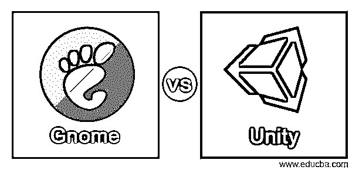
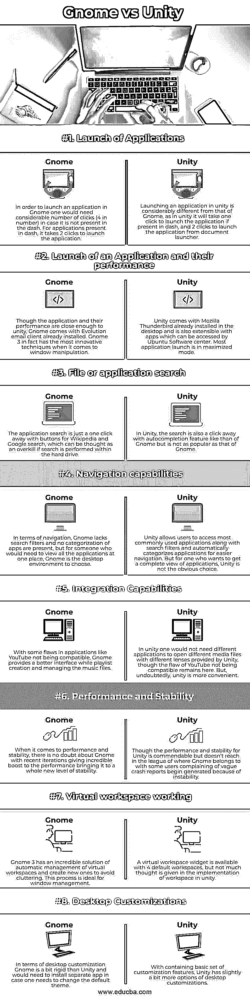

# Gnome vs Unity

> 原文：<https://www.educba.com/gnome-vs-unity/>

## Gnome 和 Unity 的区别

Gnome 和 Unity 被定义为可用于类 Unix 操作系统的桌面环境，目的是在该环境下提供各种功能，每种功能都有各自的优点和缺点，这使得本文的撰写更有意义。桌面环境是一个统一的概念，它允许用户通过捆绑程序更容易地与计算机交互，并在图形用户界面运行的操作系统之上运行它。在桌面环境中，用户很容易访问、编辑、删除操作系统存储的文件或对其执行类似的操作。另一个关于大脑的琐事，GNOME 是 GNU 网络对象模型环境的缩写版本，但是这个缩写已经不再使用了，因为 GNOME 的当前版本不再反映最初由完整形式提出的愿景！

### Gnome 与 Unity 的正面比较(信息图)

以下是 Gnome 和 Unity 之间的 8 大区别:

<small>网页开发、编程语言、软件测试&其他</small>

### Gnome 和 Unity 的主要区别

以下是 Gnome 和 Unityare 之间的主要区别:

在我们了解 Gnome 和 Unity 之间的区别之前，我们首先需要理解为什么需要这篇关于区别的文章。在简介中，我们已经看到它们都是桌面环境，各自提供了其实用程序使用情形的强大功能。由于其他一些共性，如类似的菜单操作，YouTube 是两者不兼容的应用程序，搜索中存在的自动完成功能导致用户在选择哪个更符合目的方面感到困惑，因此也是本文的意义所在。

就应用程序的启动而言，Gnome 有点乏味，虽然不是很重要，因为如果应用程序出现在仪表板中，它需要 2 次点击；如果应用程序不存在，它需要 4 次点击；但是对于 Unity，如果应用程序出现在仪表板中，它只需要 1 次点击，否则需要 2 次点击。在 Gnome 中启动的任何应用程序都使用创新的窗口操作，Gnome 3 是最具创新性的，而在 Unity 中大多数应用程序都以最大化模式启动。Gnome 和 Unity 都有预装的应用程序，Evolution email client 是 Gnome 中的一个，Mozilla thunderbird 是 Unity 中的一个。Gnome 中有维基百科和谷歌按钮，而 Unity 中却没有。

Gnome 中的导航工具缺少搜索过滤器，而 Unity 提供了搜索过滤器和应用程序的自动分类，使得导航更加容易。说到性能和稳定性，Gnome 在另一个联盟中也是数一数二的，其他任何东西都无法与之相比！最后，Gnome 在定制方面有点死板，尽管 Unity 并不是其他桌面环境中定制的经典范例，但在这里它提供了更多的灵活性！

### Gnome 与 Unity 对照表

Gnome 和 Unity 的比较如下:

| **比较的热恩** | **侏儒** | **统一** |
| **应用程序的启动** | 为了在 Gnome 中启动一个应用程序，如果它不在 dash 中，你需要点击相当多的次数(4 次)。对于仪表板中的应用程序，只需点击 2 次即可启动该应用程序。 | 在 unity 中启动一个应用程序与 Gnome 有很大的不同，因为在 unity 中，如果应用程序出现在 dash 中，只需单击一次就可以启动它，而从文档启动器中单击两次就可以启动它。 |
| **应用程序的启动及其性能** | 尽管这个应用程序和它的性能足够接近 unity，Gnome 已经安装了一个 Evolution 电子邮件客户端。事实上，Gnome 3 拥有最创新的窗口操作技术。 | Unity 自带已经安装在桌面上的 Mozilla Thunderbird，也可以通过 Ubuntu 软件中心访问的应用程序进行扩展。大多数应用程序是在最大化模式下启动的。 |
| **文件或应用程序搜索** | 应用程序搜索只需点击一下维基百科和谷歌搜索的按钮，如果搜索是在硬盘上进行的，这可以被认为是矫枉过正。 | 在 Unity 中，搜索也是点击一下就能完成的，有类似 Gnome 的自动完成功能，但没有 Gnome 流行。 |
| **导航能力** | 在导航方面，Gnome 缺少搜索过滤器，也没有应用程序分类，但是对于需要在一个地方查看所有应用程序的人来说，Gnome 是一个可供选择的桌面环境。 | Unity 允许用户访问最常用的应用程序以及搜索过滤器，并自动对应用程序进行分类，以便于导航。但是对于一个想要获得应用程序完整视图的人来说，Unity 不是显而易见的选择。 |
| **整合能力** | 由于 YouTube 等应用程序的一些缺陷，Gnome 在创建播放列表和管理音乐文件时提供了一个更好的界面。 | 在 unity 中，人们不需要不同的应用程序来打开 Unity 提供的不同镜头的不同媒体文件，尽管 YouTube 不兼容的缺陷仍然存在。但是，毫无疑问，统一更方便。 |
| **性能和稳定性** | 说到性能和稳定性，毫无疑问 Gnome 最近的迭代极大地提高了性能，将稳定性提升到了一个全新的水平。 | 虽然 Unity 的性能和稳定性值得称赞，但在 Gnome 所属的联盟中还没有达到，一些用户抱怨由于不稳定性开始产生模糊的崩溃报告。 |
| **虚拟工作空间工作** | Gnome 3 有一个令人难以置信的自动管理虚拟工作区的解决方案，并创建新的工作区来避免混乱。这个过程非常适合窗口管理。 | 一个虚拟工作空间小部件有 4 个默认的工作空间，但是在 unity 中没有考虑到工作空间的实现。 |
| **桌面定制** | 就桌面而言，定制 Gnome 比 Unity 稍显死板，需要安装一个单独的应用程序，以防需要更改默认主题。 | 由于包含了一组基本的定制特性，Unity 有了更多的桌面定制选项。 |

### 结论

在这篇文章中，我们试图理解 Gnome 和 Unity 在各种类型中的区别，这将使读者在选择 Gnome 还是 Unity 时做出明智的决定。长话短说，一个人需要一个可靠的高性能的桌面，桌面没有太多的调整，Gnome 是选择，对于那些想使用桌面使事情变得简单和高效的人来说，Unity 是选择！

### 推荐文章

这是 Gnome vs Unity 的指南。在这里，我们也讨论了 Gnome 和 Unity 的关键区别，包括信息图和比较表。您也可以看看以下文章，了解更多信息–

1.  [Ubuntu vs FreeBSD](https://www.educba.com/ubuntu-vs-freebsd/)
2.  [CentOS vs Fedora](https://www.educba.com/centos-vs-fedora/)
3.  [Linux Mint vs Ubuntu](https://www.educba.com/linux-mint-vs-ubuntu/)
4.  [Kali Linux 替代方案](https://www.educba.com/kali-linux-alternative/)

