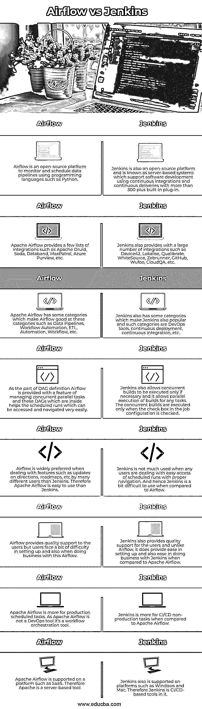

# 气流 vs 詹金斯

> 原文：<https://www.educba.com/airflow-vs-jenkins/>

## 气流 vs Jenkins 简介

Airflow 被定义为一个管理平台，它是由 Airnib 启动和创建的开源工作流，现在是 Apache 的一部分，因此 Airflow 用于创建 Python 编程语言的工作流，这些工作流可以通过 Airflow 提供的内置接口轻松调度和监控。Jenkins 也被定义为自动化服务器，用于自动化与测试、构建和部署相关的软件开发部分，因此 Jenkins 支持促进持续交付和持续集成，并且 Jenkins 可以在 Apache Tomcat(一个 servlet 容器)中运行。

### 气流与詹金斯的直接对比(信息图)

以下是 Airflow 与 Jenkins 的 8 大区别:

<small>网页开发、编程语言、软件测试&其他</small>

### Airflow 与 Jenkins 的主要区别

让我们来看看一些关键的区别:

*   **用途**

Apache Airflow 主要用于维护和创作数据管道，这是用于调度这种数据管道的工作流自动化，并且这些 Airflow 使用这些工作流，这些工作流在非循环图中使用，例如任务的 Dag，这提供了更容易的维护、测试等。鉴于 Jenkins 主要用于任何软件部署、测试、构建等任何软件部分的持续集成和持续交付。因此，Jenkins 习惯于降低代码重复率，并轻松进行审计。

*   **支持功能**

Apache Airflow 支持一些重要的功能，例如回填，这有助于在用户设定的指定时间内运行任何任务，这使用户可以自由回填整个 DAG，以便用户可以在添加新功能后重新处理历史数据。为了应对数据丢失，Airflow 还支持管理并发任务的并发性，并且还支持 Xcom 功能，这有助于在任务之间轻松实现交叉通信技术， Jenkins 还提供了各种功能，因为它只在检查作业配置时才支持并发任务的执行，否则它支持任务的并行执行，它还支持一个功能，即它可以在多台机器上分配工作，以便它可以轻松地进行测试、构建和部署，它还提供了多种用例，如 GitHub、Java、PHP 等。

*   **更好的用户评价**

当您处理 ETL 作业性能时，使用 Apache Airflow 是明智的，这些 Airflow 有助于在 ETL 过程中的任何点重新启动，因此据说 Airflow 不是任何库，因此需要部署它，这对于小型 ETL 作业来说意义不大。而 Jenkins 主要推荐用于较大的项目，这些项目需要大量内置插件，用户无需进行任何定制，因为用户有能力更改任何内容或一切，尽管该流程正在运行，但启动该流程将需要几分钟时间，而且该 CI Jenkins 可能不容易支持快速启动。

### 气流与詹金斯对比表

下面是提到的一些比较:

| **序列号** | **气流** | 詹金斯 |
| One | Airflow 是一个开源平台，使用 Python 等编程语言来监控和调度数据管道。 | Jenkins 也是一个开源平台，被称为基于服务器的系统，该系统使用 300 多个内置插件，通过持续集成和持续交付来支持软件开发。 |
| Two | Apache Airflow 提供了一些集成列表，如 Apache Druid、Soda、Databand、MaxPatrol、Azure without 等。 | Jenkins 还提供了大量的集成，如 Device42、Lokalise、Qualibrate、WhiteSource、Zebrunner、GitHub、Wufoo、CloudQA 等。 |
| Three | Apache Airflow 有一些类别，使 Airflow 擅长这些类别，如数据管道、工作流自动化、ETL、自动化、工作流等。 | Jenkins also has some categories which make Jenkins also popular and such categories are DevOps tools, continuous deployment, continuous integration, etc. |
| Four | 作为 DAG 定义的一部分，Airflow 提供了管理并发并行任务的功能，这些 DAG 在内部有助于计划运行，可以非常容易地访问和导航。 | Jenkins 还允许仅在必要时执行并发构建，并且它允许对任何任务并行执行构建。仅当选中作业配置中的复选框时，才会执行并发构建。 |
| Five | 与 Jenkins 相比，许多不同的用户在处理诸如更新方向、路线图等功能时更倾向于使用气流。因此阿帕奇气流比詹金斯更容易使用。 | Jenkins is not much used when any users are dealing with easy access of scheduled runs with proper navigation.  And hence Jenkins is a bit difficult to use when compared to Airflow. |
| Six | 气流为用户提供了高质量的支持，但用户在设置和使用气流做生意时会遇到一些困难 | Jenkins 还为用户提供高质量的支持，与 Airflow 不同，与 Apache Airflow 相比，它在设置和与 Jenkins 做生意方面都很容易。 |
| Seven | Apache Airflow 更多地用于生产计划任务。由于 Apache Airflow 不是一个 DevOps 工具，它是一个工作流编排工具。 | 与 Apache Airflow 相比，Jenkins 更适合 CI/CD 非生产任务。 |
|  8 | 阿帕奇气流支持的平台，如 SaaS。因此，Apache 是一个基于服务器的工具。 |   Jenkins also is supported on platforms such as Windows and Mac. Therefore Jenkins is CI/CD-based tools in it. |

### 结论

在本文中，我们得出结论，Apache airflow 和 Jenkins 在各自的领域都很好，而且更好，不同的用户根据他们的需求使用它们。因此，Jenkins 支持更多用于配置或触发任何构建或测试以及其他 CD 任务的 CI/CD 工具。气流更多的是考虑生产调度任务，因此气流广泛用于监控和调度数据管道，而 Jenkins 用于持续集成和交付。

### 推荐文章

这是 XAMPP 对 MAMP 的比赛指南。在这里，我们分别用信息图和比较表来讨论 XAMPP 和 MAMP 的主要区别。您也可以看看以下文章，了解更多信息–

1.  [Rails vs PHP](https://www.educba.com/rails-vs-php/)
2.  [核心 Java vs Java](https://www.educba.com/core-java-vs-java/)
3.  [Java vs .Net](https://www.educba.com/java-vs-dot-net/)
4.  [Java vs Kotlin](https://www.educba.com/java-vs-kotlin/)

