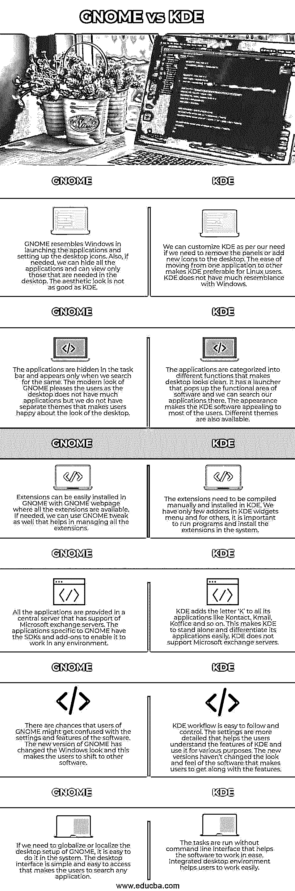

# GNOME 与 KDE

> 原文：<https://www.educba.com/gnome-vs-kde/>

## 侏儒和 KDE 的区别

GNU 网络对象模型环境或 GNOME 是 Linux 和 Unix 操作系统中的一个系统软件，帮助设置桌面环境和桌面外观。它发布于 1999 年 3 月，是免费的开源软件，可以帮助用户在 Linux 系统中拥有良好的用户界面。k 桌面环境或 KDE 是 Linux 操作系统的中央开发中心，帮助开发软件，并帮助与其他工具协作，使软件对社区可用。图形界面提供给用户，使他们像使用 Windows 一样舒适地使用 Linux。

### GNOME 和 KDE 的正面比较(信息图)

以下是 GNOME 和 KDE 之间的 6 大区别:

<small>网页开发、编程语言、软件测试&其他</small>

### GNOME 和 KDE 的主要区别

以下是 GNOME 和 KDE 的主要区别:

*   在 GNOME 和 KDE 中定制应用程序都很容易，但是定制的方式是不同的。GNOME 将定制选项隐藏在面板下面，这样桌面就不会被杂乱的应用程序占据。需要简单桌面的用户喜欢这个选项。现在，有了 KDE，定制选项在应用程序的前面提供，使用户可以立即使用所有的快捷方式。根据 KDE 用户的需求，调整面板大小和重新组织应用程序是很容易的。但是这个选项在 GNOME 中不可用，但是基本的用户体验很好。
*   我们在 GNOME 中有各种各样的应用程序，但它们都是非常基础的。主题很基础，音乐系统不好，联系人没有联系人组，还有很多其他值得注意的问题。如果我们不从 GNOME 平台安装应用程序，它在桌面上的行为可能会有所不同。在 KDE，应用程序的选择较少，但是应用程序是稳定的，并且提供了各种各样的功能。应用程序可以很容易地配置，这使得在 KDE 环境中开发新的应用程序变得很容易。所有重要的特征都存在于系统中。
*   GNOME 和 KDE 的应用程序和功能是相似的，并且提供相似的应用程序。控制台和文件管理器的外观和感觉以及所有的基本功能都是一样的，用户对此没有争议。然而，KDE 提供了额外的功能，如 Kontact，KDE 连接等。GNOME 中没有的。GNOME 和 KDE 的社区都很强大，以不同的方式帮助用户。
*   GNOME 拥有更强大的用户基础，因为用户对 GNOME 应用程序很满意。最近，GNOME 发布了它的新版本，从最初的 windows 外观变成了一个不同但真实的 GNOME 外观。一些用户对这种方法不满意，因为他们对 Windows 的外观很满意。这使得他们转向另一个应用程序，如 KDE，因为 KDE 有一个像 Windows 的外观，并有比 GNOME 更多的功能。初学者更喜欢 KDE，因为它有一个类似于 Windows 的用户界面，使他们比 GNOME 更容易工作。

Linux 的应用程序同时兼容 GNOME 和 KDE，这使得用户可以在两者之间进行选择。两者有相似的特征，但差别不大。功能丰富的 KDE 吸引用户，而 GNOME 吸引用户是因为它的粉丝群和社区支持。初学者更喜欢 KDE，但是 Linux 开发者会选择 GNOME。有了额外的库，KDE 就可以和 GNOME 一起工作了。

### GNOME 与 KDE 对比表

GNOME 和 KDE 的比较如下:

| **侏儒** | **在哪里** |
| GNOME 在启动应用程序和设置桌面图标方面类似于 Windows。此外，如果需要，我们可以隐藏所有应用程序，只查看桌面上需要的应用程序。审美看起来不如 KDE。 | 如果我们需要移除面板或在桌面上添加新图标，我们可以根据自己的需要定制 KDE。从一个应用程序转移到另一个应用程序的便利性使得 KDE 成为 Linux 用户的首选。KDE 与 Windows 没有太多相似之处。 |
| The applications are hidden in the taskbar and appear only when we search for the same. The modern look of GNOME pleases the users as the desktop does not have many applications but we do not have separate themes that make users happy about the look of the desktop. | 应用程序被分为不同的功能，使桌面看起来干净。它有一个弹出软件功能区的启动器，我们可以在那里搜索我们的应用程序。KDE 软件的外观吸引了大多数用户。也有不同的主题。 |
| 扩展可以很容易地安装在 GNOME 中，GNOME 网页上有所有的扩展。如果需要，我们也可以使用 GNOME tweak 来帮助管理所有的扩展。 | 扩展需要手动编译并安装在 KDE。我们在 KDE 窗口小部件菜单中只有几个插件，对于其他人来说，在系统中运行程序和安装扩展是很重要的。 |
| 所有的应用程序都在一个支持 Microsoft Exchange 服务器的中央服务器中提供。GNOME 特有的应用程序有 SDK 和插件，使它能够在任何环境下工作。 | KDE 将字母“K”添加到所有应用程序中，如 Kontact、Kmail、Koffice 等。这使得 KDE 能够独树一帜，轻松区分其应用。KDE 不支持 Microsoft exchange 服务器。 |
| GNOME 用户可能会对软件的设置和功能感到困惑。GNOME 的新版本改变了 Windows 的外观，这使得用户转向其他软件。 | KDE 工作流程易于跟踪和控制。设置更加详细，有助于用户了解 KDE 的功能，并将其用于各种目的。新版本并没有改变软件的外观和感觉，使用户能够适应这些功能。 |
| 如果我们需要全球化或本地化 GNOME 的桌面设置，很容易在系统中完成。桌面界面简单易用，用户可以搜索任何应用程序。 | 这些任务在没有命令行界面的情况下运行，有助于软件轻松工作。集成的桌面环境有助于用户轻松工作。 |

### 推荐文章

这是一个 GNOME vs KDE 的指南。在这里，我们也讨论了 GNOME 和 KDE 的关键区别，包括信息图表和比较表。您也可以看看以下文章，了解更多信息–

1.  [Linux Mint vs Ubuntu](https://www.educba.com/linux-mint-vs-ubuntu/)
2.  [JIRA vs Bugzilla](https://www.educba.com/jira-vs-bugzilla/)
3.  [Ubuntu vs Fedora](https://www.educba.com/ubuntu-vs-fedora/)
4.  [CentOS vs Fedora](https://www.educba.com/centos-vs-fedora/)

