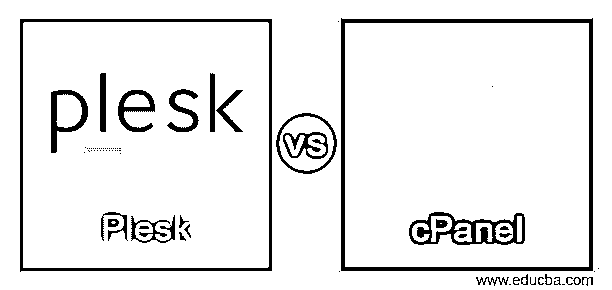
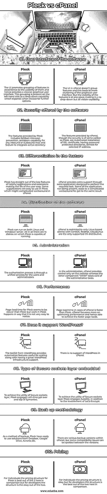

# Plesk vs cPanel

> 原文：<https://www.educba.com/plesk-vs-cpanel/>

## Plesk 与 cPanel 的区别

Plesk 和 cPanel 被定义为网络托管控制面板，这是一个基于网络的界面，用户可以在其中管理启动网站的服务器以及作为网站一部分的托管服务。有各种各样的组件是 web 主机控制面板接口的一部分，如 web 服务器、域名服务器、邮件服务器、数据库、文件管理器、系统监视器等等。要实现虚拟主机控制面板的全部功能，市场上有很多软件，其中 Plesk 和 Cpanel 在可用性方面最受欢迎。由于这两种软件获得相同的结果，因此总是有一个问题，即哪一个工作得最好。在这篇文章中，我们将尝试解释的差异，这将清除空气挑选正确的虚拟主机控制面板。

### Plesk 与 cPanel 的面对面比较(信息图)

以下是 Plesk 与 cPanel 的 10 大区别:

<small>网页开发、编程语言、软件测试&其他</small>

### Plesk 与 cPanel 的主要区别

以下是 Plesk 与 cPanel 的主要区别:

*   在我们了解 Plesk 和 cPanel 的区别之前，我们首先需要理解为什么需要这种区别。这两种类型的虚拟主机控制面板软件之间必须有一些相似之处，这使得用户或开发者很难做出选择。两者都为 web 界面提供了类似的数据库，并拥有相同的 web 服务器。
*   这种相似性的结果是，开发者很难选择哪一个是最好的。这里讨论的以及本文其他部分的表格中的差异将激发正确的神经来为用例选择正确的。Plesk 和 cPanel 有一个不同的用户界面，Plesk 提倡一个分组的 UI，其中的元素按照实用程序分组，而 cPanel 使元素在一个地方可用，有些可能会感觉有点混乱。在安全性方面，两者处于同一级别，只是启用安全性的元素不同。由于安全性的特性不同，因此 node.js、git、docker 等其他特性只能在 Plesk 中使用，而不能在 cPanel 中使用。在认证方面，Plesk 提供统一的授权流程，而 cPanel 使用两个要素，其中一个要素提供对网站的控制，另一个要素负责管理费用。
*   就价格而言，Plesk 适合寻求虚拟主机控制面板支持的个人，而对于开发者或经销商，cPanel 有最好的价格结构。在文章的另一部分，我们将以表格的形式查看 Plesk 和 cPanel 之间的对抗！

### Plesk 与 cPanel 对比表

为了便于理解，让我们通过一个比较表来看看 Plesk 和 cPanel 之间的更多差异:

| **比较的热恩** | **Plesk** | **cPanel** |
| **软件的用户界面** | UI 根据功能的可用性对功能进行分组，从而提供更简洁的图形用户界面。该分组作为下拉功能出现在左侧，单击它可以展开更多选项。 | cPanel 中的 UI 没有对特性进行分组，这导致图形用户界面更加混乱。但是特性的可见性是在一个地方，这使得它不是一个下拉菜单，而是所有可见的功能。 |
| **软件提供的安全性** | Plesk 提供的功能包括 fail2ban 入侵防御、针对任何入站或出站邮件的反垃圾邮件功能，以及集成 active directory 的功能。 | cPanel 提供的功能，虽然安全性与 Plesk 相同，但都是 SSL 证书的自动安装，有密码保护的目录，拒绝选定的 IP 地址。 |
| **特征差异** | Plesk 具有直接开箱即用的有用应用程序和扩展功能，使用户的生活变得轻松。有些恳求在 Plesk 中很容易使用，这在 cPanel 中可能是一个复杂的变通方法。 | cPanel 通过为执行所需任务而设计的额外应用程序提供额外支持。一些应用程序的不存在导致了复杂的解决方法，忘记了同样的结果。 |
| **软件的分发** | Plesk 可以在 Linux 和 Windows 服务器上运行。总的来说，Plesk 可以在 14 个发行版上运行。 | cPanel 仅限于基于 Linux 的发行版，CentOS、RedHat 和 CloudLinux 是唯一受支持的操作系统发行版。 |
| **管理** | 对于用户和管理员来说，授权过程是一个统一的过程。 | 在管理中，cPanel 只提供对网站的控制，而另一个组件“WHM”负责管理任务。 |
| **性能** | Plesk 的页面加载时间似乎比 Plesk 慢，但 Plesk 的工作方式不太容易被注意到。 | cPanel 的页面加载时间比 Plesk 快。cPanel 更注重优化性能，因此能够实现更快的页面加载。 |
| **支持 WordPress 吗？** | WordPress 的工具包提供了自动化功能，有助于扩展以及强大的 WordPress 基础设施支持。 | cPanel 中不支持 WordPress。 |
| **嵌入式安全套接字层的类型。** | 为了实现安全套接字层的效用，Plesk 在赛门铁克的基础上加入了 Let's Encrypt。 | 为了实现安全套接字层的效用，除了让我们加密之外，Plesk 还使用了 AutoSSL。 |
| **备份方法** | 作为一种备份方法，Plesk 拥有 Dropbox、Google Drive、Acronis 等现成的解决方案。 | cPanel 中有各种备份版本，但是在这些版本之间可以发现一些兼容性问题。 |
| **定价** | 对于个人来说，Plesk 的价格结构是最好的，但是对于开发者来说，这种结构是可以接受的。 | 对个人来说，价格结构还可以，但对开发商来说，这种结构是两者中最好的。 |

### 结论

我们理解 Plesk 和 cPanel 之间的相似性会导致用户的困惑，但是通读这篇文章会使情况变得更清楚，并使人们能够为正在解决的用例选择正确的选项。简而言之，Plesk 完全是为了现代化和更好地支持个人，而 cPanel 为企业、经销商、中型机构而不是个人提供更强大的基础设施。

### 推荐文章

这是 Plesk vs cPanel 的指南。在这里，我们也讨论了 Plesk 和 cPanel 的主要区别，包括信息图和比较表。您也可以看看以下文章，了解更多信息–

1.  [计算机工程 vs 计算机科学](https://www.educba.com/computer-engineering-vs-computer-science/)
2.  [AUTOCAD vs CATIA](https://www.educba.com/autocad-vs-catia/)
3.  [计算机科学 vs 数据科学](https://www.educba.com/computer-science-vs-data-science/)
4.  [JavaScript vs VBScript](https://www.educba.com/javascript-vs-vbscript/)

