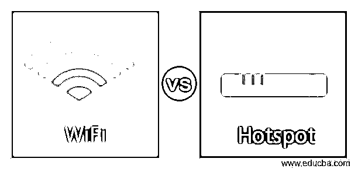
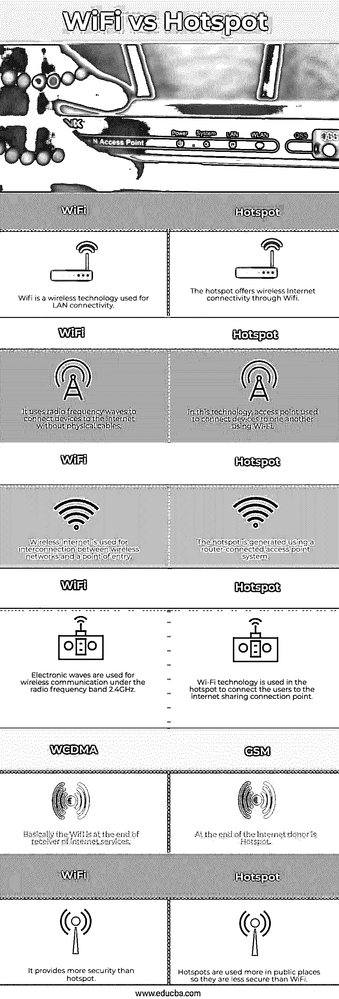

# WiFi 与热点

> 原文：<https://www.educba.com/wifi-vs-hotspot/>

## Wifi 与热点的区别

在这个主题中，我们将了解 WiFi 与热点。Wi-Fi 是一种 LAN(局域网)蜂窝网络技术。对于无线网络，Wi-Fi 使用 2.4 GHz 无线电频段下的电磁波。要构建热点，需要使用无线设备创建 WLAN。没有宽带互联网，就没有热点。在自然界，wifi 更安全，功能更丰富。可以连接游戏机、笔记本电脑、打印机等。

该热点配备了无线互联网连接。热点通过无线互联网接入提供无线互联网连接。热点是通过接入点系统生成的，但在正常使用时，热点和接入点的含义是相同的。连接到互联网的入口或路由器通常有一个接入点。热点不如私人 Wi-Fi 安全，因为它通常在公共场所使用。

<small>网页开发、编程语言、软件测试&其他</small>

### WiFi 与热点的面对面比较(信息图表)

以下是 WiFi 和热点的主要区别

### Wifi 与热点的主要区别

以下是 Wifi 和热点的主要区别。

*   Wi-Fi 互联网连接和热点都是与蜂窝互联网连接结合使用的常见概念。Wi-Fi 是一种无线网络技术，可帮助您建立基于 Wi-Fi 的 Wi-Fi 网络，从而轻松访问互联网。另一方面，热点是通过本地无线网络(WLAN)提供无线互联网接入的无线接入点。
*   Wi-Fi 是基于 IEEE 802.11 的无线网络协议，使用无线电波为移动设备提供网络接入。Wi-Fi 是一种卫星链接，网络电缆也是如此。它很像一个本地无线网络，用于连接没有电缆的计算机。热点是指通常使用 Wi-Fi 从物理地点进行互联网通信的无线点。
*   Wi-Fi 就像一个封闭的接入网络，网络提供商可以选择谁愿意或不愿意完全接入其 Wi-Fi 网络。所有者可以更改 Wi-Fi 或密码，甚至通过限制网络访问来限制连接到网络的客户数量。您也可以关闭 Wi-Fi 调制解调器并关闭网络连接。热点场所主要是机场、餐馆、咖啡店和道路，它们很容易向服务提供商开放。
*   传统的 2.4 GHz 无线电频带用于通常范围受限的设备的 Wi-Fi 路由器的连接。范围受到天线或其内部或周围位置的限制。典型的室内 Wi-Fi 可以建立到 32 米，室外也可以在车站内扩展到几公里。在 Wi-Fi range extensor 的支持下，Wi-Fi 信号也可能得到改善，Wi-Fi range extensor 是另一台具有 IP 地址的计算机。在 33 英尺的范围内，可以接入热点信号。
*   无线网络，尤其是公共 Wi-Fi 网络，更容易受到黑客攻击，因为你不是唯一连接的网络。一般来说，就保护与受 WPA2 保护的网络相关联的任何人而言，这种侵权是极不可能的。然而，就像公共 Wi-Fi 一样轻松，也有危险。热点是实际存在的地方，几乎每个人都可以访问互联网，这使得它成为网络攻击的绝佳场所。使用 VPN 可能是保证热点安全的最佳方式。

### WiFi 与热点对比表

为了便于理解，让我们通过一个比较表来看看 WiFi 和 Hotspot 之间的更多差异:

| **服务请求编号** | **Wifi** | **热点** |
| One | WiFi 是一种用于局域网连接的无线技术。 | 热点通过 Wi-Fi 提供无线互联网连接。 |
| Two | 它使用射频波将设备连接到互联网，无需物理电缆 | 在这项技术中，接入点用于通过 Wi-Fi 连接设备 |
| Three | 无线互联网用于无线网络和入口点之间的互连。 | 使用路由器连接的接入点系统生成热点。 |
| Four | 电波用于无线电频带 2.4GHz 下的无线通信 | 在热点中使用 Wi-Fi 技术将用户连接到互联网共享连接点 |
| Five | 基本上，Wifi 是在互联网服务的接收器的末端。 | 在互联网的末端，捐赠者是热点。 |
| Six | 它比热点更安全 | 热点多用于公共场所，所以不如 WiFi 安全 |

### 结论

WLAN 是一种无线网络系统，允许用户连接到局域网，但不需要物理电缆。无线互联网使用射频波而不是使用网线链接到互联网，使特定区域内的用户之间的 Wi-Fi 连接更简单。这是一个总体术语，用于指定一组基于 IEEE 802.11 规范提供高质量互联网连接的网络协议。所以在这篇文章中，我们已经看到了 WiFi 和热点的主要区别。我们希望这篇文章对您有所帮助。

### 推荐文章

这是一个 WiFi vs 热点的指南。在这里，我们通过信息图和比较表来讨论 WiFi 和热点的主要区别。您也可以看看以下文章，了解更多信息–

1.  [Asana vs Todoist](https://www.educba.com/asana-vs-todoist/)
2.  Arduino Leonardo vs Uno
3.  [内联网 vs 外联网](https://www.educba.com/intranet-vs-extranet/)
4.  [Alexa vs 谷歌](https://www.educba.com/alexa-vs-google/)

