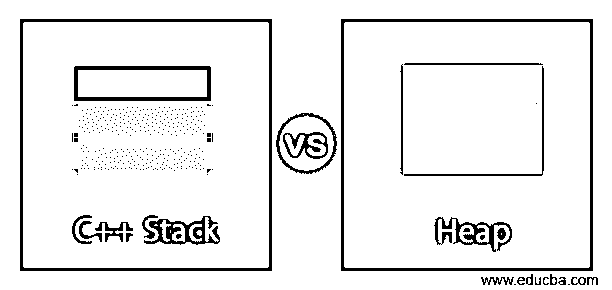
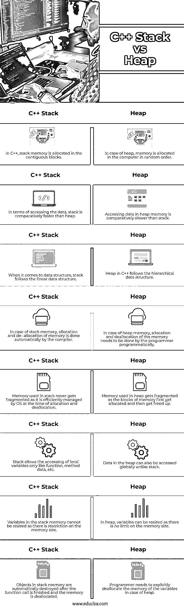

# C++堆栈与堆

> 原文：<https://www.educba.com/c-stack-vs-heap/>

## C++堆栈和堆的区别

下面的文章提供了 C++栈和堆的概要。栈是遵循后进先出策略的数据结构。它由 CPU 管理，存储由函数创建的所有局部变量，并将它们一个接一个地堆叠起来。每一个新的函数变量，一旦被声明，就被推入堆栈内存。一旦函数执行/调用完成，所有的函数数据和变量都被释放。堆栈只能访问局部变量。使用堆栈的最大优势之一(作为程序员)是 CPU 在分配或释放内存时管理内存。

堆是一个自由浮动的内存区域，它不完全由 CPU 管理，但是程序员必须管理它。它允许动态内存分配，这是在使用 malloc()和 calloc()方法执行指令时分配的。内存是随机分配的，指针是用来访问数据的。默认情况下，所有全局变量都存储在堆内存中。一旦使用 free()方法执行了任务，程序员就必须在使用堆时释放内存。

<small>网页开发、编程语言、软件测试&其他</small>

### C++堆栈与堆的直接比较(信息图表)

以下是 C++堆栈与堆之间的 8 大区别:

### C++堆栈与堆的主要区别

让我们讨论一下 C++堆栈和堆之间的一些主要区别:

*   堆栈基本上是计算机内存中的区域，它由计算机自动管理，以便存储函数使用的局部变量、方法及其数据，而堆是自由浮动的内存区域，既不是由 CPU 也不是由程序员自动管理的。
*   堆通过使用 malloc()和 calloc()关键字支持动态内存分配。为了释放内存，程序员必须使用 free()方法，而在堆栈的情况下，一旦函数执行结束，编译器就会自动释放为存储变量和函数数据而分配的内存。
*   Stack 比 heap 更灵活，因为一旦分配给 stack 的内存不能改变，而在 heap 的情况下，内存分配是动态的，因此大小可以改变。
*   在堆栈的情况下，可能发生的主要问题是内存不足，而在堆中，主要问题是碎片，因为内存被一次又一次地分配和释放。
*   与 C++中的堆内存相比，实现堆栈的成本相对较低。
*   一旦堆栈内存超出内存范围，就会导致程序异常终止，而在堆的情况下，无法释放堆中的内存会导致内存泄漏问题，因为该内存不会被释放。
*   Stack 允许将局部变量、方法数据和子程序堆叠在函数或方法之上，而 heap 不堆叠数据，而是使用动态内存分配技术将内存分配给每个成员。
*   使用堆栈内存的最大优点之一是程序员没有内存管理(分配/解除分配)的开销，因为每次函数调用完成后，堆栈数据都会被清除，而在堆的情况下，程序员必须承担内存管理的责任，并在每次执行完所需的任务后释放内存。
*   在堆栈中只能访问局部变量和方法数据，而堆允许访问全局数据和程序中任何地方的数据。
*   操作堆内存中的数据有点慢且困难，因为它允许使用指针来访问堆的内存，因为所分配的内存是随机的，而 stack 允许顺序访问数据，因此可以轻松地操作数据，直到堆栈用完内存。
*   当我们需要全局使用大的内存变量，并且经常调整大小时，就使用堆，而当只需要存储小的变量直到函数执行，并且不需要/很少需要调整大小时，就使用栈。

### C++堆栈与堆比较表

让我们来讨论一下 C++栈与堆之间的顶级比较:

| **序列号** | **C++栈** | **堆** |
| 1. | 在 C++中，堆栈内存是在连续块中分配的。 | 在堆的情况下，内存在计算机中是随机分配的。 |
| 2. | 就访问数据而言，堆栈比堆要快得多。 | 访问堆内存中的数据比访问堆栈要慢。 |
| 3. | 当涉及到数据结构时，堆栈遵循线性数据结构。 | C++中的堆遵循分层数据结构。 |
| 4. | 在堆栈内存的情况下，内存的分配和释放是由编译器自动完成的。 | 在堆内存的情况下，内存的分配和释放需要由程序员通过编程来完成。 |
| 5. | 堆栈中使用的内存永远不会产生碎片，因为它在分配和取消分配时由操作系统有效管理。 | 当内存块首先被分配，然后被释放时，堆中使用的内存会被碎片化。 |
| 6. | 栈只允许访问像函数、方法数据等局部变量。 | Data in a heap can also be accessed globally, unlike stack. |
| 7. | 堆栈内存中的变量不能调整大小，因为内存大小有限制。 | 在堆中，变量可以调整大小，因为内存大小没有限制。 |
| 8. | 在函数调用完成并且内存被释放后，堆栈内存中的对象被自动销毁。 | 在堆的情况下，程序员需要显式地释放变量的内存。 |

### 结论

上面的描述清楚地解释了什么是 C++中的堆栈和堆，以及两者之间的主要区别。然而，堆栈和堆都用于编程中的内存分配，但用途不同。两者都有各自的优点和缺点，并可能导致不同的问题；人们需要深入理解它们，以便根据程序员的具体要求来使用它们。

### 推荐文章

这是一个 C++栈与堆的指南。这里我们分别用信息图和比较表来讨论 C++栈和堆的关键区别。您也可以看看以下文章，了解更多信息–

1.  [C++与 Visual C++](https://www.educba.com/c-plus-plus-vs-visual-c-plus-plus/)
2.  [C++ vs Java](https://www.educba.com/c-plus-plus-vs-java/)
3.  [C++数组列表](https://www.educba.com/c-plus-plus-arraylist/)
4.  [Java 堆 vs 栈](https://www.educba.com/java-heap-vs-stack/)

