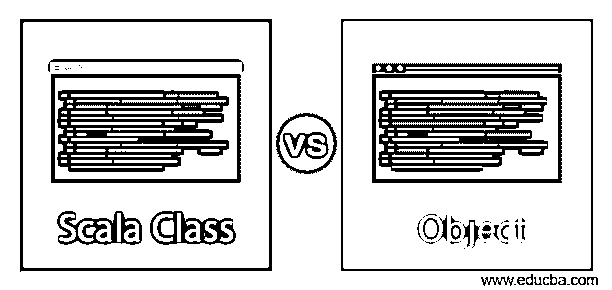

# Scala 类对对象

> 原文：<https://www.educba.com/scala-class-vs-object/>

## Scala 类和对象的区别

下面这篇文章提供了 Scala Class vs Object 的概要。类和对象是非常不同的；两者相互依存，缺一不可。为了访问类方法、变量和其他东西，我们需要一个对象，为了创建对象，我们必须有一个可用的类。类是对象的蓝图；也可以说它是一个对象构造器等等。如果我们正在使用面向对象的编程语言，那么类和对象就是基本概念。

### Scala 类和对象的直接比较(信息图)

以下是 Scala 类与对象之间的 9 大区别:

<small>网页开发、编程语言、软件测试&其他</small>

### Scala 类和对象的主要区别

在上一节中，我们已经看到了如何在 scala 中定义一个类和对象；同样，我们已经看到类和对象是面向对象编程语言的基本概念。

在本节中，我们将看到关键点，以便更好地了解它们；请参见下面的内容:

*   我们知道类是用户定义的逻辑实体，它代表了现实世界中的一些实体。如果我们谈论一个对象，对象就是类的实例。在类内部，我们将数据和它们的行为定义或绑定到一个单元中。类也被称为原型；通过使用它，我们可以创建类的对象。我们可以在类中定义成员变量、字段、数据、函数，这些在任何编程语言中都代表一个单元。

在 scala 中定义类和对象:

**1。class:** 如果我们想在 scala 中定义一个类，那么我们必须使用' class '关键字。这一节将会看到我们如何使用“class”关键字在 scala 中创建一个用户定义的类。

**举例:**

`class name_of_class`

这里我们使用“class”关键字在 scala 中创建一个类；紧跟在 class 关键字之后，我们可以给我们的类一个用户定义的名称。

**举例:**

`class Demo{}`

**2。Object:** Object 就是用来访问类函数或方法、文件等的类。

下面是在 scala 中创建对象的步骤:

**举例:**

`var object_name = new class_name;`

在上面的语法中，我们使用 scala 中的“new”关键字创建了一个类的对象。这是在 scala 中创建对象最常见的方式。类名可以紧随其后。

**举例:**

`var demoObj = new Demo();`

*   这里我们创建了一个对象，我们在 new 关键字后面提到了类名。现在，这个引用将保存 Demo()类对象，所有成员变量和方法都只能通过使用这个对象来访问。

这是在编程中创建一个类或对象可以做的基本事情，但是在 scala 中有一些特定的事情不是强制性的，但是可以遵循:

**1。如果我们想在创建类的时候给任何父类，我们可以在 scala 中这样做。但是对于这一点，我们将使用' extends '关键字。这通常是指父子关系；这不是强制性的，但如果需要也可以这样做。**

**2。类名:**在 scala 中创建一个类时，总是建议使用首字母作为大写。这是一个标准或命名惯例，我们可以说每个人都应该遵循。

**3。Class 关键字:**创建类时，必须在用户定义的类名前使用' class '关键字。

**4。Body:** 在类声明之后，我们也可以定义类的主体。在这里我们可以定义其他东西，比如构造函数、方法和其他字段。

**5。特征:**这也不是强制性的，但是可以在创建类的时候实现。我们可以使用' extends '关键字，并且我们可以实现几个特征。

对象表示真实世界实体；对象具有行为、状态和身份。对象是类的实例；没有类，e 无法创建对象；他们相互依赖。为了创建对象，我们还需要一个构造函数。

让我们讨论对象的属性:

*   **Identity:** Identity 表示对象的名称，应该是唯一的。这种身份使我们能够与其他物体互动。
*   **行为:**行为表示对象之间的交互。
*   **状态:**对象的状态代表对象的属性，这些属性往往代表对象的性质。

### Scala 类与对象对照表

让我们来讨论 Scala 类和对象之间的主要比较:

| **Scala 类** | **物体** |
| 班级是蓝图；利用这一点，我们可以创建对象。 | 对象是类的实例；通过使用它，我们可以访问类成员变量、方法等。 |
| 可以使用' class '关键字创建一个类。 | 可以使用“new”关键字创建对象。 |
| 这是面向对象编程语言的基本单元。 | 对象也是面向对象编程语言的基本单位。 |
| 如果我们想创建一个类，那么我们只需要声明它一次。 | 我们可以一次又一次地为同一个类创建对象，次数不限。 |
| 类不占用或消耗程序堆栈或内存中的任何空间；它们只是程序的逻辑实体。 | 但是当我们创建一个对象时，它们会占用一些内存空间，所以我们在为同一个类创建多个实例时应该小心；这可能会导致一些性能问题。 |
| 类代表逻辑存在。 | 而另一方面，对象代表物理存在。 |
| 类被认为是对象的集合。 | 为了访问这个成员变量、方法和类的其他东西，我们可能需要一个实例，所以对象为我们提供了一种访问类行为和函数的方法。 |
| 只能以一种可能的方式声明或创建类。 | 而另一方面，对象代表现实世界的实体，如动物、笔、勺子等。 |
| **Example:** class name_of_class.在上面几行代码中，我们可以使用 class 关键字创建一个类，后跟 scala 中该类的“名称”。 | Objects can be cared for by using multiple ways available in Scala.**示例:**新建 class_name。在上面的代码行中，我们可以通过在 scala 中使用“new”关键字后跟类名来创建一个类的对象。 |

### 结论

这样，我们知道类和对象是相互关联的，也不能相互脱离使用。在面向对象编程语言中，类是原型，而对象是现实世界中的实体。

### 推荐文章

这是 Scala Class vs Object 的指南。这里我们用信息图和比较表来讨论 Scala 类和对象键的区别。您也可以看看以下文章，了解更多信息–

1.  [Scala vs Java](https://www.educba.com/scala-vs-java/)
2.  [Haskell vs Scala](https://www.educba.com/haskell-vs-scala/)
3.  [科特林 vs 斯卡拉](https://www.educba.com/kotlin-vs-scala/)
4.  [Groovy vs Scala](https://www.educba.com/groovy-vs-scala/)

