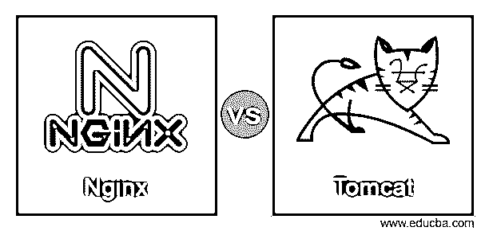
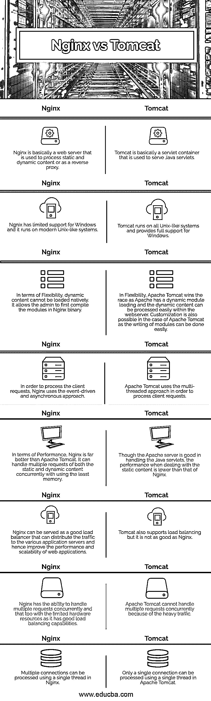

# Nginx vs Tomcat

> 原文：<https://www.educba.com/nginx-vs-tomcat/>

## Nginx 和 Tomcat 的区别

Nginx 是一个开源的、功能丰富的 web 服务器，它使用异步和事件驱动的方法来处理静态和动态请求。它可以用最少的硬件和内存同时处理多个请求。由于其灵活的高端架构，它可以非常轻松地处理高波动负载。它还智能地使用负载平衡器来处理 web 应用程序的多个请求的负载。

Tomcat 是一个开源的高性能 HTTP 服务器，用于服务 HTTP 请求，由 Apache Software Foundation 维护。它被认为是处理 HTTP 请求最安全、最有效的 web 服务器之一。它支持几乎所有类型的操作系统，包括所有版本的 Unix，并提供对 Windows 的全面支持。近年来发布了许多新版本的 Apache，展示了更有效、更安全地处理请求的新方法。

<small>网页开发、编程语言、软件测试&其他</small>

### Nginx 与 Tomcat 的面对面比较(信息图)

以下是 Nginx 和 Tomcat 之间的主要区别:

### Nginx 和 Tomcat 的主要区别

Ngnix 和 Tomcat 服务器之间的一些关键差异将在下面详细解释:

1.  Apache Tomcat 是一个 HTTP web 服务器，主要用于处理 Java servlets，而 Nginx 是一个开源、高效、高性能的 web 服务器和反向代理服务器。
2.  Apache Tomcat 是由最著名的 Apache 软件基金会之一开发和维护的，因此所有的错误修复、问题和维护都报告给各种渠道，并由世界各地的大型用户社区处理。Apache 的商业支持也可以从 OpenLogic 等第三方公司获得，而与 Nginx 相关的所有问题都由同名公司“Nginx Plus”处理，该公司成立于 2011 年。但是，用户可以通过各种第三方渠道发布查询。它还提供了各种内部培训课程和教程，包括各种主题的视频和其他数据，以便更好地理解。
3.  Nginx 和 Apache Tomcat 之间的主要区别之一是这两个服务器处理请求的方式。Nginx 有很好的能力同时处理多个客户端请求，并且只需使用最少的硬件资源，而 Tomcat 则不能同时处理多个请求，但是它使用大量的多处理模块来处理请求。
4.  Nginx 使用事件驱动的异步方法来处理多个客户端请求，即使在流量很大的情况下也能为用户提供高性能，而 Apache Tomcat 使用多线程方法来处理请求，但效率不够高，因此缺乏可伸缩性。
5.  Nginx 可以使用 FastCGI 和 SCGI 等服务静态和动态内容。，非常容易，速度也非常快，但当使用 Apache Tomcat 处理静态内容时，它相对较慢，比 Nginx 低。
6.  Apache Tomcat 的优势之一是它可以处理静态的 HTML、XML、JSON 等。使用传统方法的文件和 web 服务器本身上的动态文件，而 Nginx 可以很好地提供静态内容，但不能在内部提供动态内容。对于动态文件的执行，它使用外部源。

### Nginx 和 Tomcat 的比较表

虽然 Nginx 和 Tomcat 都是著名的 web 服务器，它们以不同的方式处理客户端请求，但是它们在处理 web 内容时有不同的目的。重要的是了解它们之间的区别，以便有一个清晰和深入的了解。下面给出的比较表格显示了 Nginx 和 Tomcat 服务器之间的直接比较:

| **Sr 号** | **Nginx** | 雄猫 |
| 1. | Nginx 基本上是一个 web 服务器，用于处理静态和动态内容，或者作为一个反向代理。 | Tomcat 基本上是一个 servlet 容器，用于服务 Java servlets。 |
| 2. | Ngnix 对 Windows 的支持有限，它运行在现代的类 Unix 系统上。 | Tomcat 运行在所有类似 Unix 的系统上，并提供对 Windows 的全面支持。 |
| 3. | 就灵活性而言，动态内容不能本地加载。它允许管理员首先用 Nginx 二进制编译模块。 | 在灵活性方面，Apache Tomcat 赢得了比赛，因为 Apache 具有动态模块加载，并且动态内容可以在 web 服务器中轻松处理。在 Apache Tomcat 的情况下，定制也是可能的，因为编写模块很容易。 |
| 4. | 为了处理客户端请求，Nginx 使用事件驱动的异步方法。 | Apache Tomcat 使用多线程方法来处理客户机请求。 |
| 5. | 就性能而言，Nginx 远胜于 Apache Tomcat。它可以使用最少的内存同时处理静态和动态内容的多个请求。 | 虽然 Apache 服务器擅长处理 Java servlets，但在处理静态内容时，性能却低于 Nginx。 |
| 6. | Nginx 可以作为一个很好的负载均衡器，将流量分配到不同的应用服务器，从而提高 web 应用程序的性能和可伸缩性。 | Tomcat 也支持负载均衡，但不如 Nginx。 |
| 7. | Nginx 具有并发处理多个请求的能力，并且在硬件资源有限的情况下也是如此，因为它具有良好的负载平衡能力。 | 由于流量过大，Apache Tomcat 无法同时处理多个请求。 |
| 8. | Nginx 中的一个线程可以处理多个连接。 | 在 Apache Tomcat 中，使用单线程只能处理一个连接。 |

### 结论

上面的描述清楚地解释了 Nginx 和 Tomcat 服务器以及两者之间的主要区别。Apache Tomcat 和 Nginx 服务于不同的目的；如果需要处理最大的静态内容，Nginx 是最好的。但是在处理动态内容时，两者都表现得很好，但是 Apache Tomcat 表现得更好。这取决于用户的需求，我们可以通过结合两者的优点来制作最好的网页内容。

### 推荐文章

这是 Nginx vs Tomcat 的指南。在这里，我们用信息图和比较表来讨论 Nginx 和 Tomcat 的主要区别。您也可以看看以下文章，了解更多信息–

1.  [Node.js vs Nginx](https://www.educba.com/node-js-vs-nginx/)
2.  [Weblogic vs Tomcat](https://www.educba.com/weblogic-vs-tomcat/)
3.  [特雷罗 vs 斯莱克](https://www.educba.com/trello-vs-slack/)
4.  [vs 兰](https://www.educba.com/vlan-vs-lan/)

