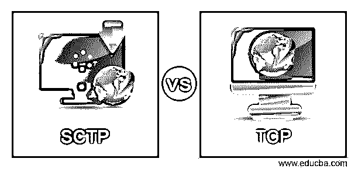
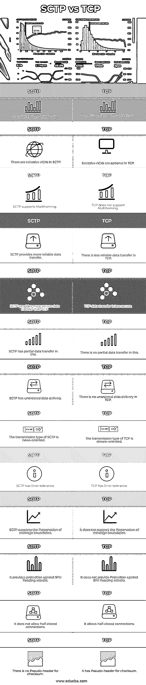

# SCTP vs TCP

> 原文：<https://www.educba.com/sctp-vs-tcp/>

## SCTP 与 TCP 的区别

下面的文章提供了 SCTP 与 TCP 的概要。SCTP 是计算机网络中面向链路的协议，允许在两个端点之间全双工传输多个数据流，从而创建网络连接。

TCP 是面向连接的协议，确保数据传输。TCP 从连接开始就确保安全的数据传输。它是一种传输层协议，允许数据包从一个位置发送到另一个位置。这是一个面向链路的协议，这意味着它在网络计算设备之间联系之前定义了连接。该接口用于 IP 协议，但它们被称为 TCP/IP。

<small>网页开发、编程语言、软件测试&其他</small>

TCP 的主要作用是从应用层收集数据。然后，它将数据分成多个数据包，给每个数据包分配一个号码，并将数据包发送到目的地。另一方面，TCP 在将数据包发送到设备层之前将其重新组装。

### SCTP 与 TCP 的直接对比(信息图)

以下是 SCTP 与 TCP 的主要区别

### SCTP 与 TCP 的主要区别

让我们讨论一下 SCTP 与 TCP 之间的一些主要区别

*   多宿主是 SCTP 引入的第一个功能。多宿主要求一个连接的两个端点声明多个接口(IP 地址)。在现有接口因任何原因出现故障时，为数据提供备份路径。通信不会中断，从一个界面到另一个界面的转换也很流畅。TCP 不支持多宿主。
*   SCTP 支持多流，而 TCP 不提供多流。SCTP 不是使用单一的数据源，而是可以创建不同的数据源分别使用。这实际上并没有提高介质的速度，但它允许数据并行到达，减少了页面完全加载所需的时间。这个特性还防止控制包被数据包阻塞，这是经常发生的事情。
*   TCP 容易受到拒绝服务攻击，这种攻击锁定服务器的资源并阻止其他人访问它，这是非常容易受到攻击的。SCTP 使用 4 次握手，在握手结束时分配资金，而不是 TCP 使用的 3 次握手。因此，SCTP 不容易受到拒绝服务攻击。
*   TCP 中的数据以数据包的形式到达。数据包具有一定的大小，因此长流将被分割以匹配，而短流将被拼接在一起。为了完全区分不同的消息，应用层必须支持消息组帧。SCTP 使用消息组帧，确保每条消息发送出去时的大小与接收时的大小相同。
*   SCTP 已将订购送货作为一种选择。在某些情况下，需要订购交付。这就是 TCP 中需要它的原因。但是，在一些不需要排序的情况下，禁用此功能将释放资源。通过可选的订单交付，SCTP 提供了满足各种条件的灵活性。
*   SCTP 有无序的数据传输。而在 TCP 中没有无序的数据传输。
*   SCTP 的传播类型是新闻导向型。另一方面，TCP 的传输类型是面向字节的。
*   SCTP 提供容错功能。TCP 没有容错功能。
*   SCTP 保留消息边界，而 TCP 保留消息边界。
*   SCTP 针对 SYN 泛洪攻击提供保护。另一方面，TCP 不提供针对 SYN 泛洪攻击的保护。
*   SCTP 不允许半封闭连接，而 TCP 允许半封闭连接。
*   SCTP 没有用于校验和的伪报头。TCP 具有用于校验和的伪报头

### SCTP 与 TCP 的对比表

下表展示了 SCTP 与 TCP 之间的详细比较

| **Sr 号** | **SCTP** | **TCP** |
| **1** | 它支持多流。 | 它不支持多流。 |
| **2** | 在 SCTP 有选择性的 ack。 | 选择性 ack 在 TCP 中是可选的。 |
| **3** | SCTP 支持多宿主。 | TCP 不支持多宿主。 |
| **4** | SCTP 提供更可靠的数据传输 | TCP 中的数据传输不太可靠。 |
| **5** | SCTP 提供比 TCP 更安全的数据传输。 | TCP 数据传输不太安全。 |
| **6** | SCTP 在这有部分数据传输。 | 这里没有部分数据传输。 |
| **7** | SCTP 有无序的数据传输。 | TCP 中没有无序的数据传递。 |
| **8** | SCTP 的传播类型是新闻导向型。 | TCP 的传输类型是面向流的。 |
| **9** | SCTP 有容错能力 | TCP 具有容错能力 |
| **10** | SCTP 支持保留消息边界 | 它不支持保留消息边界 |
| **11** | 它针对 SYN 泛洪攻击提供保护 | 它不提供针对 SYN 泛洪攻击的保护 |
| **12** | 它不允许半封闭连接 | 它允许半封闭连接 |
| **13** | 校验和没有伪标头。 | 它具有用于校验和的伪报头。 |

### 结论

在本文中，我们看到了 SCTP 和 TCP 之间的主要区别。SCTP 在几个方面相当于 TCP。然而，由于我们长期使用 TCP，过渡到高级版本是很困难的。尽管如此，SCTP 的好处最终会吸引兴趣和用户。我希望这篇文章对你有所帮助。

### 推荐文章

这是一个 SCTP vs TCP 的指南。在这里，我们通过信息图和比较表来讨论 SCTP 与 TCP 的主要区别。您也可以看看以下文章，了解更多信息–

1.  [OSPF vs 瑞普](https://www.educba.com/ospf-vs-rip/)
2.  [Verilog vs VHDL](https://www.educba.com/verilog-vs-vhdl/)
3.  [Minitab vs SPSS](https://www.educba.com/minitab-vs-spss/)
4.  [OpenGL vs DirectX](https://www.educba.com/opengl-vs-directx/)

