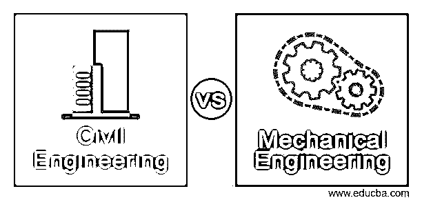
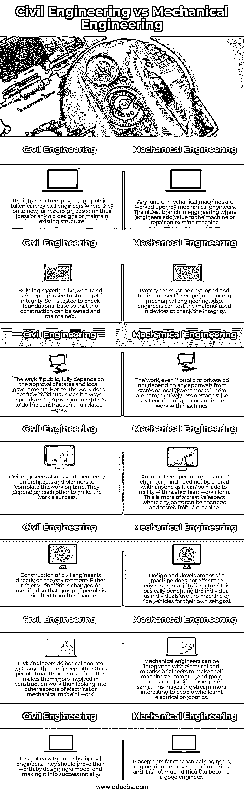

# 土木工程 vs 机械工程

> 原文：<https://www.educba.com/civil-engineering-vs-mechanical-engineering/>

## 土木工程与机械工程的区别

以下文章提供了土木工程与机械工程的概要。土木工程是研究建筑物、桥梁、公路和任何物理结构的设计和建造，以便定期对它们进行适当的维护。土木工程是工程学的一个分支，它以建造房屋、新道路和任何建筑的形式帮助人们提高生活水平。机械工程研究由机械工程师设计、制造和维护的机器。任何运动的物体都可以在机械工程中进行研究，在机械工程中，人体本身被看作是一台机器。这结合了物理和数学，形成机械公式来解决任何问题。

### 土木工程与机械工程的直接对比(信息图)

以下是土木工程与机械工程之间的 7 大区别:

<small>网页开发、编程语言、软件测试&其他</small>

### 土木工程与机械工程的主要区别

让我们讨论一下土木工程与机械工程之间的一些主要区别:

*   土木工程师的工作帮助一群人改善生活方式，过上更好的生活。但是，检查所用材料的质量和测试结构所能承受的重量是很重要的。如果发生什么意外，影响的是人群，伤亡不会是个小数目。在向公众开放之前做好所有的检查是非常重要的。另一方面，机械工程师在设计机器时不需要担心更大的社区。它可以是个人的，如汽车，也可以是使用机器的公司。如果机器有问题，可以拿去维修，但不会像土建那样造成更大的伤亡。
*   机械工程与电气和机器人技术相结合，使机械工作更有趣，并增加了同一类别的人数。这使得机械流对人们来说看起来更现代，他们被吸引到同一个流中工作。电气和机器人工程师也可以通过为机器添加电气附件或为机器创建自动化设计来从事机械工作。土木工程师不与任何其他工程师群体一起工作，因此其他群体的人也不能与他们一起改进他们的施工。使建筑变得更好的全部责任只取决于土木工程师。
*   桥梁、高速公路、建筑物的建设涉及土木工程，其中有诸如建筑师方面、环境因素、设计、土壤力学和水资源等类别。所有这些都是使建设成功的重要因素。建筑物的设计对公众来说是很重要的。机械工程包括力学、运动学、水力学、分析技能和材料研究。一旦机器设计好了，知道机器是如何利用机械动力使其工作的就很重要了。热力学是另一个领域，对于机械工程师来说，了解机器的脉动是非常重要的。
*   土木和机械流本身是独特的。当土木工程需要较长的时间来完成时，机械工程大多很短。数学和物理成为机械工程的核心，而土木工程师应该知道数学、设计和基础设施，以完成建设。这些领域在本质上是广阔的，一条河流可以使另一条受益。由机械工程师设计的机动车只能在土木工程师修建的道路上行驶。

### 土木工程与机械工程对照表

我们来讨论一下土木工程与机械工程的顶级对比:

| **土木工程** | **机械工程** |
| 基础设施，无论是私人的还是公共的，都由土木工程师负责，他们建造新的形式，基于他们的想法或任何旧的设计进行设计，或者维护现有的结构。 | 任何一种机械都是由机械工程师操作的。工程学中最古老的分支是工程师为机器增值或修理现有机器。 |
| 木材和水泥等建筑材料用于结构完整性。测试土壤以检查地基，以便测试和维护建筑。 | 原型必须开发和测试，以检查其在机械工程中的性能。此外，工程师可以测试设备中使用的材料，以检查其完整性。 |
| 这项工作如果公开，完全取决于州和地方政府的批准。因此，工程不是连续不断的，因为它总是依赖政府的资金来进行建设和相关工程。 | 这项工作，无论是公共的还是私人的，都不需要州或地方政府的批准。相对来说，像土木工程这样用机器继续工作的障碍较少。 |
| 土木工程师也依赖建筑师和规划师来按时完成工作。他们互相依赖以使工作成功。 | 一个机械工程师头脑中产生的想法不需要与任何人分享，因为他/她可以独自努力将它变成现实。这是一个更有创造性的方面，任何部分都可以从机器上改变和测试。 |
| 土木工程师的建设是直接对环境的。要么改变环境，要么修改环境，使一群人从改变中受益。 | 机器的设计和开发不会影响环境基础设施。这基本上是造福个人，因为个人使用机器或乘坐车辆为自己的目标。 |
| 土木工程师不与任何其他工程师合作，除了他们自己的人。这使他们更多地参与建筑工作，而不是研究电气或机械工作模式的其他方面。 | 机械工程师可以与电气和机器人工程师相结合，使他们的机器自动化，并对使用这些机器的个人更有用。这使得学习电气或机器人技术的人对这种流更感兴趣。 |
| 土木工程师不容易找到工作。他们应该通过设计一个模型并使之取得初步成功来证明自己的价值。 | 任何小公司都可以找到机械工程师的职位，成为一名优秀的工程师并不难。 |

### 结论

这两种工程都很重要，而且在某些方面都很相似。土木和机械工程师可以把他们的设计建成真实的形式并加以利用。此外，这两个流派都在利用分析和数学技能来设计和建造结构和机器。

### 推荐文章

这是一本关于土木工程和机械工程的指南。这里我们分别讨论信息图和比较表的主要区别。您也可以看看以下文章，了解更多信息–

1.  [Java vs PHP](https://www.educba.com/java-vs-php/)
2.  [核心 Java vs Java](https://www.educba.com/core-java-vs-java/)
3.  [Java vs Java EE](https://www.educba.com/java-vs-java-ee/)
4.  [UML 聚合与组合](https://www.educba.com/uml-aggregation-vs-composition/)

