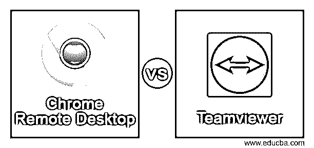
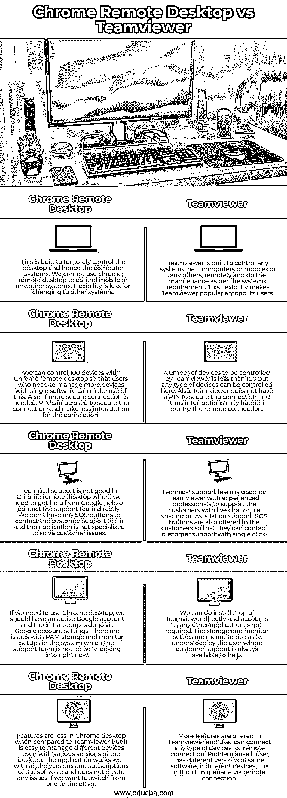

# Chrome 远程桌面 vs Teamviewer

> 原文：<https://www.educba.com/chrome-remote-desktop-vs-teamviewer/>

## Chrome 远程桌面与 Teamviewer 的区别

以下文章提供了 Chrome 远程桌面与 Teamviewer 的概要。Chrome 桌面视图的扩展，从远程中心而不是桌面前的人来控制它，这被称为 Chrome 远程桌面视图。这也可以用来从任何其他地方通过手机或平板电脑通过 Chrome 远程桌面应用程序访问系统。为了维护计算机和任何其他系统，使用 Teamviewer 远程访问和控制计算机软件进行任何活动。2005 年发布的自由软件可以在所有的操作系统中运行。它在互联网的帮助下工作，也可以用于会议和文件共享。

### Chrome 远程桌面与 Teamviewer 的面对面比较(信息图表)

以下是 Chrome Remote Desktop 与 Teamviewer 之间的 5 大区别:

<small>网页开发、编程语言、软件测试&其他</small>

### Chrome 远程桌面与 Teamviewer 的主要区别

让我们讨论一下 Chrome Remote Desktop 与 Teamviewer 之间的一些主要区别:

*   我们可以在 Teamviewer 白板的帮助下，通过远程访问管理系统，让用户看到桌面的问题。此外，我们可以使用拖放功能复制文件，这样文件共享不会花费太多时间。Chrome 桌面上没有白板，这使得用户很难理解这个问题。此外，在 chrome desktop 中，对于其他最终用户来说，屏幕似乎没有滞后，他们无法解决这个问题。
*   Chrome desktop 通过一次共享所有屏幕并通过应用程序进行多任务处理，可以轻松监控不同的屏幕。我们甚至可以在移动设备上做同样的事情。这有助于了解通过 Chrome 桌面管理的所有系统的状态。Teamviewer 中也有监控功能，但效率不如 Chrome 桌面。Chrome 桌面不提供提醒，让用户检查中间的应用程序，以了解 Teamviewer 管理的系统的状态。
*   Teamviewer 易于进行远程管理，甚至有助于大文件的文件传输。此外，我们可以通过 Teamviewer 使用多平台远程控制和集中的仪表板来管理远程服务器。屏幕共享和即时消息服务使 Teamviewer 对用户更有吸引力。使用 Chrome remote desktop，我们无法管理服务器，也无法传输大文件。但是，我们可以通过智能卡进行身份验证，也可以访问关机或休眠的计算机，并轻松管理它们。Chrome remote desktop 提供 Active Directory，让客户可以轻松了解所有可用的功能。
*   Chrome remote desktop 只需一个谷歌账户就能轻松使用。不需要任何事先培训，因为初学者很容易理解和管理任何距离的桌面。chrome desktop 不需要许可，可以在系统中轻松管理。Teamviewer 对于地理覆盖范围较大的设备非常有用。旅行时可以降低成本，用户甚至可以从任何地理位置管理移动电话。
*   任何拥有谷歌账户的人都可以使用谷歌 chrome 远程桌面，因为它只需要一个谷歌账户。Teamviewer 是免费提供的，需要订阅。我们有业务计划、公司计划和高级计划，其中 Teamviewer 可用于通过一个软件控制多达 500 台设备。价格从 50 美元到 200 美元不等，用户数量最多可达 300 人。

### Chrome 远程桌面与 Teamviewer 对比表

让我们来讨论一下 Chrome Remote Desktop 与 Teamviewer 之间的主要对比:

| **Chrome 远程桌面** | **Teamviewer** |
| 这是为了远程控制桌面和计算机系统而设计的。我们不能使用 chrome 远程桌面来控制手机或任何其他系统。转换到其他系统的灵活性较低。 | Teamviewer 可以远程控制任何系统，无论是电脑、手机还是其他系统，并根据系统要求进行维护。这种灵活性使得 Teamviewer 深受用户欢迎。 |
| 我们可以用 Chrome 远程桌面控制 100 台设备，这样需要用单一软件管理更多设备的用户就可以利用这一点。此外，如果需要更安全的连接，可以使用 PIN 来保护连接并减少连接中断。 | 由 Teamviewer 控制的设备数量少于 100 台，但在这里可以控制任何类型的设备。此外，Teamviewer 没有 PIN 来保护连接，因此在远程连接过程中可能会发生中断。 |
| Chrome remote desktop 的技术支持不好，我们需要从 Google help 获得帮助，或者直接联系支持团队。我们没有任何 SOS 按钮来联系客户支持团队，该应用程序也不是专门用来解决客户问题的。 | 技术支持团队非常适合 Teamviewer，有经验丰富的专业人员为客户提供实时聊天、文件共享或安装支持。还为客户提供了 SOS 按钮，这样他们只需单击一下就可以联系客户支持。 |
| 如果我们需要使用 Chrome 桌面，我们应该有一个活跃的谷歌帐户，初始设置是通过谷歌帐户设置完成的。系统内存存储和显示器设置存在问题，支持团队目前并未积极调查。 | 我们可以直接安装 Teamviewer，不需要任何其他应用程序中的帐户。存储和显示器设置旨在便于用户理解，客户支持随时可以提供帮助。 |
| 与 Teamviewer 相比，Chrome desktop 的功能较少，但即使使用不同版本的桌面，也很容易管理不同的设备。该应用程序适用于所有版本和订阅的软件，如果我们想从一个版本切换到另一个版本，不会产生任何问题。 | Teamviewer 提供了更多功能，用户可以连接任何类型的设备进行远程连接。如果用户在不同的设备上有相同软件的不同版本，问题就出现了。很难通过远程连接进行管理。 |

### 结论

这两个应用程序各有利弊，但 Chrome 桌面的免费订阅和 Teamviewer 的众多功能对用户来说很有吸引力。当需求很简单时，Chrome desktop 就能满足需求，如果用户越来越多，Teamviewer 就是一个不错的解决方案。

### 推荐文章

这是 Chrome 远程桌面与 Teamviewer 的对比指南。这里我们分别讨论信息图和比较表的主要区别。您也可以看看以下文章，了解更多信息–

1.  [Java vs PHP](https://www.educba.com/java-vs-php/)
2.  [核心 Java vs Java](https://www.educba.com/core-java-vs-java/)
3.  [Java vs Java EE](https://www.educba.com/java-vs-java-ee/)
4.  [UML 聚合与组合](https://www.educba.com/uml-aggregation-vs-composition/)

