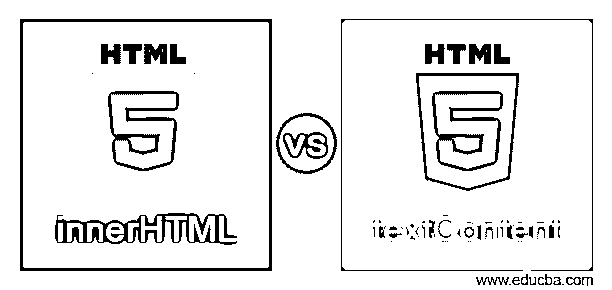
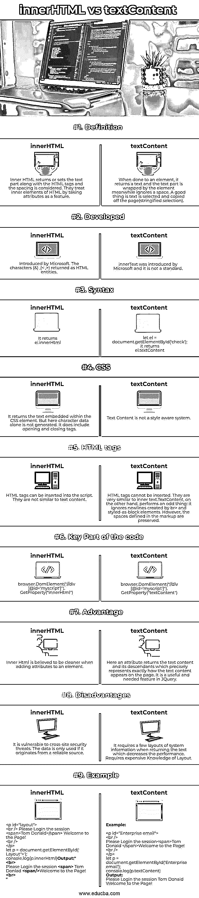
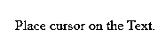
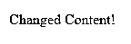
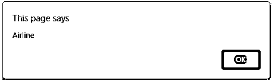
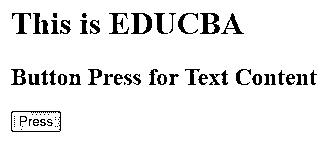
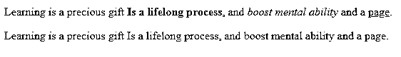

# innerHTML 与 textContent

> 原文：<https://www.educba.com/innerhtml-vs-textcontent/>




## innerHTML 与 textContent 的定义

元素及其所有子元素包含的所有文本都被称为文本内容，当通过元素的 text contents 属性访问时，文本中的空白在所有支持的浏览器中都会不断减少。而 inner HTML 返回所有的文本和 HTML 标签，标签被一个元素包围。此属性更改元素内的文本内容。与 text Content 属性不同，inner HTML 完全按照原样返回元素内部的所有内容，包括 HTML。

### innerHTML 与 textContent 的直接比较(信息图表)

以下是 innerHTML 和 textContent 之间的 9 大区别:

<small>网页开发、编程语言、软件测试&其他</small>




### innerHTML 与 textContent 的比较表

下表给出了内部 HTML 和文本内容之间的比较。让我们开始吧。

| **序列号** | **文本内容** | **内部 HTML** |
| **定义** | 当对一个元素执行此操作时，它返回一个文本，文本部分被该元素换行，同时忽略一个空格。一件好事是文本被选中并从页面上复制下来(字符串化选择)。 | Inner HTML 返回或设置文本部分以及 HTML 标记，并考虑间距。他们通过将属性作为一种特征来对待 HTML 的内部元素。 |
| **发达** | InnerText 是由微软推出的，它不是一个标准。 | 由微软推出。作为 HTML 实体返回的字符(&)、(< ,>)。 |
| **语法** | 

```
let el = document.getElementById('check');
```

它回来了el.textContent |  它回来了el.innerHtml |
| **CSS** | Text Content is not a style aware system. | 它返回 CSS 元素中嵌入的文本。但是这里不仅仅生成字符数据。它包括开始和结束标记。 |
| **HTML 标签** | 无法插入 HTML 标记。它们非常类似于内部文本。另一方面，TextContent 执行一件奇怪的事情:它忽略由 br >和 styled-as-block 元素创建的换行符。但是，标记中定义的空格会被保留。 | HTML 标签可以插入到脚本中。它们不同于文本内容。 |
| **代码的关键部分** | 

```
browser.DomElement("//div
[@id='myscript']"). GetProperty("textContent")
```

 | 

```
browser.DomElement("//div
[@id='myscript']"). GetProperty("innerHtml")
```

 |
| **优势** | 这里，属性返回文本内容及其后代，精确地表示文本内容在页面上的显示方式。这是 JQuery 中一个有用且必需的特性。 | 当向元素添加属性时，内部 Html 被认为是更干净的。 |
| **缺点** | 当返回文本时，它需要一些系统信息的布局，这会降低性能。需要昂贵的布局知识。 | 它容易受到跨站点安全威胁。只有来源可靠的数据才会被使用。 |
| **例子** | **Example:**

```
<p id="Enterprise email">
<br />
Please Login the sessionTom Donald Welcome to the Page!
<br />
</p>
let p = document.getElementById('Enterprise email');
console.log(p.textContent)
```

**输出:**请登录会话汤姆唐纳德欢迎来到页面！ | 

```
<p id="layout">
<br /> Please Login the session Tom Donald Welcome to the Page!
<br />
</p>
let p = document.getElementById(' Layout">');
console.log(p.innerHtml)Output:" <br>Please Login the session  Tom Donlad Welcome to the Page!<br>"
```

 |

### innerHTML 与 textContent 的主要区别

1.元素的 innerHTML 属性获取或设置元素的 HTML 内容。因为 textContent 元素不会自动编码和解码文本，所以我们只能操作元素的内容部分。
2。文本内容只允许您将纯文本写成字符串，但是 innerHTML 提供了一种更直接、更简单的方法来创建字符串形式的 HTML 模板并将它们插入 DOM。
3。尽管 innerHTML 并不是在所有情况下都完全安全，但它在其他情况下也很有用，比如在不捕获用户输入的网站上添加静态数据。
4。更改时，文本内容会移除子节点。文本内容有好的表现有它的价值不被解析。它阻止了 XSS 的袭击。
5。与 innerText 不同，文本内容不知道 CSS 样式，也不会导致重排。只有 HTMLElement 对象有 innerText，而所有节点对象都有 textContent。
6。Internet Explorer 支持 InnerHtml，而 IE 不支持 textContent 属性。
让我们从展示每个属性如何工作的 HTML 脚本开始。

示例:

#### 示例#1

```
demo.html
<!DOCTYPE html>
<html>
<body>
<p id="click" onclick="myclick()">Place cursor on the Text.</p>
<script>
function myclick() {
document.getElementById("click").textContent = "Changed Content!";
}
</script>
</body>
</html>
```

**解释**

脚本要求单击短语，内容被更改为文本，输出如下所示:

**输出:**







#### 实施例 2

**air.html**

```
<!DOCTYPE html>
<html>
<body>
Airline Ticket Reservation
<button onclick="reservation();">inner</button>
<button onclick="cancel();">textContent</button>
<script>
function reservation()
{
var elt = document.getElementById("exid");
alert(elt.innerText);
}
function cancel()
{
var ele1 = document.getElementById("exid");
alert(ele1.textContent);
}
</script>
</body>
</html>
```

**解释**

上面的示例代码显示了 innerHTML 和文本内容格式。因此，当提交一个按钮时，页面会指向显示文本内容的对话框。

**输出:**


点击内部按钮后




点击文本内容按钮后


#### 实施例 3

**edu.html**

```
<!DOCTYPE html>
<html>
<head>
<title>
HTML textContent Property Demo
</title>
</head>
<body>
<h1>This is EDUCBA</h1>
<h2>Button Press for Text Content</h2>
<button id = "edu" onclick = "Myeducba()">
Press
</button>
<p id = "exam"></p>
<script>
function Myeducba() {
var tt =
document.getElementById("edu").textContent;
document.getElementById("exam").innerHTML = text;
}
</script>
</body>
</html>
```

**解释**

文本内容返回正在剥离标记标签的脚本中所有文本节点的连接文本。在上面的脚本中，当一个按钮被点击时，它显示 HTML 标签中的文本，而不是标记标签。因此，输出如下所示:

**输出:**




#### 实施例 4

**page.html**

```
<html>
<body>
<p>
Learning is a precious gift <strong>Is a lifelong process</strong>,
and <em> boost mental ability</em> and a <a href="#">page</a>.
</p>
<p></p>
</body>
<script>
const a1 = document.querySelectorAll("p")[0];
const a2 = document.querySelectorAll("p")[1];
a2\. textContent = a1.textContent;
</script>
</html>
```

**解释**

我们可以看到，当我们执行上面的例子时，上面段落的格式已经从下面段落中删除了。这意味着我们不能使用 textContent 用 HTML 替换文本。

**输出:**




### 结论

因此，在本文中，我们学习了如何使用内部 Html 和文本内容的 JavaScript 属性来获取文本节点和 Html 元素及其后代。InnerHTML 更加通用，因为它允许更有创造性。如果用户只是想返回文本内容，那么可以使用 text content。因为我们有更多的 JavaScript 属性，我们在上一篇文章中已经讨论过了，这取决于我们更喜欢的属性的情况。

### 推荐文章

这是一个关于 innerHTML 和 textContent 的指南。这里我们分别讨论 innerHTML 和 textContent 在信息图和比较表方面的主要区别。您也可以看看以下文章，了解更多信息–

1.  [MapReduce vs spark](https://www.educba.com/mapreduce-vs-spark/)
2.  [PostgreSQL 数据库 vs 模式](https://www.educba.com/postgresql-database-vs-schema/)
3.  [NFS vs 中小企业](https://www.educba.com/nfs-vs-smb/)
4.  [焦虑 vs 码头](https://www.educba.com/ansible-vs-docker/)


