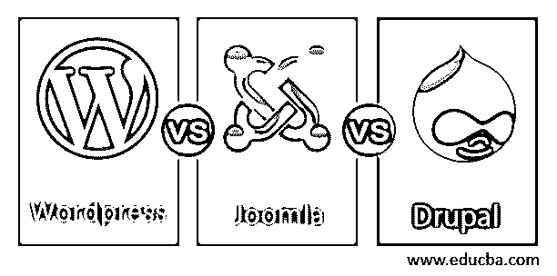
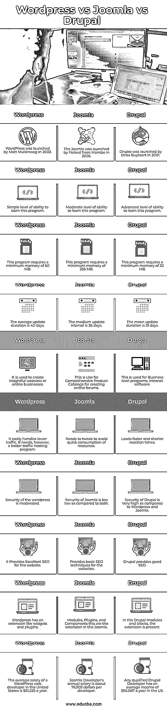

# WordPress vs Joomla vs Drupal

> 原文：<https://www.educba.com/wordpress-vs-joomla-vs-drupal/>

## WordPress vs Joomla vs Drupal 的区别

WordPress、Joomla 和 Drupal 都是根据 GPL 许可的开源自由软件网站。因此您可以免费下载、使用和更改应用程序。在 21 世纪的前十年，WordPress、Joomla 和 Joomla 这三个 CMS 应用程序都发布了。Drupal 是由 Dries Buytaert 在 2001 年推出的，而马特·莫楞威格和 Mambo 团队分别在 2003 年和 2005 年发布了 WordPress 和 Joomla。在不到二十年的时间里，网站制作的方式已经随着这些 CMS 技术而改变。CMS 系统已经成为普通用户理想的非编码网站平台，它易于快速定制，操作简单且经济实惠。在这个主题中，我们将学习 WordPress vs Joomla vs Drupal。

### 什么是 WordPress？

WordPress 是世界上最常见和免费的 CMS 开源软件。它最初是一个博客网站，但几年来已经大大增加了功能。它现在是内容管理的完整平台。你必须把它安装在网络服务器上才能在 WordPress 上运行。

<small>网页开发、编程语言、软件测试&其他</small>

### Joomla 是什么？

Joomla 是另一个常见的 CMS，它允许你创建一个网站和不同种类的商业在线应用程序。它很容易在大多数网站上运行，因为它使用简单，是一个非常详细的免费 CMS 工具。

### Drupal 是什么？

Drupal 是一个 web 开发开源框架，用于构建互联网用户社区和内容管理系统。Drupal CMS 可以从一个基本的博客设置为大型组织使用的内容存储库。Drupal 可以控制所有高流量的网站，几乎可以针对任何视觉设计进行定制。您还可以使用各种插件定制根文件。CMS 可能会有很大的改进。

### WordPress vs Joomla vs Drupal 的面对面比较(信息图)

以下是 WordPress vs Joomla vs Drupal 的顶级对比:

### WordPress 与 Joomla 和 Drupal 的主要区别

以下是 WordPress 与 Joomla 和 Drupal 的主要区别:

1.  WordPress 是 CMS 的理想选择，安装简单快捷。WordPress 对于初学者来说是一个优秀的 CMS，它可以快速设置，易于定制，有数百万个不同的模板。而 Joomla 是为客户建立社交媒体网络或电子商务商店的最佳方式。这对任何懂 PHP 语言的人来说都是最好的，因为 PHP 语言很容易使用。另一方面，Drupal 是资源最多但只适合专业 web 用户和程序员的系统。
2.  WordPress 和 Drupal 为网站提供了优秀的 SEO，而 Joomla 提供的 SEO 技术只是基础水平。
3.  WordPress 要求最低 60 MB 的内存；另一方面，运行 Joomla 所需的最低内存是 256 MB，对于 Drupal 来说是 32 MB。
4.  WordPress 支持 MySQL DBMS，Joomla 支持 MySQL、SQLServer、SQLAzure、PostgreSQL、SQLite 等各种 DBMS，而 Drupal 支持 MySQL、PostgreSQL、SQLite。
5.  WordPress 提供的安全性是中等的，而 Joomla 提供的安全性较低。另一方面，Drupal 是其中最安全的。

### WordPress vs Joomla vs Drupal 对比表

现在，让我们在下表中进行比较

| **WordPress** | **Joomla** | **Drupal** |
| WordPress 是由 Matt Mullenwag 于 2003 年推出的。 | Joomla 于 2005 年由 Mambo 公司推出。 | Drupal 由 Dries Buytaert 于 2001 年推出。 |
| 学习这个程序的简单能力水平 | 中等水平的学习能力 | 学习该程序的高级能力 |
| 这个程序至少需要 60 MB 的内存 | 这个程序至少需要 256 兆的内存 | 这个程序至少需要 32 MB 的内存 |
| 平均更新持续时间为 42 天。 | 中间更新间隔为 36 天。 | 平均更新持续时间为 51 天。 |
| 它被用来创建有见地的网站或在线业务。 | 这用于创建在线论坛的综合产品目录。 | 这用于业务级程序、内部网软件。 |
| 它很容易处理较低的流量。它需要；然而，一个更好的流量托管程序。 | It needs to tweak to avoid quick consumption of resources. | 加载速度更快，反应时间更短。 |
| wordpress 的安全性是适度的。 | 与两者相比，Joomla 的安全性太低 | 与 WordPress 和 Joomla 相比，Drupal 的安全性非常高 |
| 它为网站提供了优秀的搜索引擎优化 | 为网站提供基本的搜索引擎优化技术 | Drupal 提供了很好的 SEO |
| WordPress 有一个类似小部件和插件的扩展。 | 模块、插件和组件这是 Joomla 中的扩展 | 在 Drupal 模块和块中，存在扩展。 |
| 在美国，WordPress web 开发人员的平均年薪是 61，225 美元。 | Joomla 开发者的年薪大约是每个开发者 76，903 美元 | 任何合格的 Drupal 开发人员在美国的平均年收入为 96.067 美元。 |

### 结论

不可否认，这三个平台是当今最好的 CMS 平台，因此没有必要选择其中任何一个。所以在这篇文章中，我们看到了 WordPress、Joomla 和 Drupal 之间的各种差异。你可以挑选任何真正符合你需求的人。

### 推荐文章

这是 WordPress vs Joomla vs Drupal 的指南。在这里，我们讨论 WordPress 和 Joomla，以及 Drupal 与信息图和比较表的主要区别。您也可以看看以下文章，了解更多信息–

1.  [WordPress vs WebFlow](https://www.educba.com/wordpress-vs-webflow/)
2.  [WordPress vs Blogger](https://www.educba.com/wordpress-vs-blogger/)
3.  [WordPress vs Wix](https://www.educba.com/wordpress-vs-wix/)
4.  [Squarespace vs WordPress](https://www.educba.com/squarespace-vs-wordpress/)

