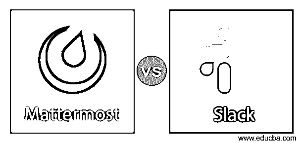
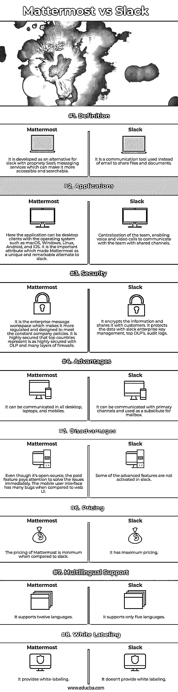

# 最大与最小

> 原文：<https://www.educba.com/mattermost-vs-slack/>

## Mattermost 和 Slack 的区别

下面的文章提供了 Mattermost 与 Slack 的概要。企业在要求越来越高的在线环境中进行协作和联系的能力。不断增长的需求通过实施 slack 来弥补，slack 创建了一个虚拟和数字直播站，用于即时、私人和群组消息传递，以在合并的第三方服务中共享文件。它可以以多种方式支持企业的任务。这里是关于消息平台的开源私有云。但随后 mattermost 被部署到大规模企业，所有受益者都由 slack 提供。

### 材料过剩与可宽限的直接比较(信息图)

以下是 Mattermost 与 Slack 之间的 8 大区别:

<small>网页开发、编程语言、软件测试&其他</small>

### Mattermost 与 Slack 的主要区别

Slack 和 Mattermost 基于一种云，它使用软件作为消息传递系统的服务，支持组织进行在线通信。让我们讨论一下 Mattermost 与 Slack 之间的一些主要区别:

*   **定义和工作:** Slack 存储了对话中所有的历史记录和可搜索项，这使得文件共享和应用程序集成成为可能，从而提供了一个巨大的 API。因此，开发者可以创建新的应用来为系统和企业有效地制定计划和任务。Mattermost 提供专为组织设计的解决方案，并专注于成为与应用内置企业交互的基本方法。组织中的消息传递产品提供了安全性、隐私性、可扩展的配置和法律遵从性。
*   **敏捷:**敏捷和效率是由 slack 和 Mattermost 这两个现代协会提供的。mattermost 中的自托管技术提供了不平等和不匹配的控制、法律保障和合规性。但是它也帮助团队交付增强质量的软件，以满足安全性和可伸缩性的需求，并增加隐私。
*   **开源可用性:**内部 Mattermost 私有云的部署提供了现代通信和强大隐私的优势。slack 和 Mattermost 都使用开放软件，通过管理整个代码控制和可审计性，使团队能够集成和整合 ChatOps、对话式部署、DevOps 和持续开发的高性能工作流。Slack 可以跨平台，也支持自托管。
*   安全:slack 和 mattermost 的安全特性由他们的团队不断更新，为用户提供更多隐私。slack for security 选项中包含的趋势功能是用户设备上的二次身份验证。这种类型的二次认证是触摸 ID、密码生成、面部 ID。它具有复制消息的能力，并阻止未经验证的文件下载。因此可以阻止盗版数据和未授权设备以及数据的复制。但是在这里，Mattermost 提供了运行在防火墙后面的更高级的通信。机密数据的重要通信和传输在现有的 IT 规范和安全性下工作。基于单一租户系统部署混合云、公共云和私有云，可完全访问和完全控制源代码。
*   **隐私:**组织更有可能了解公司的 IP 地址、使用顺序、消息内容、软件即服务。Mattermost 提供了增强的隐私和安全性，同时又不影响客户的需求。Slack 提供了一个最大的防火墙，它有一个强有力的政策，即不与任何第三方共享信息或控制信息。客户说明、与他人的合作、与关联公司的整合是一些不应再共享的机密数据。
*   **法律合规:** Slack 是 17 a-4，FINRA 可配置，使团队变得更加协作，并且仍然同意合规政策。量身定制的 FEDRAMP 和跟踪将在温和的 FEDRAMP 获得更多授权，使其在以合规方式使用该平台的公共部门中更加结构化。Slack 获得了 ISO 27001 和 ISO 27018，后者提供了 4 级安全性。它提供给支付卡行业、商户数据、信用卡信息。但它目前不是 PCI 服务提供商。消费者数据保护政策，GDPR，非披露条款是不变的和复杂的，这使得臀位与高处罚，因为自托管属性使通信更加简化，降低了复杂性。
*   **扩展性:** Mattermost 提供企业级定制，可以端到端访问源代码。驱动程序、API、UI 文本文件是集成源阵列的几个例子。使用白色标签制作登录浏览器和移动应用程序的品牌是在企业的控制之下。slack 使用共享通道直接与团队的员工一起工作，并通过关联重要的工具和应用程序的集成来集中工作。

### Mattermost 与 Slack 比较表

让我们讨论一下 Mattermost 与 Slack 之间的主要比较:

| **属性** | **Mattermost** | **松弛** |
| **定义** | 它是作为 slack with proprietary SaaS 消息服务的替代产品开发的，这可以使它更容易访问和搜索。 | 它是一种用来代替电子邮件来共享文件和文档的通信工具。 |
| **应用程序** | 在这里，应用程序可以是带有 macOS、Windows、Linux、Android 和 iOS 等操作系统的桌面客户端。这是使 Mattermost 成为 slack 的独特而卓越的替代品的重要属性。 | 团队集中化，使语音和视频通话能够通过共享通道与团队进行交流。 |
| **安全** | 正是企业消息工作区使其更加规范，并设计为符合公司一贯的政策。它是高度安全的，顶级国家表示它是高度安全的，具有 DLP 和多层防火墙。 | It encrypts the information and shares it with customers. It protects the data with slack enterprise key management, top DLP’s, audit logs. |
| **优势** | 它可以在所有台式机、笔记本电脑和手机上进行通信。 | 它可以与主信道通信，并用作邮箱的替代品。 |
| **缺点** | 尽管它是开源的，但付费功能注重立即解决问题。与 web 用户界面相比，移动用户界面有许多缺陷。 | 一些高级功能在 slack 中没有被激活。 |
| **定价** | 与 slack 相比，Mattermost 的定价最低。 | 它有最高定价。 |
| **多语言支持** | 它支持十二种语言。 | 它只支持五种语言。 |
| **白色标签** | 它提供白色标签。 | 它不提供白色标签。 |

### 结论

对于许多商业企业来说，mattermost 比 slack 更适合于通信，因为它具有可扩展的高级特性。

### 推荐文章

这是 Mattermost vs Slack 的指南。这里我们分别用信息图和比较表来讨论 Mattermost 和 Slack 键的区别。您也可以看看以下文章，了解更多信息–

1.  [大本营 vs 懈怠](https://www.educba.com/basecamp-vs-slack/)
2.  [懈怠 vs 不和谐](https://www.educba.com/slack-vs-discord/)
3.  [特雷罗 vs 斯莱克](https://www.educba.com/trello-vs-slack/)
4.  [Yammer vs Slack](https://www.educba.com/yammer-vs-slack/)

