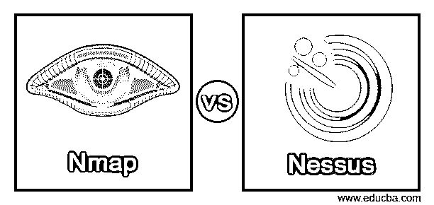
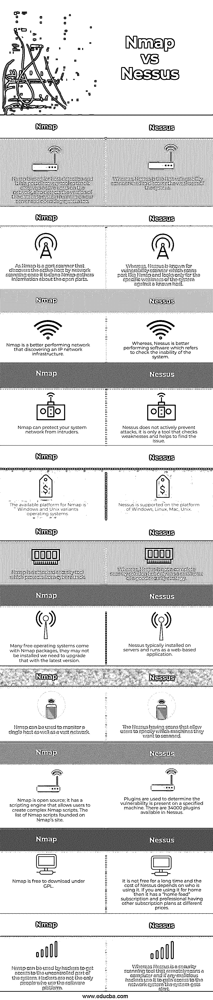

# Nmap 对 us

> 原文：<https://www.educba.com/nmap-vs-nessus/>

## Nmap 与 Nessus 的区别

Nmap(网络映射器)被定义为一种网络扫描工具，网络管理员使用它来映射他们的网络，并通过发送数据包和分析响应来发现主机和服务，它还是一种免费的开源工具，用于检查网络的能力或弱点，然而， Nessus 被定义为远程安全扫描工具，可用于扫描计算机，并在系统检测到受到攻击的可能性或黑客试图访问我们在网络中连接的任何计算机时发出警报。

### Nmap 与 Nessus 的面对面比较(信息图)

以下是 Nmap 和 Nessus 之间的主要区别。

<small>网页开发、编程语言、软件测试&其他</small>

### 主要差异

Nmap 和 Nessus 都是网络扫描工具，所以它们试图完成的任务有很大的不同。

#### 1.安全性

Nessus 是一个漏洞扫描器，漏洞是指扫描计算机和网络中的系统弱点，以识别安全性和提高系统的有效性。然而，网络映射是 Nmap 的第一个目的，它可以发现系统上的主机和服务。网络管理员和安全专业人员通常使用 Nmap 来映射他们的网络。

Nmap 确定主机的启动和关闭状态，还确定主机、网络中的服务、防火墙、操作系统和主机上的版本的意外存在。Nessus 有安全检查插件来确定系统网络的性能。

#### 2.漏洞扫描器

扫描可以保证我们系统的安全。在黑客做任何事情之前发现漏洞对于保证我们公司的数据安全和网络安全非常重要。脆弱性意味着识别网络中系统的弱点或无能。漏洞扫描可以检测出漏洞，通过使用 Nessus 工具，我们可以检测出系统的弱点，这将有助于保护我们的系统并提高系统的效率。Nessus 在一个工具中提供了许多功能，黑客可以运行完全相同的工具，这有利于了解他们扫描系统的结果。Nessus 是用来发现恶意攻击的漏洞扫描器之一。

然而，Nmap 不是一个完整的漏洞扫描器，它是一个报告工具，用于分析数据包中的服务响应，报告工具可以帮助识别网络中的漏洞。Nmap 使用脚本引擎来识别漏洞信息。

#### 3.在 Windows 上安装

在 Windows 版本发布之前，Nmap 是一个仅适用于 Unix 的工具，在发布之后，它是 Nmap 的第二大流行平台。它之所以受欢迎，是因为 Windows 用户没有编译器，并且还为想要在 Windows 上运行 Nmap 的用户维护了一个指南。Nmap 支持用于原始数据包扫描的以太网接口。扫描速度比 Unix 慢，因为 windows 网络 API 中存在缺陷。Windows 有三种安装 Nmap 的选择，可以在 https://nmap.org/download.html 的下载页面上找到，它们是 Windows 自安装程序、命令行 zip 二进制文件和可选的编译器。

然而，对于 Nessus，我们可以获得 windows 安装程序，并需要根据操作系统下载它，下载后双击安装程序，然后完成安装，Nessus 用户的欢迎向导将打开。

### Nmap 与 Nessus 对比表

| **序列号** | **Nmap** | **内苏斯** |
| **1** | Nmap 用于主机检测，它是一个端口发现工具，可以发现网络上的活动主机，还可以检测我们的服务器和操作系统上运行的数据库系统的版本。 | 而 Nessus 是第一个用来发现系统弱点的漏洞扫描器。 |
| **2** | 由于 Nmap 是一个端口扫描器，它通过网络扫描发现活动主机，一旦完成，Nmap 就收集关于开放端口的信息。 | 然而，Nessus 以漏洞扫描器而闻名，该扫描器扫描诸如 Nmap 之类的端口，并且仅针对已知主机寻找系统的特定弱点。 |
| **3** | Nmap 是发现 IP 网络基础设施的性能更好的网络。 | 然而，Nessus 是一款性能更好的软件，它可以检查系统的故障。 |
| **4** | Nmap 可以保护您的系统网络免受入侵。 | Nessus 并不主动防止攻击，它只是一个检查弱点并帮助找到问题的工具。 |
| **5** | Nmap 的可用平台是 Windows 和 Unix 变体操作系统。 | Nessus 支持 Windows、Linux、Mac、Unix 平台。 |
| **6** | Nmap 是一种标准的安全工具，可以防止网络攻击。 | 然而，Nessus 并不是一个完整的安全解决方案，只是一个好的安全策略的一小部分。 |
| Seven | 许多免费操作系统都有 Nmap 包，它们可能没有安装，我们需要升级到最新版本。 | Nessus 通常安装在服务器上，并作为基于 web 的应用程序运行。 |
| **8** | Nmap 可用于监控单个主机以及大型网络。 | Nessus 具有允许用户指定他们想要扫描的机器的扫描功能。 |
| **9** | Nmap 是开源的；它有一个脚本引擎，允许用户创建复杂的 Nmap 脚本。Nmap 网站上的 Nmap 脚本列表。 | 插件用于确定特定机器上是否存在漏洞。Nessus 中有 34000 个可用的插件。 |
| **10** | Nmap 可以在 GPL 下免费下载。 | 它不是长期免费的，Nessus 的费用取决于谁在使用它。如果你在家里使用它，那么它有一个“家庭饲料”订阅和专业有不同价格的其他订阅计划。 |
| **11** | 黑客可以利用 Nmap 来访问系统中不受控制的部分。黑客不是唯一使用软件平台的人。 | 而 Nessus 是一种安全扫描工具，它可以远程扫描计算机，如果任何恶意黑客使用它来访问网络系统，系统就会发出警报。 |

### 结论

上述文章的结论是，两者都用于检查网络安全，它们在网络安全扫描中的作用最适合我们的网络安全。我们还得出结论，在这些工具管理员手动检查网络之前，Nmap 和 Nessus 使用它们的命令来检查网络和服务器故障。

### 推荐文章

这是 Nmap vs Nessus 的指南。在这里，我们通过信息图和比较表来讨论 Nmap 和 Nessus 的主要区别。您也可以看看以下文章，了解更多信息–

1.  [MPLS vs 互联网](https://www.educba.com/mpls-vs-internet/)
2.  [conamu vs cmd](https://www.educba.com/conemu-vs-cmder/)
3.  [sprintf vs snprintf](https://www.educba.com/sprintf-vs-snprintf/)
4.  [B 树 vs 二叉树](https://www.educba.com/b-tree-vs-binary-tree/)

