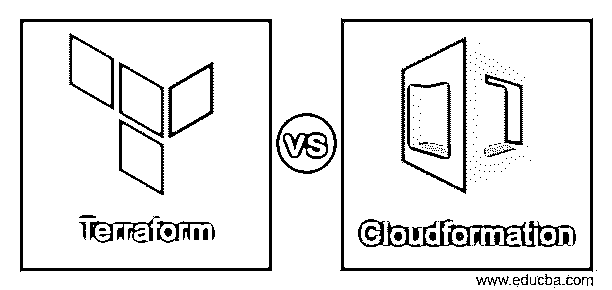
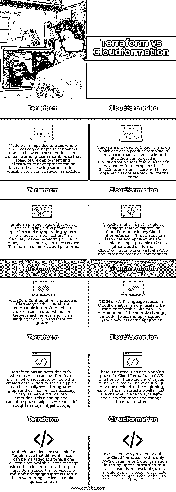

# 地形对云形成

> 原文：<https://www.educba.com/terraform-vs-cloudformation/>

## 地形与云形成的区别

基础设施是 HashiCorp 在 2014 年 7 月开发的代码软件，用户可以部署 HashiCorp 配置语言或 JSON 来部署数据中心基础设施，称为 Terraform。用户可以为基础设施提供版本号，并使用 Terraform 构建或修改基础设施，其中为此目的涉及低级和高级组件。AWS 提供的一项服务称为 CloudFormation，用户可以在其中构建任何第三方资源组，并收集所有应用程序。AWS 提供了一个模板，我们可以通过更新或创建堆栈来更新或创建 CloudFormation 的资源。

### 地形与云形成的直接对比(信息图)

以下是 Terraform 与 Cloudformation 之间的主要区别:

<small>网页开发、编程语言、软件测试&其他</small>

### 主要差异

*   Terraform 中提供了内置函数和字符串插值，使其更适合条件语句。条件循环使应用程序设计基于服务提供者的基础设施，使其在执行阶段具有视觉吸引力。这些功能有助于根据客户的需求定制应用程序，并且可以添加任意数量的提供者作为对应用程序的支持。CloudFormation 中的内置函数和字符串较少，因此它总是必须依赖 AWS 来构建任何功能或获得其他云提供商的支持。
*   我们可以在配置设置中使用 Terraform 的信息，也可以从外部导入。这使得数据在 Terraform 中可以灵活地以任何形式更新，并为基础架构提供新的或现有的 IP 地址。获取信息的数据源来自提供者，并且应该满足数据源设置的标准。关于云信息，应用程序中有一些独特的参数，数据类型被迁移到受支持的云信息中。最初必须在堆栈中定义参数，这有助于管理数据类型。用户可以通过向堆栈中的参数添加动态内容来对所需的数据类型进行自定义配置。
*   Terraform 的状态文件必须保存在一个单独的实体中，并且应注意文件不能以任何形式损坏。对于 Terraform 来说，使用这个文件非常重要。用户应该注意状态文件，当更新发生时，该文件将被更新的文件替换。但是在 CloudFormation 中，AWS 会处理状态文件，自动更新。
*   创建状态文件和文件夹是 Terraform 配置中的难点，因为它是 Terraform 工作中最重要的文件。我们可以将它存储在源代码控制系统中，但是这样就不容易对文件进行修改。在这里，我们可以使用 AWS 来管理 Terraform 的状态文件和文件夹。
*   Terraform 代码存储在 Git 存储库或 Terraform 文件夹中后，可以在不同的项目中重用。当项目以类似的方式工作时，这有助于用户编写和重用代码。这在 CloudFormation 中是不可能的，因为单个项目的代码存储在堆栈中，不能被任何其他项目重用。用户应该编写代码并将其用于单个项目。

这取决于用户使用这些云应用程序的灵活性。如果用户已经进入 AWS 并有权使用它，那么 CloudFormation 就是答案，但是如果他/她可以灵活地使用任何有第三方支持的应用程序，那么 Terraform 是更好的主意。

### 对照表

现在让我们来看一下 Terraform 和 Cloudformation 之间的比较如下:

| **地形** | **云的形成** |
| 模块被提供给用户，其中资源可以被存储在容器中并且可以被使用。这些模块可以在团队成员之间共享，以便在使用同一个模块时可以提高部署和基础设施开发的速度。可重用的代码可以保存在模块中。 | CloudFormation 提供了堆栈，可以很容易地以可重用的格式生成模板。嵌套栈和栈集可以在 CloudFormation 中使用，这样就可以从模板本身创建模板。堆栈集更安全，因此需要更多的权限。 |
| Terraform is more flexible that we can use in any cloud provider’s platform and any operating system without any modification. This flexibility makes Terraform popular in many cases. In one system, we can use Terraform in different cloud platforms. | CloudFormation 没有 Terraform 灵活，因此我们不能在任何云平台中使用 CloudFormation。虽然定制资源和应用程序可以在其他云平台上使用，但 CloudFormation 与 AWS 及其相关技术组件配合得很好。 |
| HashiCorp 配置语言与 JSON 一起使用，因为它与 Terraform 兼容，使用户能够在资源组中轻松理解和解释机器语言和人类语言。 | JSON 或 YAML 语言用于云形成，使用户在解释 YAML 时更加舒适。如果数据很大，最好在应用程序的堆栈集中使用多个资源。 |
| Terraform 有一个执行计划，用户可以执行 Terraform 计划，其中的资源可以自己创建或修改。这个计划可以通过图表直观地看到，用户可以在计划执行之前进行必要的修改。这个规划和执行阶段帮助用户决定 Terraform 基础设施。 | AWS 中没有云形成的执行和规划阶段，因此，如果在执行期间有任何要执行的更改，必须在开始时决定，以便基础架构将反映这些更改。我们不能可视化执行模式和改变基础设施。 |
| Terraform 有多个提供者，因此可以同时管理不同的集群。如果一个集群不可用，它可以通过其他集群或任何第三方提供商进行管理。支持服务是可用的，并且在所有支持服务中使用单一语法以使其看起来是唯一的。 | AWS 是 CloudFormation 唯一可用的提供者，因此只有 AWS 集群帮助 CloudFormation 建立基础设施。如果此群集不可用，用户应该等到它变得可用，并且其他提供程序不能在此处使用。 |

### 推荐文章

这是一个地形对云形成的指南。在这里，我们用信息图和比较表来讨论地形和云形成的主要区别。您也可以看看以下文章，了解更多信息–

1.  [侏儒 vs KDE](https://www.educba.com/gnome-vs-kde/)
2.  [气流 vs 詹金斯](https://www.educba.com/airflow-vs-jenkins/)
3.  [Gnome vs Xfce](https://www.educba.com/gnome-vs-xfce/)
4.  [Log4j vs Logback](https://www.educba.com/log4j-vs-logback/)

