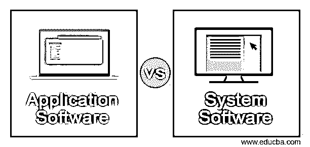
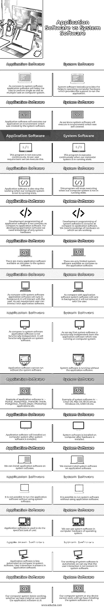

# 应用软件与系统软件

> 原文：<https://www.educba.com/application-software-vs-system-software/>

## 应用软件与系统软件的区别

应用软件和系统软件只不过是指导计算机按照指令执行特定任务的一套程序。一般来说，我们可以说应用程序和脚本是用来描述应用程序和系统软件的。系统软件只不过是系统和应用软件之间交互的软件类型，而应用软件只不过是根据用户需求运行的软件类型。基本上，系统软件是使用与系统硬件兼容的低级语言开发的。

### 应用软件与系统软件的直接比较(信息图表)

下面是应用软件和系统软件的主要区别。

<small>网页开发、编程语言、软件测试&其他</small>

### 应用软件与系统软件的主要区别

下面是应用软件与系统软件的主要区别:

*   系统软件只不过是与应用软件和系统硬件交互的软件。
*   应用软件只不过是根据用户请求与系统软件进行交互的软件。
*   系统软件基本上是为管理系统资源而设计的，比如内存和被管理的进程。
*   应用软件基本上是为满足用户在系统上执行任务的需求而设计的。
*   系统软件和应用软件的主要区别在于系统软件是用于通用目的的。而应用软件用于任何特定目的。
*   基本上系统软件都是用汇编语言之类的低级语言。而应用软件使用 Java、Python 等高级语言。
*   下面是系统软件的类型如下。

**系统软件类型:**

1.  操作系统软件
2.  编程语言翻译程序
3.  通信软件
4.  实用程序

*   众所周知，像 Windows 和 Linux 这样的操作系统将有助于利用我们计算机系统的硬件和软件。
*   编程语言翻译器将指令转换成由开发者准备的编程语言。
*   通信软件用于将数据从一个系统转换到另一个系统。
*   实用程序用于在一定时间内执行的系统维护。
*   下面是系统软件的类型如下。

**系统软件类型:**

1.  娱乐软件
2.  教育软件
3.  数据库软件
4.  电子表格软件
5.  图形软件
6.  文字处理软件

*   娱乐软件应用程序允许计算机作为娱乐工具使用。
*   教育软件应用程序允许计算机用作教学和学习工具。
*   数据库软件应用程序将数据存储在表或集合中。数据库软件的例子有 MySQL、Oracle、PostgreSQL、MongoDB 等。
*   图形应用软件将允许计算机系统绘制、编辑和查看图形。
*   与应用软件相比，系统软件更接近系统。系统软件速度快。
*   没有应用软件，我们的计算机系统可以运行，但是没有系统软件，它就不能运行。
*   应用软件容易设计。与应用软件相比，系统软件更难设计。
*   系统软件需要较大的空间来存储软件文件，而应用软件需要较小的空间来存储文件。
*   系统软件很难操作，而应用软件很容易操作。

### 应用软件与系统软件对照表

下表显示了应用软件和系统软件之间的比较。

| **Sr 号** | **系统软件** | **应用软件** |
| One | 系统软件主要是帮助操作支持应用程序运行的计算机硬件。 | 与系统软件相比，应用软件将帮助用户在计算机系统上执行单个或多个任务。 |
| Two | 众所周知，系统软件将在自己创建的环境中运行。 | 应用软件将在系统软件创建的环境中执行我们的应用程序。 |
| Three | 当我们的计算机系统处于运行状态时，这个程序会持续执行。 | 该程序不会连续执行。根据用户的要求，我们可以这样做。 |
| Four | 当我们的计算机系统不处于运行状态时，这个程序将停止执行。 | 当我们的计算机系统不处于运行状态时，应用软件也停止工作。 |
| Five | 与应用软件相比，系统软件的开发编程是复杂的。我们需要关于我们正在工作的硬件的知识。 | 与应用软件相比，应用软件的开发编程并不复杂。为了开发应用软件，我们只需要系统硬件的知识。 |
| Six | 与应用软件相比，只有有限的系统软件可用。 | 与系统软件相比，有许多应用软件可供使用。 |
| Seven | 与应用软件相比，系统软件将在后台运行，它不会与用户交互。 | 与系统软件相比，应用软件将在前台运行，它将与用户交互。根据需要，用户可以与应用软件进行交互。 |
| Eight | 我们说系统软件在功能上独立于运行在计算机系统上的应用软件。 | 与系统软件相比，应用软件在功能上不是独立。它在功能上依赖于系统软件。 |
| Nine | 系统软件在没有应用软件的情况下运行。 | 没有系统软件，应用软件就无法运行。 |
| Ten | 系统软件的例子有:–Linux 操作系统、Mac 操作系统、BIOS 设置、Windows 操作系统、UNIX 操作系统等。 | 应用软件的例子有:–MySQL、PostgreSQL、MariaDB、Oracle、PostgreSQL、media player、Photoshop 应用等。 |
| Eleven | 系统软件在硬件安装后安装在计算机上。 | 在安装系统软件之后，应用软件将被安装在计算机系统上。 |
| Twelve | 我们不能在应用软件上安装系统软件。 | 我们可以在系统软件上安装应用软件。 |
| Twelve | 可以在不使用应用软件的情况下运行系统软件。 | 不使用系统软件就不可能运行应用软件。 |
| Thirteen | 我们可以在计算机硬件或操作系统中使用系统软件。 | 应用软件用于完成用户指定的任务。 |
| Fourteen | 系统软件的工作是自动化的，我们可以说系统软件中不存在用户交互。 | 与系统软件相比，应用软件自动化程度较低。用户交互存在于应用软件中。 |
| Fifteen | 我们的计算机系统或任何设备只有在安装了系统软件后才能工作。 | 不管我们是否安装了应用软件，我们的计算机系统都会一直工作。 |

### 结论

系统软件只不过是管理计算机硬件操作的一套程序。应用软件是按照要求管理用户工作的程序。与应用软件相比，系统软件的开发更加复杂。没有系统软件，我们就无法运行我们的系统。

### 推荐文章

这是应用软件和系统软件的指南。在这里，我们用信息图和比较表来讨论应用软件和系统软件的主要区别。您也可以看看以下文章，了解更多信息–

1.  [反应自然 vs 颤动](https://www.educba.com/react-native-vs-flutter/)
2.  [Xamarin vs React Native](https://www.educba.com/xamarin-vs-react-native/)
3.  [离子 vs 反应原生](https://www.educba.com/ionic-vs-react-native/)
4.  [反应原生 vs 迅捷](https://www.educba.com/react-native-vs-swift/)

