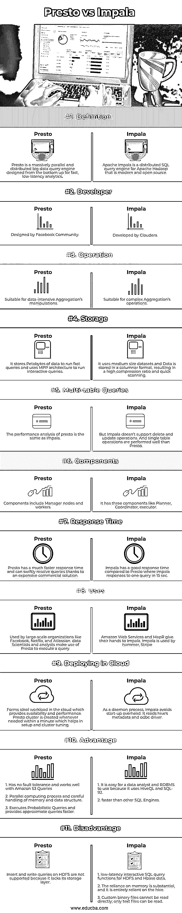

# 很快就要和 Impala 比赛了

> 原文：<https://www.educba.com/presto-vs-impala/>

## Presto 和 Impala 的区别

Impala 和 Presto(或 Presto DB)是一个分布式 SQL 查询引擎和一个原生分析数据库，它们是为对任何规模的数据进行快速分析查询而从头设计的，同时它们都很适合 BI 查询，并且分别是开源的 OLAP 引擎。亚马逊网络服务和 MapR 在不到两年的时间里都获得了对 Impala 的支持，这一事实表明了它的快速崛起。Presto 在 2012 年接管了蜂巢，比其他引擎快了 20 倍左右。Presto 不是一个数据库，但我们可以存储数据，它是基于 java 构建的，可以提供专门的分析。

### Presto 与 Impala 的面对面对比(信息图)

以下是 Presto 和 Impala 的主要区别:

<small>网页开发、编程语言、软件测试&其他</small>

### 主要差异

接下来，我们将看到 Presto 和 Impala 之间的一些关键差异。

1.  Apache Impala 是 HDFS 的现代实时查询，Presto 是开源的分布式 SQL 引擎，两者都属于大数据工具。
2.  Impala 是用 C++和 java 编写的，presto 是用 java 构建的。
3.  Presto 的独特关键因素是它可以直接处理没有 ETL 格式的文件，Impala 被认为是一个超级快的执行者。虽然它被认为更快，但 presto 更具可插拔性。Impala 拥有高效的元数据缓存。
4.  Impala 支持 HDFS 存储，而 Presto 则没有。Presto 直接与 HDFS 通信，并通过连接器与数据源通信。Presto 没有数据限制，因为我们生成每小时或每天的报告，例如，脸书用户。
5.  Presto 概念是从一个名为 Volcano 的并行数据库发展而来的，是为高速数据分析而设计的。但 Impala 是为 CDH 平台设计的 PB 级实时查询分析。Impala 是减少查询延迟的一个好选择，特别是对于并发执行。Presto 用于增加的工作量。
6.  Presto 的创建是为了使商业数据仓库中的查询处理更快。它有可能扩大组织规模，与脸书相匹配。
7.  Impala 不使用 Hive 和 MapReduce，而是更喜欢关系数据库。由于 Presto 是基于内存的，因此与 Impala 相比，它在查询时占用的内存更少。
8.  Impala 连接了 Hadoop 固有的安全性和 Kerberos 进行认证。这里控制数据访问。LDAP 认证很快就完成了。
9.  Presto 支持 ORC、Parquet 和 RCFile 文件格式。因此，它被认为是一个神奇的查询引擎，也消除了数据转换的需求。Impala 支持 RCFile、Parquet、Avro 文件和序列文件格式。
10.  Presto 将中间结果存储在缓冲区缓存中，Impala 不使用 MapReduce 存储中间结果，而是使用内存，因此处理速度很慢。

### 对照表

一直以来，开发人员都在寻找实用高效的 SQL 引擎。Impala 和 Presto 发动机是市场上最受欢迎的发动机。我们来看一个 Presto 和 Impala 的正面对比，看看他们的见解和做法。

|  | **转眼间** | **黑斑羚** |
| **定义** | Presto 是一个大规模并行和分布式大数据查询引擎，自下而上地设计用于快速、低延迟分析**。** | Apache Impala 是 Apache Hadoop 的一个分布式 SQL 查询引擎，是一个现代的开源引擎。 |
| **开发商** | 由脸书社区设计 | 由 Cloudera 开发 |
| **操作** | 适合数据密集型聚集的操作。 | 适用于复杂聚合的操作。 |
| **存储** | 它存储数 Pb 的数据来运行快速查询，并使用 MPP 架构来运行交互式查询。 | 它使用中等大小的数据集，数据以列格式存储，因此压缩率高，扫描速度快。 |
| **多表查询** | presto 的性能分析和 Impala 一样。 | 但是 Impala 不支持删除和更新操作。并且单表操作比 Presto 执行得更好。 |
| **组件** | 组件包括管理器节点和工作器。 | 它有三个组成部分，如计划者、协调者和执行者。 |
| **响应时间** | 由于昂贵的商业解决方案，Presto 有更快的响应时间，可以迅速解决查询。 | 与 Presto 相比，Impala 有很好的响应时间，在 Presto 中，impala 在 15 秒内响应一个查询。 |
| **用途** | 被脸书、网飞和亚特兰大等大型组织使用。数据科学家和分析师利用 Presto 来执行查询。 | 亚马逊网络服务和 MapR 向 Impala 伸出援手。黑斑羚使用的是铁锤，条纹 |
| **在云端部署** | 在云中形成理想的工作负载，提供可用性和性能。Presto 集群是在一分钟内根据需要创建的，这有助于设置和集群调优。 | 作为一个守护进程，Impala 避免了启动开销。它读取 hive 的元数据和 odbc 驱动程序。 |
| **优势** | 1.Has no fault tolerance and works well with Amazon S3 Queries2.并行计算过程以及对内存和数据结构的仔细处理。3.执行概率查询并更快地提供近似查询。 | 1\. It is easy for a data analyst and RDBMS to use because it uses HiveQL and SQL-92.2.比其他 SQL 引擎更快。 |
| **缺点** | 1.不支持对 HDFS 的插入和写入查询，因为它缺少存储层。 | 1.low-latency interactive SQL query functions for HDFS and Hbase data.

2.对内存的依赖是实质性的，而且完全依赖于蜂巢。

3.无法直接读取自定义二进制文件；只能读取文本文件。

 |

**此处给出 Presto 安装:**

`$ tar  -zxf  presto-server-0.149.tar.gz
$ cd presto-server-0.149`

**Presto 服务器配置**

`$ cd etc
$ vi config.properties
coordinator = true
node-scheduler.include-coordinator = true
http-server.http.port = 8080
query.max-memory = 5GB
query.max-memory-per-node = 1GB
discovery-server.enabled = true
discovery.uri = http://localhost:8080`

**Presto 中的样本应用**

`public class Prestodemo {
public static void main(String[] args) {
Connection connection = null;
Statement sta = null;
try {
Class.forName("com.facebook.presto.jdbc.PrestoDriver");
connection = DriverManager.getConnection(
"jdbc:presto://localhost:8080/mysql/demo", "test", “");
sta= connection.createStatement();
String sql;
sql = "select auth_id, auth_name from mysql.tutorials.author”;
}
}`

### 结论

选择正确的数据库或 SQL 引擎完全取决于您的需求。在本文中，我们强调了所有 SQL 引擎中一些最广泛使用和最有益的方面。通过具体的特性和属性，我们在比较中列出了给用户更容易的选择。我们可以选择使用 Presto 或 Impala。存储库的选择取决于技术规格和功能可用性。

### 推荐文章

这是一个普雷斯托 vs 黑斑羚指南。在这里，我们通过信息图和对比表来讨论 Presto 和 Impala 的主要区别。您也可以看看以下文章，了解更多信息–

1.  [气流 vs 詹金斯](https://www.educba.com/airflow-vs-jenkins/)
2.  [侏儒 vs KDE](https://www.educba.com/gnome-vs-kde/)
3.  [Gnome vs Unity](https://www.educba.com/gnome-vs-unity/)
4.  [Log4j vs Logback](https://www.educba.com/log4j-vs-logback/)

