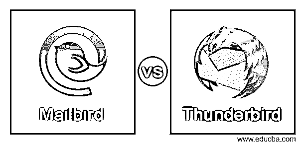
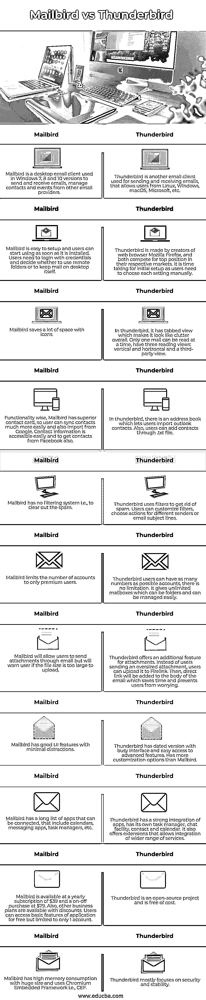

# 邮件鸟 vs 雷鸟

> 原文：<https://www.educba.com/mailbird-vs-thunderbird/>

## 邮件鸟和雷鸟的区别

Mailbird vs Thunderbird 将通过比较其特点、规格、优点和缺点来给出相同点和不同点。Mailbird 是一款适用于 Windows 7、8 和 10 桌面的电子邮件客户端，用于发送和接收电子邮件、管理事件以及来自 Outlook、Yahoo、Gmail 等其他电子邮件提供商的联系人。Thunderbird 是一个免费的开源电子邮件客户端、新闻客户端、个人信息管理器、聊天客户端和 RSS，由 Mozilla 开发，允许 Microsoft、MacOS、Windows、Linux 和其他支持系统上的用户发送和接收电子邮件。在这里，我们将比较 Mailbird 和 Thunderbird，并检查相似之处和主要差异。

### Mailbird 与 Thunderbird 之间的直接对比(信息图)

以下是邮件鸟和雷鸟的主要区别。

<small>网页开发、编程语言、软件测试&其他</small>

### 邮件鸟与雷鸟的主要区别

除了比较表中列出的差异之外，我们仍然需要讨论 Mailbird 和 Thunderbird 的一些关键相似之处或要点。

*   Mailbird 有一个专业版，其中有一个额外的贪睡电子邮件功能。它将重新安排邮件使用打盹选项。况且雷鸟没有这个功能。
*   Mailbird 有一个免费的试用版，但是用户经常会收到广告来升级到高级版本，而在 Thunderbird 上没有广告。
*   他们都有电子邮件客户端，都有各自的起伏。
*   两者都支持快捷键。例如，C 用于编写电子邮件，空格键用于快速查看。雷鸟后退一步，使用传统形式的快捷键，每个动作都按下 CTRL 键。
*   雷鸟与 MacOS 的交互很糟糕，例如，拖放图像选项，这是一个简单的功能，但在 MacOS 上不起作用。
*   雷鸟的界面就过时多了，类似 Windows XP。
*   在雷鸟中，主题行偶尔会从邮件列表中消失。
*   在某些情况下，点击电子邮件的主题行可能会显示错误的电子邮件，这是雷鸟的一个严重缺陷。
*   Mailbird 有一个速度阅读器选项，即它让用户选择用户想要阅读邮件的速度。
*   Mailbird 支持全世界几乎 17 种主要使用的语言。
*   Mailbird 有一个撤销选项，即如果发送了任何非预期的邮件，用户可以快速撤销任何邮件。
*   Mailbird 还有一个视频会议选项来进行远程会议，还有一个快速预览附件的选项。
*   雷鸟可以选择快速网络搜索，因为 Mozilla 开发了雷鸟，所以用户可以直接在搜索栏上搜索。

### 对比表(Mailbird 与 Thunderbird)

| 邮件鸟 | 雷鸟 |
| Mailbird 是 Windows 7、8 和 10 版本中使用的桌面电子邮件客户端，用于发送和接收电子邮件，管理来自其他电子邮件提供商的联系人和事件。 | Thunderbird 是另一个用于发送和接收电子邮件的电子邮件客户端，允许来自 Linux、Windows、macOS、Microsoft 等的用户使用。 |
| Mailbird 很容易设置，用户一安装就可以开始使用。用户需要使用凭证登录，并决定是使用远程文件夹还是将邮件保存在桌面上。 | 雷鸟是由网络浏览器 Mozilla Firefox 的创造者开发的，两家公司都在各自的市场上争夺领先地位。初始设置需要时间，因为用户需要手动选择每个设置。 |
| Mailbird 用图标节省了很多空间。 | 在 thunderbird 中，它有一个选项卡式的视图，这使得它看起来很杂乱。一次只能阅读一封邮件，有三种阅读视图:垂直和水平，以及第三方视图。 |
| 在功能方面，Mailbird 有一个高级的联系人卡片，所以用户可以更容易地同步联系人，也可以从谷歌导入。联系信息很容易获得，也可以从脸书联系。 | 在雷鸟，有一个地址簿，让用户导入 outlook 联系人。此外，用户可以通过添加联系人。txt 文件。 |
| Mailbird 没有过滤系统，即清除垃圾邮件。 | 雷鸟使用过滤器来清除垃圾邮件。用户可以自定义过滤器，为不同的发件人或电子邮件主题行选择操作。 |
| Mailbird 将帐户数量限制为高级用户。 | 雷鸟用户可以拥有尽可能多的账号，没有限制。它给了无限的邮箱，可以是文件夹，可以很容易地管理。 |
| Mailbird 将允许用户通过电子邮件发送附件，但如果文件太大而无法上传，它会警告用户。 | 雷鸟为附件提供了一个额外的功能。用户可以上传到 Firelink，而不是发送超大的附件。然后，直接链接将被添加到电子邮件的主体，节省时间，防止用户担心。 |
| Mailbird 有很好的用户界面特性，干扰很少 | 雷鸟已经过时的版本与繁忙的界面和容易获得先进的功能。比 Mailbird 有更多的定制选项。 |
| Mailbird 有一长串可以连接的应用程序，包括日历、信息应用程序、任务管理器等。 | 雷鸟拥有强大的应用集成，拥有自己的任务管理器、聊天工具、联系人和日历。它还提供了允许集成更广泛服务的扩展。 |
| Mailbird 的年费为 39 美元，分次购买的价格为 79 美元。此外，其他商业计划也有折扣。用户可以免费使用该应用程序的基本功能，但仅限于 1 个帐户。 | 雷鸟是一个开源项目，是免费的。 |
| Mailbird 内存消耗大，体积庞大，使用铬嵌入式框架，即 CEF。 | 雷鸟主要关注安全性和稳定性。 |

### 结论

至此，我们将结束“邮件鸟 vs 雷鸟”的话题。我们已经了解了什么是 Mailbird 和 Thunderbird，并初步了解了它们的特性、相似性、差异和特征。我们还从各个方面比较了 Mailbird 和 Thunderbird，并列出了它们各自的主要特性，以及一些用途、优点和缺点。不过综合以上几点，雷鸟是在很多方面比 Mailbird 更有优势的那一个。不过，在这两个应用程序中选择邮件应用程序纯粹是用户的选择。谢谢！快乐学习！!

### 推荐文章

这是一个邮件鸟 vs 雷鸟的指南。在这里，我们用信息图和比较表来讨论 Mailbird 和 Thunderbird 的主要区别。您也可以看看以下文章，了解更多信息–

1.  [侏儒 vs KDE](https://www.educba.com/gnome-vs-kde/)
2.  [气流 vs 詹金斯](https://www.educba.com/airflow-vs-jenkins/)
3.  [Hazelcast vs Ignite](https://www.educba.com/hazelcast-vs-ignite/)
4.  [Neo4j vs MongoDB](https://www.educba.com/neo4j-vs-mongodb/)

