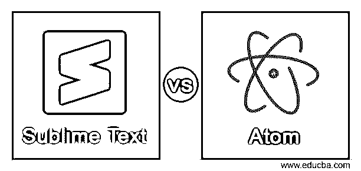
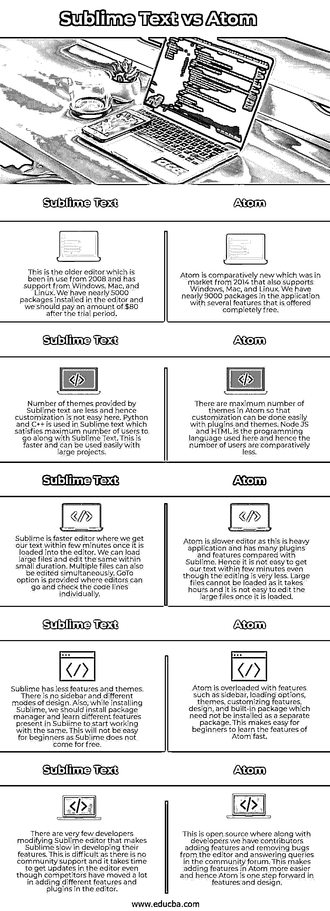

# 崇高的文本 vs 原子

> 原文：<https://www.educba.com/sublime-text-vs-atom/>

## 崇高文本 vs 原子导论

具有 Python 支持的编程接口的编辑器被称为 Sublime Text editor，它具有跨平台源代码以与任何平台进行交互，并且在应用程序中具有免费软件许可证。Sublime Text 支持多种文件类型，也可以使用应用程序本身的几个插件来管理。借助不同的 web 技术开发的桌面应用程序被称为 Atom text editor，它的功能和用户界面可以轻松定制。这也很灵活，我们可以根据自己的需求添加功能，并将其称为 IDE。

### Sublime Text 与 Atom 的面对面比较(信息图)

以下是 Sublime Text 与 Atom 之间的 5 大区别:

<small>网页开发、编程语言、软件测试&其他</small>

### 崇高文本与原子对照表

| **崇高的文字** | **Atom** |
| 这是从 2008 年开始使用的旧编辑器，支持 Windows、Mac 和 Linux。我们有近 5000 个软件包安装在编辑器中，我们应该在试用期后支付 80 美元。 | Atom 是相对较新的产品，从 2014 年开始上市，同时支持 Windows、Mac 和 Linux。我们有近 9000 个应用程序包，有几个功能是完全免费提供的。 |
| Number of themes provided by Sublime text is less and hence customization is not easy here. Python and C++ are used in Sublime text which satisfies the maximum number of users to go along with Sublime Text. This is faster and can be used easily with large projects. | Atom 中有最大数量的主题，因此可以通过插件和主题轻松进行定制。Node JS 和 HTML 是这里使用的编程语言，因此用户数量相对较少。 |
| Sublime 是一个更快的编辑器，我们可以在几分钟内将文本加载到编辑器中。我们可以加载大文件并在短时间内编辑它们。也可以同时编辑多个文件。提供了 GoTo 选项，编辑可以在这里单独检查代码行。 | Atom 是一个较慢的编辑器，因为这是一个沉重的应用程序，与 Sublime 相比有许多插件和功能。因此，即使编辑很少，也不容易在几分钟内得到我们的文本。无法加载大文件，因为这需要几个小时，而且一旦加载就不容易编辑。 |
| Sublime 的特色和主题比较少。没有侧边栏和不同的设计模式。此外，在安装 Sublime 时，我们应该安装一个包管理器，并学习 Sublime 中的不同特性，以便开始使用它们。这对初学者来说并不容易，因为 Sublime 不是免费的。 | Atom 有很多特性，比如侧边栏、加载选项、主题、定制特性、设计和内置包，它们不需要作为单独的包安装。这使得初学者很容易快速学习 Atom 的特性。 |
| 很少有开发者修改 Sublime editor，这使得 Sublime 在开发其功能时速度很慢。这很困难，因为没有社区支持，即使竞争对手在编辑器中添加了不同的功能和插件，也需要时间来更新编辑器。 | 这是开源的，除了开发人员之外，我们还有贡献者在社区论坛中添加功能、删除编辑器中的错误和回答问题。这使得在 Atom 中添加特性变得更加容易，因此 Atom 在特性和设计方面向前迈进了一步。 |

### 崇高文本与原子的主要区别

*   与 Sublime 相比，Atom 更加灵活，在 Sublime 中，我们可以通过使用搜索栏或用户界面中的项目树选项来找到我们的项目。尽管我们可以夸耀 Atom 中可用的特性和插件，但有时很难在所有用于编辑给定文本的可用插件中做出选择。我们在 Sublime 中没有很多功能，并且不容易找到一个项目，因为应用程序中没有树选项。这些功能和插件不会让用户感到惊讶，他们可以很容易地从应用程序的可用选项中进行选择。但是一个优点是，即使项目很大，也很容易在项目内搜索代码。
*   Atom 的文档更具描述性和自明性，有助于用户管理可用的插件，甚至为这些插件添加特性。这些文档和在线社区支持使得 Atom 在用户中更受欢迎。Sublime 的文档对用户来说很容易理解，但是对于插件和增加额外的特性没有单独的解释。用户不能向 Sublime 应用程序添加单独的功能，也不能自定义可用的功能。
*   Atom 具有内置的 git 集成，可以帮助用户将文本直接保存在 git 中，并向用户显示文件的未提交版本。树形视图帮助用户在文本编辑器中识别已提交和未提交的文件。它由 GitHub 支持。Sublime 没有任何自动保存文件的内置集成，但我们可以通过 Git 或 SVN 手动将其与任何存储库集成。
*   我们可以轻松地为这两个应用程序添加快捷方式，但内置快捷方式仅在 Atom 中可用。我们需要创建快捷方式，并将其添加到 Sublime 的包中，这使得用户可以很容易地知道应用程序中可用的快捷方式。Atom 之所以被称为 Hackable，是因为我们可以根据自己的需求添加功能并进行定制。我们可以在 sublime 中停止编辑，然后重新启动，在这里我们可以看到我们的文件完好无损，外观和感觉没有任何变化。Chrome inspector 可以在 Atom 中使用，用户界面在所有操作系统中都是一致的。

### 结论

Atom 的更新速度越来越快，技术世界总是支持更多的功能和更大的灵活性。Sublime text 更新缓慢，每一步都有节奏。初学者可以从 Atom 编辑器开始，如果他们需要一个有技术支持的强大编辑器，Sublime 将是一个不错的选择。

### 推荐文章

这是一本崇高文本 vs 原子的指南。在这里，我们分别用信息图和比较表来讨论 Sublime Text 和 Atom 键的区别。您也可以看看以下文章，了解更多信息–

1.  [MongoDB vs Postgres](https://www.educba.com/mongodb-vs-postgres/)
2.  [PostgreSQL vs SQLite](https://www.educba.com/postgresql-vs-sqlite/)
3.  [MySQL vs MongoDB](https://www.educba.com/mysql-vs-mongodb/)
4.  [CouchDB vs MongoDB](https://www.educba.com/couchdb-vs-mongodb/)

