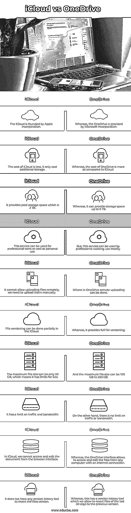

# iCloud 诉 OneDrive 案

> 原文：<https://www.educba.com/icloud-vs-onedrive/>

## iCloud 与 OneDrive 的区别

iCloud vs OneDrive 的定义是，iCloud 是苹果公司提供的云存储和云计算服务，允许存储文档、照片、音乐等数据，还允许分享和发送数据给其他用户，如果苹果设备丢失，有助于管理。 OneDrive 也称为 Microsoft OneDrive，它是一种云存储服务，允许用户将所有文件安全地存储在一个地方，以便我们可以从任何地方访问它们。这项服务就像外部驱动器一样工作，但唯一的区别是它可以通过互联网使用，并具有附加功能。

### 主要差异

*   **同步速度**

与他们的服务相比，iCloud 没有提供良好的同步速度，这意味着 iCloud 提供了良好的服务，但当涉及到处理大文件时，同步速度是好的，这种缓慢的处理可能会激怒用户，因为每个用户都希望他们的工作速度，另一方面，OneDrive 提供了令人满意的与大量服务器的同步速度，它具有块级复制，可以使文件同步快速，也有助于复制 office 文件的一部分，而无需对整个文件进行更改。

<small>网页开发、编程语言、软件测试&其他</small>

*   **安全**

iCloud 为我们的文件提供了很好的安全性，因为它们提供了数据加密的安全性，但苹果没有信息或访问用于加密所有数据的加密密钥。其他 iCloud 服务可以保留用户加密密钥的副本，而它将加密密钥与 Apple id 相连接，并且存储在其上的电子邮件也没有任何加密，这也是 iCloud 的一个缺陷，而 OneDrive 仅向商业计划用户提供安全性，它加密商业计划用户的每个文件。几年前，它增加了使用户文件更安全的功能，帮助企业和个人用户恢复过去 30 天被攻击的数据。此外，它有一个很大的特点，保护密码使用 OneDrive 链接，由于当用户共享文件给他人，那么它更安全。

*   **特性**

有一些特征描述了这两种云服务之间的差异。OneDrive 与 Office 365 密切相关，iCloud 和 OneDrive 这两种云服务都与 windows 服务的 window-8 或 windows-10 集成，OneDrive 可以很好地与 windows 配合使用，它可以管理设备上的所有文件，OneDrive 无法访问第三方的数据，另一方面，iCloud Drive 与云集成，可以轻松访问，不需要额外的应用程序。 它可以帮助 Mac 用户备份我们的桌面文件夹和文档，iCloud drive 是为苹果用户设计的，而不是为 Android 设备设计的。

*   **性能**

这两种云服务都是 iCloud 和 OneDrive，允许使用桌面应用程序、移动应用程序或网络浏览器上传文件。iCloud 的最大文件大小只有 50GB，因此如果我们想上传大视频文件，iCloud 就无法上传，因为大多数视频文件都大于 50GB，另一方面，OneDrive 的文件大小令人印象深刻，为 250GB，因此当文件较大时，我们可以使用 iCloud，iCloud 可以流畅地工作，特别是在苹果设备上。因此，与 OneDrive 相比，iCloud 提供了出色的性能。

*   **支持**

如果我们在使用 iCloud 时遇到任何问题，我们可以联系技术支持寻求帮助。它提供非常高效的技术服务，任何用户都可以通过电话与技术人员交谈，免费计划用户也可以与技术人员联系，等待时间也更短，可能只有 2 分钟，时间因您的位置而异，另一方面，OneDrive 不为每个人提供技术支持，他们的支持仅适用于商业用户，但他们提供网络聊天支持，而聊天时他们有服务问题，因此它无法提供帮助。

所以在支持方面，微软比苹果更全面，因为他们都有在线提问服务。

### 对照表

### iCloud 与 OneDrive 对比表

| **序号** | **iCloud** | **                       OneDrive** |
| 1. | 苹果公司创建了 iCloud。 | 鉴于 OneDrive 由微软公司提供。 |
| 2. | iCloud 的成本更低，只需要额外的存储空间。 | 然而，OneDrive 的成本高于 iCloud。 |
| 3. | 它提供 2 TB 的付费存储空间。 | 然而，它可以提供高达 6 TB 的存储空间。 |
| 4. | 这项服务既可用于专业工作，也可用于个人使用。 | 但是，这项服务大部分可以被专业工作人员使用。 |
| 5. | 它不允许远程上传文件，我们需要手动上传。 | OneDrive 中可以进行远程上传的地方。 |
| 6. | 文件版本控制可以部分在 iCloud 中完成。 | 然而，它提供了完整的文件版本控制。 |
| 7. | 最大文件大小只能是 50 GB，这意味着它有大小限制。 | 最大文件大小可以是 100 GB 到 250 GB。 |
| 8. | 它对流量和带宽有限制。 | 另一方面，流量或带宽没有限制。 |
| 9. | 在 iCloud 中，我们无法从浏览器界面访问和编辑文档。 | 而 OneDrive 界面允许从任何连接互联网的计算机上访问和编辑文件。 |
| Ten | 它没有任何版本历史工具来恢复文件的版本。 | 然而，这有一个版本历史工具，我们允许将过去 30 天的文件恢复到以前的版本。 |

### 结论–I cloud 与 OneDrive

在本文中，我们看到了两种云服务之间的比较和主要差异，考虑到它们的差异，它们为不同的用户提供不同的服务，本文也有助于根据安全性、速度、技术支持和性能来选择好的云服务。

### 推荐文章

这是一个 iCloud vs OneDrive 的指南。在这里，我们通过信息图和对比表来讨论 iCloud 和 OneDrive 的主要区别。您也可以看看以下文章，了解更多信息–

1.  [Plesk vs cPanel](https://www.educba.com/plesk-vs-cpanel/)
2.  [气流 vs 詹金斯](https://www.educba.com/airflow-vs-jenkins/)
3.  [Gnome vs Unity](https://www.educba.com/gnome-vs-unity/)
4.  [Log4j vs Logback](https://www.educba.com/log4j-vs-logback/)

