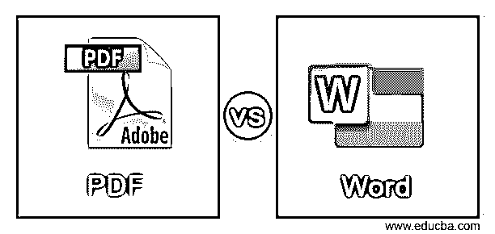
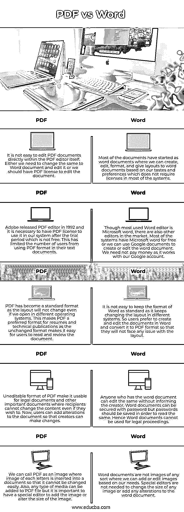

# PDF 与 Word

> 原文：<https://www.educba.com/pdf-vs-word/>

## PDF vs Word 简介

称为 PDF 的可移植文件格式是在任何类型的设备和任何编辑器中以给定形式表示文件而不改变布局的文件格式。它本身带有布局信息以及图形、格式化文本、大小和形状。我们可以使用 PDF 轻松交换文档。任何人共享文档时最常用的格式是 Word，这样任何人都可以从系统中阅读文档，而无需任何预装软件。编辑 word 文档不需要太多技术，因为这些特性是不言自明的。我们可以毫不费力地创建、编辑和发送 word 文档。

### PDF 与 Word 的直接对比(信息图表)

<small>网页开发、编程语言、软件测试&其他</small>

以下是 PDF 与 Word 之间的 5 大区别:

| **PDF** | **字** |
| 直接在 PDF 编辑器中编辑 PDF 文档并不容易。要么我们需要改变同样的 Word 文档并编辑它，或者我们应该有 PDF 许可证来编辑文档。 | 大多数文档都是从 word 文档开始的，我们可以根据自己的喜好和偏好来创建、编辑、格式化和布局 word 文档，在大多数系统中不需要许可证。 |
| Adobe released PDF editor in 1992 and it is necessary to have PDF license to use it in our system after the trial period which is not free. This has limited the number of users from using PDF format in their text documents. | 虽然最常用的 word 编辑器是微软的 Word，但市场上也有其他的编辑器。大多数系统都有免费的微软 word，或者我们可以使用谷歌文档来创建或编辑 word 文档。我们不需要付钱，因为它与我们的谷歌帐户。 |
| PDF 已经成为一种标准格式，因为即使我们在不同的操作系统中打开，布局也不会改变。这使得 PDF 成为简历和技术出版物的首选格式，因为不变的格式便于用户阅读和审阅文档。 | 保持 Word 的格式标准并不容易，因为它在不同的系统中不断改变布局。因此，用户更喜欢在 Word 中创建和编辑文档，并将其转换为 PDF 格式，这样他们就不会面临任何布局问题。 |
| 不可编辑的 PDF 格式使其适用于法律文件和其他重要文件，即使收件人想更改内容也无法更改。现在，用户可以对文档进行修改，以便创建者可以进行更改。 | 任何拥有 word 文档的人都可以在不通知创建者的情况下编辑该文档。Word 文档可以使用密码进行保护，但是应该保存密码以便阅读。因此，Word 文档不能用于法律诉讼。 |
| 我们可以称 PDF 为图像，其中每个字母的图像被插入到文档中，这样它就不能被轻易改变。此外，任何类型的媒体都可以添加到 PDF 文件，但重要的是有一个特殊的编辑器来添加图像或改变图像的大小。 | Word 文档不是我们可以根据需要添加或编辑图像的任何类型的图像。不需要特殊的编辑器来改变任何图像的大小或对 word 文档进行任何修改。 |

### PDF 与 Word 的主要区别

*   PDF 文档的扩展名是。我们可以保存任何文件为 pdf 格式，通过给这个扩展名，同时保存文件或图像。Word 的扩展名是 doc 或 docx。它通过以 doc 格式保存来支持其他文档。这有助于用户将任何文档转换为 word 或 pdf，方法是将其保存为相应的格式，并在支持 word 和 pdf 的系统中进行管理。这有助于用户检查文档的格式和布局。
*   如果一个超链接被添加到 PDF 文档中，我们需要一个特殊的编辑器来阅读它，并在任何浏览器中检查链接。但是不要求特殊编辑人员阅读或使用 word 文档中存在的超链接。我们可以在 word 文档中添加超链接，并在需要时随时使用。这有助于我们根据需要浏览网页。我们可以根据自己的意愿添加和删除单词，但这在 PDF 文档中不会发生。
*   我们可以称 Word 为一个软件，它应该预先安装在系统中，或者我们可以从任何资源安装。这个软件帮助我们编辑和创建文档。PDF 是一种使用 Adobe reader 阅读文档的格式或扩展。当我们从头开始创建任何文档时，我们应该使用 Word 创建相同的文档，在给出适当的格式后，我们应该将其转换为 PDF 格式。PDF 为我们提供了可打印形式的文档，可以直接打印，无需对布局进行任何更改。
*   pdf 可用于创建在线内容和网页，这有助于我们将目录作为适当的技术文档。由于 pdf 不能被任何人修改，我们可以在互联网上发布它，我们可以添加签名，这样没有人会在任何平台上重复使用相同的内容。我们不能直接使用单词作为在线内容，因为任何人都可以对其进行编辑或更改。
*   将文件存档以备将来使用是很重要的。pdf 可以轻松压缩和存档，因此不会占用系统太多空间。这将使存储文档变得容易，不像 word 文档那样容易压缩。此外，我们可以添加任何格式的 PDF，并使其成为一个单一的文件，将工作完全良好的 PDF 格式。

### 结论

PDF 和 Word 对于文档生成和使用非常重要，因为编辑可以在 Word 的帮助下完成，格式化和布局可以在 PDF 文档的帮助下完成。这使一个人成为其他人的另一个自我，而不是 PDF 或 Word 的替代品。

### 推荐文章

这是一个 PDF vs Word 的指南。在这里，我们分别用信息图和比较表来讨论 PDF 和 Word 关键字的区别。您也可以看看以下文章，了解更多信息–

1.  [OpenLayers vs 传单](https://www.educba.com/openlayers-vs-leaflet/)
2.  [SCTP vs TCP](https://www.educba.com/sctp-vs-tcp/)
3.  [inside html vs text content](https://www.educba.com/innerhtml-vs-textcontent/)
4.  [RxJava vs 反应器](https://www.educba.com/rxjava-vs-reactor/)

