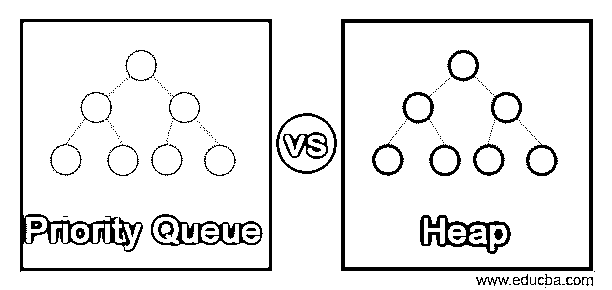
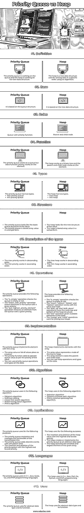

# 优先级队列与堆

> 原文：<https://www.educba.com/priority-queue-vs-heap/>

## 优先级队列与堆简介

*   优先级队列和堆是不同类型的数据结构，用于操作数据。
*   优先级队列和堆是对数据结构进行排序和实现队列的路径。
*   优先级队列和堆相互关联，用于处理队列和排序数据。
*   堆和优先级队列使用算法帮助实现优先级队列和排序数据。
*   优先级队列是队列数据结构，堆是操作和组织数据的树形数据结构。
*   优先级队列基于作为具有优先级功能的队列工作的队列数据结构。
*   堆是一种树形数据结构，用于使用算法按特定顺序对数据进行排序。
*   优先级队列正在处理队列，堆正在处理树数据结构。
*   面向对象技术使用优先级队列和堆来操作 web 应用程序的数据。

### 优先级队列与堆之间的直接比较(信息图表)

下面是优先级队列与堆之间的 13 大区别:

<small>网页开发、编程语言、软件测试&其他</small>

### 对照表

*   优先级队列在队列数据结构上工作，堆在树数据结构上工作。
*   面向对象语言使用优先级队列和堆对应用程序的数据进行操作和排序。
*   堆正在按照优先级或顺序的要求实现和排序优先级队列。
*   优先级队列和堆既有相似之处，也有不同之处。
*   这种数据结构依赖于许多具有独特类型和属性的条件。

优先级队列和堆的对照表如下所示。

| **功能** | **优先级队列** | **堆** |
| **定义** | The priority queue is working on the queue and the heap is working on the tree data structure. | The heap is a tree data structure uses for sorting data in a specific order using an algorithm. |
| **基地** | 它基于队列结构。 | 它基于树形数据结构。 |
| **规则** | 具有优先功能的队列。 | 父和子节点。 |
| **功能** | 优先级队列作为一个队列工作，但是额外的函数优先级在元素上工作。 | 堆像二叉树一样工作，父节点和子节点在元素上工作。 |
| **类型** | The priority queue has two types.最大优先级队列最小优先级队列 | The heap has two types.最大堆最小堆 |
| **结构** | ·         The priority queue looks like the basic queue structure of the value.优先级队列是以简单形式存储的数组值。 | ·         The heap looks like the tree structure of the value.堆以排序的形式存储数组值。 |
| **类型描述** | ·         The max priority works in descending order.最小优先级按升序工作。 | ·         The max heap works in descending order.最小堆按升序工作。 |
| **操作** | The priority queue provides the following operations.“is_empty”操作检查队列是否为空。“insert_with_priority”操作在队列中插入具有给定优先级的元素。“pull_highest_priority_element”操作从队列中删除具有给定优先级的元素。 | The heap provides the following operations.“is_empty”操作检查队列是否为空。“插入”、“提取”、“删除”和“替换”操作与值和节点一起工作。“shift_up”和“shift_down”操作将节点移动到堆结构的顶部和底部。

“size”操作给出了堆中的可用元素。

“merge”和“meld”操作用于连接两个堆。

 |
| **实施** | The priority queue implements element with the array.作为队列放置数组值或值列表。优先级函数根据值的优先级添加操作队列值。您可以对数据使用优先级队列操作和类型。 | The heap implements elements with the array.数组值表示树或堆的一个节点。数组元素包围父节点和子节点。您可以对数据使用堆操作和类型。 |
| **算法** | The priority queue uses in the following algorithm.Dijkstra 算法霍夫曼编码最佳优先搜索算法

漫游三角测量算法

普里姆算法

 | The heap uses in the following algorithm.选择算法Dijkstra 最短路径算法Prim 的最小生成树算法。 |
| **应用程序** | The priority queue uses for the following purposes.优先级队列维护和管理传输线路的带宽。优先级队列增加了离散事件和模拟时间。具有最高和最低优先级的优先级队列的插入和删除。 | The heap uses for the following purposes.具有最高和最低优先级的堆值的插入和删除。堆将优先级队列创建或实现为抽象数据类型。堆搜索给定数组中最小和最大的元素。 |
| **语言** | 优先级队列在 C++、Java、Scala、Go 和 PHP 编程语言中使用。 | 堆使用 C++、Java、Perl、Go、Python 和 PHP 编程语言。 |
| **用途** | 优先级队列用于抽象数据类型及其功能。 | 堆用于抽象数据类型及其功能。 |

### 主要差异

*   优先级队列正在处理队列，堆正在处理树数据结构。
*   优先级队列是以简单形式存储的数组值，而堆是以排序形式存储的数组值。
*   堆提供了比优先级队列更多的功能和操作。优先级队列提供了与队列相关的功能。
*   堆实现抽象数据类型，如优先级队列，但优先级队列不实现堆。
*   优先级队列比堆数据结构简单。由于父节点规则，堆很复杂。

### 结论

*   优先级队列数据结构和堆数据结构创建、操作和组织数组数据。
*   优先级队列和堆在数组值的最高和最低优先级上工作。
*   优先级队列和堆可以轻松维护应用程序的大规模、复杂数据。

### 推荐文章

这是优先级队列与堆的指南。这里我们分别用信息图和比较表来讨论优先级队列和堆键的区别。您也可以看看以下文章，了解更多信息–

1.  [堆栈与堆内存](https://www.educba.com/stack-vs-heap-memory/)
2.  [什么是堆内存？](https://www.educba.com/what-is-heap-memory/)
3.  [堆栈 vs 队列](https://www.educba.com/stack-vs-queue/)
4.  [CouchDB vs MongoDB](https://www.educba.com/couchdb-vs-mongodb/)

