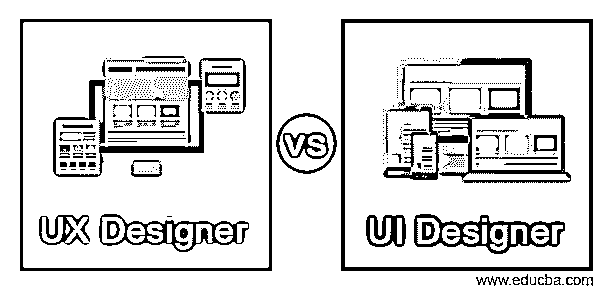
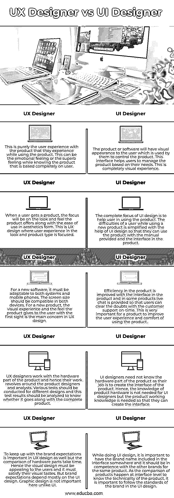

# UX 设计师 vs UI 设计师

> 原文：<https://www.educba.com/ux-designer-vs-ui-designer/>

## UX 设计师 vs UI 设计师简介

通过更多的交互来提高产品的可用性和合意性，从而支持用户体验的设计过程被称为用户体验设计或 UX 设计。产品的任何尺寸都是为 UX 设计选择和参数化的。用户界面设计或 UI 设计是开发软件或系统界面的过程，以积极的方式改善用户体验。通过增强的 UI 设计，用户可以通过直接与产品界面进行交互来获得舒适的使用体验。

### UX 设计师和用户界面设计师的直接对比(信息图)

以下是 UX 设计师和用户界面设计师的 5 大区别:

<small>网页开发、编程语言、软件测试&其他</small>

### UX 设计师与 UI 设计师对比表

| **UX 设计师** | **UI 设计师** |
| 这纯粹是用户在使用产品时对产品的体验。这可以是在了解完全基于用户的产品时的情感感受，也可以是超棒的感受。 | 产品或软件将对用户具有视觉外观，用户使用该视觉外观来控制产品。该界面有助于用户根据自己的需求管理产品。这是完全的视觉体验。 |
| 当用户得到一个产品时，关注的焦点将是产品提供的外观和感觉，以及在美学形式上的易用性。这是 UX 设计，用户在外观和产品类型的体验是重点。 | UI 设计的全部重点是帮助用户使用产品。用户在使用新产品时遇到的困难在 UI 设计的帮助下得以简化，这样他们就可以使用产品中提供的手册和界面来使用产品。 |
| 对于新软件来说，必须既能适应系统，又能适应手机。屏幕尺寸应与两种设备兼容。对于一个新产品，视觉体验和产品给用户的第一眼感觉是 UX 设计的主要关注点。 | 产品中的界面提高了产品的效率，并且在某些产品中提供了实时聊天，以便用户可以及时与客户支持人员一起解决疑问。这对于一个产品提高用户体验和使用产品的舒适度是非常重要的。 |
| UX 设计师与产品的硬件部分一起工作，因此他们的工作围绕着产品设计师和分析师。应该对不同的设计进行各种测试，并对这些测试结果进行分析，以了解它是否符合完整的产品。 | UI 设计师不需要知道产品的硬件部分，因为他们的工作是创建产品的界面。因此，UI 设计师不需要产品硬件知识，但需要产品工作知识，这样他们才能创建界面。 |
| 跟上品牌期望在 UX 设计中也很重要，但硬件部件的比较需要时间。因此，视觉设计必须吸引用户，必须满足他们的视觉品味。但是品牌期望主要取决于用户界面设计。与 UI 不同，图形设计在这里并不重要。 | 在做 UI 设计的时候，在界面的某个地方包含品牌名称是很重要的，而且它不能与其他品牌的相同产品混为一谈。由于产品的比较发生在界面层面，以了解产品的技术性，因此在 UI 设计中遵循品牌的标准非常重要。 |

### UX 设计师与用户界面设计师的主要区别

*   假设我们正在购买一种新产品，我们到现在还没有使用过。最初，当我们把产品拿在手里，看到它的外观时，我们得到的感觉就是 UX 设计。形状、大小、颜色、排版、设计、几何以及我们第一眼看到和触摸到的所有方面都被认为是 UX 设计。现在，一旦我们开始使用产品，我们将了解界面。开关、计时器和警告方面是任何 UI 设计产品中存在的接口。
*   对于 UI 设计师来说，了解设计、交互、产品信息、不同开关和设计的动作以及产品所属的品牌是非常重要的。UI 设计师也被称为数字产品设计师。UX 设计师需要了解产品硬件，以便他们能够设计产品的美学外观。UX 设计师可以被称为硬件设计师。
*   任何领域的专业人士都可以开始在 UX 设计工作，因为它需要来自生活各个方面的人，如营销，平面设计，网页设计，硬件工程师，甚至心理学家。这个职业欢迎任何领域的任何人。唯一的要求是，一个人必须对任何变化持开放态度，并准备学习新的东西。UI 设计师不能来自任何领域，因为他们应该是懂得编程和网页设计的专业人士。
*   在这里，用户界面的焦点完全集中在产品上，以及如何在每次使用中改进它，而 UX 关注的是用户以及他们如何体验产品。在这里，营销策略和调查对于了解用户并根据他们的需求满足他们是很重要的。
*   现在，我们无法理解 UX 是产品的用户体验，UI 是产品的界面。现在，我们用声音与产品互动，甚至不用触摸产品。界面不需要总是在屏幕上。同样，UX 在各方面都非常重要，即使产品没有合适的用户界面，它也应该用它的 UX 设计来安慰用户。

### 结论

用户界面和 UX 设计对于全面了解产品非常重要，没有一个设计是不完整的。这有助于用户基于网站上提供的设计和他们与产品的界面来改善他们的体验。对于以用户为中心的产品来说，这两个方面都很重要。

### 推荐文章

这是一个 UX 设计师 vs UI 设计师的指南。这里我们分别用信息图和比较表来讨论 UX 设计器和 UI 设计器的主要区别。您也可以看看以下文章，了解更多信息–

1.  [什么是 UI 设计师？](https://www.educba.com/what-is-ui-designer/)
2.  [Log4j vs Logback](https://www.educba.com/log4j-vs-logback/)
3.  [UX 设计师面试问题](https://www.educba.com/ux-designer-interview-questions/)
4.  [Chrome 远程桌面 vs Teamviewer](https://www.educba.com/chrome-remote-desktop-vs-teamviewer/)

