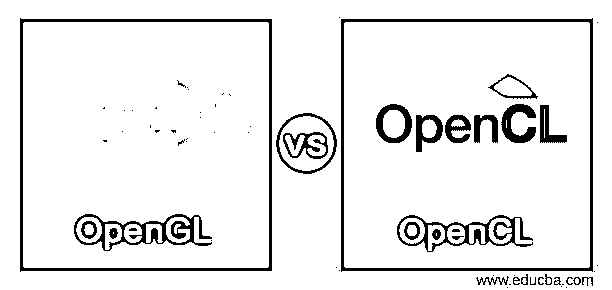
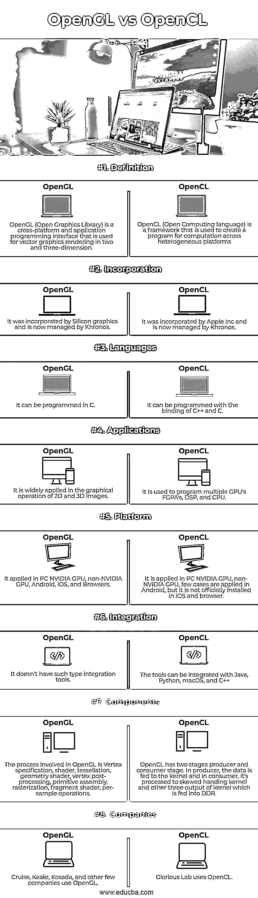

# OpenGL 与 OpenCL

> 原文：<https://www.educba.com/opengl-vs-opencl/>

## OpenGL 与 OpenCL 的区别

OpenGL 被扩展为一个开放的图形库，它是一个将数据从 CPU 传输到 GPU 的 API。图形开发人员将数据作为 OpenGL 对象传输到 GPU。当数据被复制到 GPU 时，它通过 OpenGL 渲染管道传递。而开放计算语言被称为 OpenCL，它旨在为计算提供一个完美的接口。它适用于实时场景，以解决没有太多依赖性且需要更多计算能力的问题。碰撞检查、3D 场景、线性代数和搜索算法都基于 OpenCL。在这里，我们讨论 OpenGL 和 OpenCL 之间的一些重要的关键区别。

### OpenGL 与 OpenCL 的正面比较(信息图表)

以下是 OpenGL 与 OpenCL 之间的八大区别:

<small>网页开发、编程语言、软件测试&其他</small>

### OpenGL 和 OpenCL 对照表

| **特性** | **OpenGL** | **OpenCL** 的缩写形式 |
| 定义 | OpenGL(开放图形库)是一个跨平台的应用程序编程接口，用于二维和三维的矢量图形渲染。 | OpenCL(开放计算语言)是一个用于创建跨异构平台计算程序的框架 |
| 公司 | 它被 Silicon graphics 合并，现在由 Khronos 管理 | 它被苹果公司合并，现在由 Khronos 管理。 |
| 语言 | 它可以用 C 语言编程 | 它可以用 C++和 C 的绑定来编程 |
| 应用程序 | 它广泛应用于 2D 和三维图像的图形操作 | 它用于编程多个 GPU 的 FGPA、DSP 和 CPU |
| 平台 | 它适用于 PC NVIDIA GPU、非 NVIDIA GPU、Android、iOS 和浏览器 | 在 PC 英伟达 GPU 应用，非英伟达 GPU，在安卓应用的情况很少，但在 iOS 和浏览器没有正式安装 |
| 综合 | 它没有这种类型的集成工具 | 这些工具可以与 Java、Python、macOS 和 C++集成 |
| 成分 | OpenGL 中涉及的过程是顶点指定、着色器、镶嵌、几何着色器、顶点后处理、图元组装、光栅化、片段着色器、每样本操作。 | OpenCL 有两个阶段生产者和消费者阶段。在生产者中，数据被提供给内核，在消费者中，数据被处理给偏斜处理内核和内核的其它三个输出，它们被提供给 DDR |
| 公司 | Cruise、Keakr、Kosada 和其他少数公司使用 OpenGL | 光荣实验室使用 OpenCL |

### OpenGL 与 OpenCL 的主要区别

重要的区别是 OpenGL 用于图形渲染程序，而 OpenCL 用于复杂的计算。但两者都是由 Khronos 管理，用 C 语言编译。OpenGL 允许编程进行图形操作，而 OpenCL 允许编程在多个处理器中进行计算。

**可访问性:**

OpenGL 是由 Silicon graphics 创建的，用于 3D 和 2D 矢量图形。它是图形编程中广泛使用的 API 之一。它是杰出的，并使开发者经常意识到它的不可替代的用法。OpenCL 由 Apple Inc .合并，并且在 OpenCL 中，内核功能被执行并使得所执行的程序能够托管和暗示计算设备上的内核并管理存储设备。它还支持其他编程语言，如 C++、C. Java 等。NET，Python，Perl 来写程序

**应用:**

OpenGL 被应用于制作 UI 动画来管理嵌入式视频或用于构建矢量图形。它广泛应用于飞行模拟、机械工程、设计视频游戏和科学可视化。OpenGL 已经定义了一组函数，图形设计者可以在他们的程序中像使用对象一样直接使用它。它用于开发二维六边形、三角形和多边形，以及三维圆环体、球体和立方体。它应用于旋转、阴影和填充颜色、翻译、缩放、混合、动画、制作烟雾或雾等大气效果、投影以及在输入设备上添加交互。它还增强了系统的性能并支持并行计算，OpenCL 用于增强性能，处理器根据任务而变化。它类似于一个框架，其中程序为异构系统编写代码。它适用于数字信号处理器、多个 GPU 和 CP、现场可编程门阵列、数据相关并行，并根据任务的优先级执行并行计算。

### OpenCL 与 OpenGL 的数据共享

数据共享的概念是写入和读取相同的内存，为了实现这一点，应用程序从 OpenGL 的对象开发了 OpenCL 的内存对象。确切地说，主机开发从 VBO 提取的缓冲对象，并从渲染对象和纹理中提取图像。内存对象是从 OpenGL 开发的，以实现 OpenCL 和 OpenGL 之间的互操作性。OpenGL 中的数据可以以三种形式中的任何一种来访问。像颜色、常量向量和坐标这样的顶点数据存在于顶点缓冲区对象中。图像格式包括纹理对象中的纹理数据，渲染缓冲对象包括需要显示的像素。标准的 OpenGL 应用程序开发并初始化 VBO 的，并将 VBO 共享给 GPU。通过使用属性，顶点着色器处理数据。通过集成 OpenCL 和 OpenGL，开发者可以通过初始化 VBO 数据和使用 OpenCL 的内核在 GPU 上开发应用程序的代码。这是因为顶点数据不需要在 CPU 和 GPU 之间共享。在从内核访问 VBO 之前，主机必须使用下面的函数开发一个缓冲区对象，以达到共享数据的目的。clCreateFromGLBuffe

**OpenCL 和 OpenGL 的互操作性:**

为了集成 OpenCL 和 OpenGL，开发了 basic_interop 代码，然后 OpenCL 内核定义了顶点的颜色和坐标。这可能非常复杂，因为涉及到许多函数和数据结构，甚至开发人员也会对代码的目的及其功能感到困惑。但是一旦弄清楚了，他就会发现这很有趣，并暗示它在许多应用中的优势。

### 结论

在 3d 渲染中，OpenGL 有点竞争力，经常出现在科学可视化、CAD 和视频游戏中。但是在渲染上，可以在 OpenCL 中加速，可以用可复用的代码开发。所以每个主人在他们自己的环境中都是独一无二的，不可战胜的。

### 推荐文章

这是一个 OpenGL vs OpenCL 的指南。这里我们分别用信息图和比较表来讨论 OpenGL 和 OpenCL 的主要区别。您也可以看看以下文章，了解更多信息–

1.  [OpenGL vs 火山](https://www.educba.com/opengl-vs-vulkan/)
2.  [OpenGL vs DirectX](https://www.educba.com/opengl-vs-directx/)
3.  [粉笔 vs GIMP](https://www.educba.com/krita-vs-gimp/)
4.  [OpenGL 版本](https://www.educba.com/opengl-versions/)

