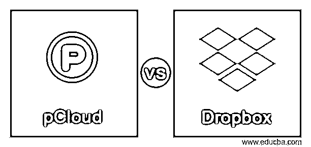
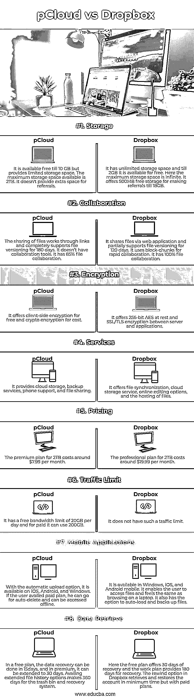

# pCloud 与 Dropbox

> 原文：<https://www.educba.com/pcloud-vs-dropbox/>

## pCloud 与 Dropbox 的区别

pCloud 是一种驱动器，人们可以通过在计算机上创建受保护的虚拟驱动器来存储和访问数据，而不会干扰硬盘的空间。这是一个桌面应用程序，免费提供 10GB，付费后可以使用 2TB。Dropbox 可以保存、共享和帮助项目协作。Dropbox 可以用作共享帐户，所有员工都可以访问该文件。它有备份存储，也可以在线使用。Dropbox 受到多层 256 高级加密标准的保护。

### pCloud 与 Dropbox 的直接对比(信息图)

以下是 pCloud 和 Dropbox 的主要区别。

<small>网页开发、编程语言、软件测试&其他</small>

### pCloud 和 Dropbox 的主要区别

Dropbox 和 pCloud 之间的重要区别可能是其定价、可访问性、安全性、同步和文件协作。

**用户友好度**

pCloud 提供安全的可访问性和用户友好的存储服务，并具有完美的界面，为初学者创造了一个舒适的环境。注册后，许多顶级功能都可以在网络上使用，并且网络平台可以在任何设备上的任何网络浏览器上使用。即使在离线状态下，您也可以访问所有喜爱的图片、文件和音乐。Dropbox 类似于硬件设备上的一个文件夹，放入其中的每一个数据都会同步到网络上，并且可以在其他安装并登录了 Dropbox 的设备上使用。

Dropbox 和 pCloud 具有标准的可访问性，但 pCloud 为初学者铺平了一条有吸引力的道路。

**同步**

与 1 GB 的数据相比，Dropbox 和 pCloud 的工作速度比其他云存储设备快得多。他们可以在 30 秒内上传 1GB 的文件，而其他云设备大约需要 4 分钟。Dropbox 和 pCloud 将数据转换成小块，从而减少了同步数据所需的时间。因此，在数据同步方面，两者都发挥了最大的优势。

**虚拟驱动器**

有助于隔离 pCloud 的标准功能是其集成的虚拟驱动器功能，使外部数字硬盘能够同步虚拟服务器。虚拟驱动器像标准硬盘驱动器一样显示文件资源管理器。对这些文件的输入和更改会反映并同步到云，并在所有 pCloud 安装中变为在线。Dropbox 遵循同样的原理，但没有 pCloud 有效。原因是 Dropbox 使用户能够访问单个文件以实现快速同步，而 pCloud 使用户能够同步几乎整个驱动器。

pCloud 在 drive 领域名列前茅，因为它的整个虚拟快速驱动器同步。

**团队合作**

协作不能通过处理单个文件来衡量，因为市场标准是指 TB。但是没有云存储能够满足 Dropbox 提供的标准。它为内置注释提供了一整套工具，加速了单个文件的协作。但 pCloud 没有任何类似的工具，也无法进行团队协作。

因此，Dropbox 与它的工具套件协同工作。

**通信速度**

pCloud 的上传下载速度比 Dropbox 快 10 倍，除非用户有稳定的互联网连接。

**安全**

到了安全环境，两者都是用标准加密方法构建的。pCloud 提供客户端加密，客户端的数据受到保护，以避免恶意软件的攻击。它的加密方法用多层安全墙保护机密文件，使它们更安全地访问。但它有一个单独的计划来利用顶级加密功能。Dropbox 依赖第三方应用程序来利用加密方法。服务器和应用程序之间启用了 SSL 和 TLS 加密，这为高级加密方法开发了一个安全通道。Dropbox 中的静态文件由 256 位 AES 加密。

### pCloud 与 Dropbox 对比表

| **特性** | **pCloud** | **Dropbox** |
| **存储** | 10 GB 以内免费提供，但存储空间有限。最大可用存储空间为 2TB。它没有为推荐人提供额外的空间。 | 它有无限的存储空间，直到 2GB 是免费的。这里的最大存储空间是无限的。它提供 500MB 的免费存储空间，直到 18GB |
| **协作** | 文件的共享通过链接工作，完全支持 180 天的文件版本控制。它没有协作工具。它有 85%的文件协作 | 它通过 web 应用程序共享文件，并部分支持 120 天的文件版本控制。它使用块块进行快速协作。它拥有 100%的文件协作 |
| **加密** | 它提供免费的客户端加密和收费的加密 | 它在服务器和应用程序之间提供 256 位静态 AES 和 SSL/TLS 加密 |
| **服务** | 它提供云存储、备份服务、电话支持和文件共享 | 它提供文件同步、云存储服务、在线编辑选项和文件托管。 |
| **定价** | 2TB 的高级计划每月花费约 7.99 美元。 | 2TB 的专业计划每月费用约为 19.99 美元 |
| **交通限制** | 它有每天 20GB 的免费带宽限制，付费可以使用 200GB | 它没有这样的流量限制 |
| **移动应用** | 通过自动上传选项，它可以在 iOS、Android 和 Windows 上使用。如果用户利用付费计划，他可以去自动删除，可以离线访问。 | 它可以在 Windows、iOS 和 Android mobile 中使用。它使用户能够访问文件，感觉就像在笔记本电脑上浏览一样。它还可以选择自动加载和备份文件。 |
| **数据检索** | 在免费计划中，数据恢复可以在 15 天内完成，在高级计划中，可以延长到 30 天。利用扩展的文件历史记录选项，使垃圾桶和恢复系统 360 天。 | 在这里，自由计划提供 30 天的恢复时间，而工作计划提供 180 天的恢复时间。Dropbox 中的回滚选项可以在最短的时间内检索和恢复帐户，但使用付费计划 |

### 结论

当比较 pCloud 和 Dropbox 的许多功能时，建议 pCloud 以最低的价格提供或多或少与 Dropbox 相同的选项。而如果用户需要环保，他可以选择 Dropbox。

### 推荐文章

这是 pCloud vs Dropbox 的指南。这里我们用信息图和对比表来讨论 pCloud 和 Dropbox 的主要区别。您也可以看看以下文章，了解更多信息–

1.  [粉笔 vs GIMP](https://www.educba.com/krita-vs-gimp/)
2.  [Plesk vs cPanel](https://www.educba.com/plesk-vs-cpanel/)
3.  [侏儒 vs KDE](https://www.educba.com/gnome-vs-kde/)
4.  [Verilog vs SystemVerilog](https://www.educba.com/verilog-vs-systemverilog/)

