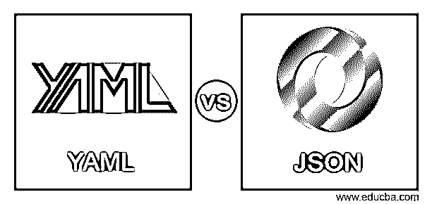
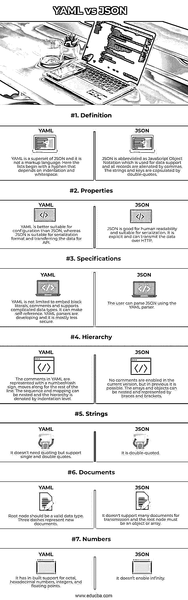

# YAML vs JSON

> 原文：<https://www.educba.com/yaml-vs-json/>

## YAML 和 JSON 简介

JSON 缩写为 JavaScript Object Notation，易于理解和自描述。它以标准文本格式提供，用于保存和传输数据。JSON 有助于在 web 应用程序中传输数据，在 web 应用程序中，数据从服务器发送到客户机，并且可以在 web 页面上查看。YAML 用于编写配置文件的脚本，可以与其他编程语言结合使用。它因数据序列化语言、人类可读语言和自适应而流行。文章介绍了 JSON 和 YAML 的区别和比较。

### YAML 与 JSON 的正面比较(信息图)

以下是 YAML 与 JSON 的八大区别:

<small>网页开发、编程语言、软件测试&其他</small>

### YAML 和 JSON 对比表

| F **特征** | **YAML** | **JSON** |
| **定义** | YAML 是 JSON 的超集，它不是一种标记语言。在这里，列表以连字符开始，这取决于缩进和空白。 | JSON 缩写为 JavaScript Object Notation，用于数据支持，所有记录用逗号分隔。字符串和键用双引号括起来。 |
| **属性** | YAML 比 JSON 更适合配置，而 JSON 适合序列化格式和为 API 传输数据。 | JSON 对人类可读性很好，适合序列化。它是显式的，可以通过 HTTP 传输数据。 |
| **规格** | YAML 并不局限于嵌入块文字、注释和支持复杂的数据类型。它可以进行自我参照。YAML 解析器正在发展，但大多不太安全。 | 用户可以使用 YAML 解析器解析 JSON。 |
| **层级** | YAML 中的注释用一个数字/散列符号表示，并移动到该行的其余部分。序列和映射可以嵌套，层次结构由缩进级别表示。 | 当前版本不支持注释，但在以前的版本中可以。数组和对象可以嵌套，并用大括号和方括号表示 |
| **琴弦** | 它不需要引号，但支持单引号和双引号 | 这是双引号。 |
| **单据** | 根节点应该是有效的数据类型。三个破折号代表新文档 | 它不支持传输许多文档，根节点必须是对象或数组 |
| **数字** | 它内置了对八进制、十六进制、整数和浮点的支持。 | 它不能实现无限 |

定义 YAML 是 JSON 的超集，它不是一种标记语言。在这里，列表以连字符开始，这取决于缩进和空白。JSON 缩写为 JavaScript Object Notation，用于数据支持，所有记录用逗号分隔。字符串和键用双引号括起来。

属性 YAML 比 JSON 更适合配置，而 JSON 适合序列化格式和为 API 传输数据。JSON 对人类可读性很好，适合序列化。它是显式的，可以通过 HTTP 传输数据。
规范 YAML 并不局限于嵌入块文字、注释和支持复杂的数据类型。它可以进行自我参照。YAML 解析器正在发展，但大多不太安全。用户可以使用 YAML 解析器解析 JSON。

层次结构 YAML 中的注释用一个数字/散列符号表示，沿着行的其余部分移动。序列和映射可以嵌套，层次结构由缩进级别表示。当前版本不支持注释，但在以前的版本中可以。数组和对象可以嵌套，并用大括号和方括号表示

字符串它不需要引号，但支持单引号和双引号它是双引号。

文档根节点应该是有效的数据类型。三个破折号代表新文档它不支持许多文档的传输，根节点必须是一个对象或数组

它内置了对八进制、十六进制、整数和浮点的支持。它不能实现无限

### YAML 和 JSON 的主要区别

*   **及时性:**

JSON 是面向实现的，由于速度快，它拥有最大的本机支持，因此被广泛使用。但是 YAML 和 JSON 一样，但是倾向于拉更多的卡车。但是就速度而言，与 JSON 和 YAML 相比，JSON 行动更快。众所周知，YAML 文件是一个较小的 JSON，因为它有,“和”字符，在特殊情况下，它可以使 YAML 高度优化和快速。

*   **内存:**

就内存而言，JSON 和 YAML 占用了相似的数据结构，但 YAML 解析器的效率比 JSON 解析器更有效，而且争论继续到知道哪个内存效率更高。

*   **可访问性:**

Python 程序员更喜欢 YAML，而 JavaScript 程序员选择 JSON。JSON 的语法很容易记忆，它对每个语法的意义也很容易理解。但是《YAML》并没有给人类一个清晰的理解，因为它的一些边缘情况和微妙之处相当复杂和极端。因为有些解析器是按照特定的规范部署的，所以很难理解给定注释中所提供的表达式的真正含义。JSON 中没有注释部分，这使得它有点困难，但在实践中，这是可以避免的。

*   **兼容性:**

不使用 JSON 库来构建一门现代语言是不可想象的，它的解析器只部署了最少的完整规范。YAML 不像 JSON 那样全球化，但是它很普遍，这里每个解析器都包含一个不同的子集。但是文件的互操作性较差。编写 YAML 递归结构的脚本是有潜力的，这种结构在几个转换器中有一个无限循环。YAML 炸弹可能在循环探测中被发现。因为没有引用，所以很难序列化 JSON 中关于对象的复杂结构。但是它在 YAML 序列化中可以更高效地执行，并且它使攻击者能够在某些编码环境中运行任意代码。

*   **互联网:**

JavaScript 以巨大的数量统治着 web，因为著名的 web APIs 对数据格式的响应势不可挡。当涉及到团队环境时，在一般应用程序中编写 web 编程脚本时，最好不要使用 YAML 而不是 JSON。许多程序员不知道 YAML 的存在，并且在互联网上使用它时感到不舒服。如果用户正在执行 web 编程，他可以使用 JSON，因为当他开始下一个翻译步骤时，互联网上有许多可用的代码。

*   **互操作性:**

从开发人员的角度来看，YAML 使用 Python 开发人员所需的空间标识。JSON 和 YAML 上都有很多有效的解析器。YAML 空间的格式是紧凑的，并且制表符不被认为是空格，这使得用户难以编辑和解释空格列中的键击。一个常见的错误是 YAML 要求最少的标点符号，并且比 JSON 更压缩，这是一个错误的假设。不可见的空白被要求出现在 YAML 中，但是它出现在更少的字符中，这些字符应该通过正确的识别得到正确的解释。但是 JSON 不像 YAML 那样大量使用空白，但是它表示层次和分组，这很容易被践踏，为了有效的压缩传输，不需要的空白被消除了。

### 结论

YAML 有多种特性，包括关系锚和注释，但它非常复杂，难以理解，当你开始经常使用它时，它会比 JSON 更具可读性，也更实惠。很容易在短时间内编写一个定义良好的 JSON 解析器。JSON 的工作既快速又稳定，它可以与高端系统互操作。很少有重复的键在 JSON 中理论上是有效的，但在 YAML 中却变得无效。

### 推荐文章

这是一个 YAML vs JSON 的指南。这里我们分别讨论信息图和比较表的主要区别。您也可以看看以下文章，了解更多信息–

1.  [JSON vs BSON](https://www.educba.com/json-vs-bson/)
2.  [JSON vs SOAP](https://www.educba.com/json-vs-soap/)
3.  [JSON vs AJAX](https://www.educba.com/json-vs-ajax/)
4.  [JSON vs CSV](https://www.educba.com/json-vs-csv/)

