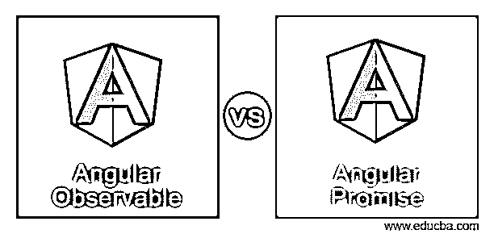

# 角度可观测性与承诺

> 原文：<https://www.educba.com/angular-observable-vs-promise/>

## 角度可观测值与承诺值之间的差异

下面的文章提供了一个角度可观测 vs 承诺的概要。在任何角度应用程序中，动态和快速的响应是一个关键要求，这反过来要求开发人员异步处理多个外部服务调用，这在复杂的角度应用程序中广泛使用。为了实现这一切，Angular 提出了可观测量和承诺的概念，其中承诺是自 AngularJS 版本(第一版)以来一直使用的东西，并且作为承诺的增强，在可观测量中发现了更多的附加内容。

### 角度可观测值与承诺值的直接比较(信息图)

以下是角度可观测值与承诺值之间的 5 大差异:

<small>网页开发、编程语言、软件测试&其他</small>

### 角度可观测值与承诺值的主要区别

让我们讨论一下角度可观测性与承诺之间的一些主要差异:

*   使用角度可观察值和角度承诺，两者同等重要，但是当角度应用程序中出现多个异步调用时，可观察值的优先级高于承诺。有角度的观察和承诺之间有一些差异，这是值得知道的，因为它们将帮助我们知道在哪里使用什么。
*   角度可观测量和角度承诺之间的一个主要区别是，可观测量遵循一个延迟加载的过程，这意味着它们在成为订户之前不会在应用程序中被调用，另一方面，承诺一旦在应用程序中被创建，就会被调用，不管是否需要执行。
*   **角度可观测量:**每当我们想要创建一个新的可观测量时，我们需要使用 new 关键字后跟 Observable。可观察函数接受一个参数，即数据。我们称之为。订阅功能。
*   让我们看看下面的例子。还有强大的操作符，如 retry()或 replay()、forEach()等，它们通常非常便于观察，并广泛用于角度应用中。

**举例:**

**代码:**

`const dataFromObservable = new Observable((item) => {
item.next(10);
Item.next(20);
Item.next(30);
}).subscribe(response => console.log(‘ Response from Observable : ‘ + response));`

**输出:**

来自可观察对象的响应:10
来自可观察对象的响应:20
来自可观察对象的响应:30

*   在上面的代码中，我们创建了一个新的 Observable，它有一个 item 参数，我们正在调用它的。下一个操作和传递输入值，即 10，20，30。现在，对于这个新创建的可观察对象，我们使用。subscribe 方法，一旦它被执行，console.log 语句将从 Observable 中打印出响应。现在我们可以看到，在输出中，我们有 3 个响应，因为 observables 一次处理多个值。
*   在 observable 中处理错误，执行过程中遇到的错误被传递给订阅者的错误处理程序，订阅者自动退订 Observable。

**举例:**

**代码:**

`observable.subscribe(() => {
throw new Error(‘ Generic Error’);
});`

*   使用 Observables 取消订阅，其中事件的处理可以使用 Observables 取消。unsubscribe()方法。

**举例:**

**代码:**

`const dataFromObservable = new Observable((item) => {
item.next(10);
Item.next(20);
Item.next(30);
}).subscribe(response => console.log(‘ Response from Observable : ‘ + response));
dataFromObservable.unsubscribe();`

*   **Angular Promises:** 每当我们想要创建一个调用外部 HTTP 服务并返回单个响应的新承诺时，我们需要使用 new 关键字，后跟 Promise。Promise 函数也接受一个参数，即数据。对于这个承诺函数，我们只能调用。然后功能。

**举例:**

**代码:**

`const dataFromPromise = new Promise((item) => {
item(10);
item(20);
item(30);
}).then(response => console.log(‘ Response from Promise : ‘ + response));`

**输出:**

承诺的回应:10

*   在上面的代码中，我们创建了一个新的 Promise，它有一个 item 参数，我们通过传递输入值来调用它，比如 10，20，30。现在来看看这个新创造的承诺，我们称之为调用。然后，一旦执行了 console.log 语句，就会打印出 Promise 的响应。
*   在上面的代码中，我们可以看到，由于只读取了第一个值，所以只返回了来自 Promise: 10 的响应，其余的都被忽略。这是 Observable 和 Promise 之间的主要区别，Observable 可以在一段时间内处理多个值，而 Promise 可以处理单个值。
*   处理承诺中的错误，将执行过程中遇到的错误传递给子承诺。

**举例:**

**代码:**

`promise.then(() => {
throw new Error(‘ Promise Error ‘);
});`

### 角度可观测值与承诺值对照表

让我们讨论一下角度可观测性与承诺之间的主要比较:

| **比较的基础** | **可观察角度** | **角许诺** |
| **加载** | 这意味着可观察对象在被订阅之前不会开始执行。这使得 Observables 非常有用，因为我们可以在需要响应时运行它。 | 承诺没有偷懒。这意味着承诺一经做出就立即执行。 |
| **值** | 可观测量可用于在一段时间内发出多个值。一次获取多个值很有用。 | 承诺一次发出一个值。 |
| **错误处理** | 角度可观测量本身负责处理误差。这样，当我们使用 Observables 时，所有的错误处理都可以在一个地方完成。 | 角承诺总是把错误推给子承诺，而不是自己处理。 |
| **取消** | 使用退订方法。当你需要停止监听接收值时，可以取消观察值。 | 承诺永远不能取消，永远要执行。 |
| **操作** | 观察对象可以有链接和订阅。例如:forEach、filter、reduce 等。运算符可用于可观测量。 | 只承诺支持。然后功能。 |

### 结论

在构建角度应用程序时，角度可观测量和承诺被广泛使用。创建与一个视图相关联的新的角度可观测量，并创建多个更小的可观测量，有助于代码分离，提高可读性，并维护代码的可重用性。另一方面，Angular Promises 添加或修改现有的 DOM 行为，并处理各种事件，如点击、模糊、聚焦、滚动等。，并且可以在承诺文件中采取适当的行动。从构建角度应用程序和使用角度承诺或可观察性开始，你只需要知道什么时候用什么。

### 推荐文章

这是一个角度可观 vs 承诺的指南。这里我们分别讨论信息图和比较表的主要区别。您也可以看看以下文章，了解更多信息–

1.  [反应与角度 2](https://www.educba.com/reactjs-vs-angular2/)
2.  [角度 vs 敲除](https://www.educba.com/angular-vs-knockout/)
3.  [Angular vs JQuery](https://www.educba.com/angular-vs-jquery/)
4.  角度 2 相对于视图 JS

