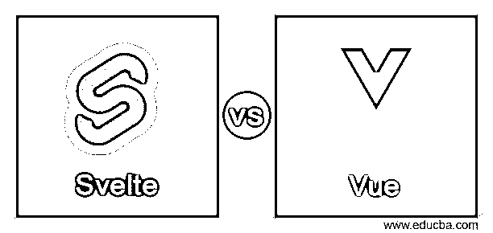
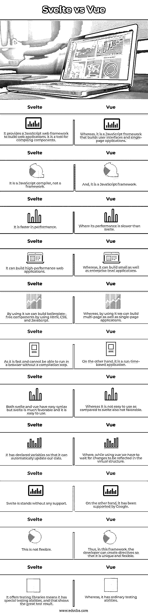

# 动作快一点

> 原文：<https://www.educba.com/svelte-vs-vue/>

## 苗条 vs Vue 简介

Svelte vs Vue 的定义是，Svelte 是一个 JavaScript web 框架，用于构建快速的 web 应用程序，它是一个免费的开源前端编译器，由 Rich Harris 在 2016 年开发，许多软件公司都将其作为前端框架，因为它提供了许多东西，使开发人员更少复杂化，而 Vue 是一个开源的渐进式 JavaScript 框架，用于构建用户界面和单页应用程序。 它使用高度解耦，允许开发人员逐步创建用户界面，由 Evan 在 2014 年开发。

### 苗条和脆弱之间的直接对比(信息图)

以下是苗条和 Vue 之间的 11 大区别:

<small>网页开发、编程语言、软件测试&其他</small>

### 苗条与脆弱的对比表

| **序号** | **苗条的** | 视图 |
| 1. | 它提供了一个 JavaScript web 框架来构建 web 应用程序，它是一个编译组件的工具。 | 然而，它是一个构建用户界面和单页面应用程序的 JavaScript 框架。 |
| 2. | 它是 JavaScript 编译器，不是框架。 | 而且，它是一个 JavaScript 框架。 |
| 3. | 它在性能上更快。 | 它的表现比苗条还慢。 |
| 4. | 它可以构建高性能的 web 应用程序。 | 然而，它可以构建小型和企业级的应用程序。 |
| 5. | 通过使用它，我们可以使用 Html、CSS 和 JavaScript 构建无样板的组件。 | 然而，通过使用它，我们可以构建多页面以及单页面应用程序。 |
| 6. | 因为它速度很快，不经过编译步骤就不能在浏览器中运行。 | 另一方面，它是一个基于运行时的应用程序。 |
| 7. | svelte 和 vue 都有简单的语法，但是 svelte 更受欢迎，也更容易使用。 | 然而，与苗条相比，它不容易使用，也不是有利的。 |
| 8. | 它已经声明了变量，这样它就可以自动更新我们的数据。 | 其中，当使用 vue 时，我们必须等待虚拟结构中反映的变化。 |
| 9. | 苗条是没有任何支撑的。 | 另一方面，它得到了谷歌的支持。 |
| 10. | 这不灵活。 | 因此，在这个框架中，开发人员可以创建指令，因此它是独特和灵活的。 |
| 11. | 它提供测试库意味着它有特殊的测试能力，这表明了伟大的测试结果。 | 然而，它具有普通的测试能力 |

### 苗条与 Vue 的主要区别

让我们来看看一些关键的区别:

*   #### Performance

现在让我们比较一下 svelte 和 vue 之间最重要的特性，svelte 是一个编译器，它能够只通过一个步骤就产生并同时优化代码，因此性能得到了增强，并且它不使用 DOM，因此它有助于减少运行时间，这样用户可以享受平滑的过渡，因此它提供了非凡的性能，而， 当我们比较 svelte 和 vue 的性能时，我们观察到它们非常不同，正如我们在上面看到的，svelte 不使用 DOM，而 vue 使用虚拟 DOM。 它们之间的另一个区别是延迟加载，这是一种策略，允许我们推迟非关键资源的呈现，直到用户需要它们，特别是由于这一点，页面加载将更快地完成。苗条的人得分比 vue 高。这种性能差异在轻量级应用程序中并不明显，只有在大型应用程序中才能察觉到。

*   #### Application architecture

svelte 和 vue 之间的架构比较是，svelte 可以像 vue 一样直接提供页面，因为它使用现有的 JavaScript 来提供页面，并通过使用其编译功能来生成应用程序的组件，另一方面，vue 的架构相当不同，它使用视图模型方法作为它的最后一个模型，该模型基于 MVVM 模型中的双向数据绑定，它是一个似乎受到 MVC 和 MVP 模式限制的模板。其中 M 是具有应用程序业务逻辑的模型，V 是用户界面的视图，VM 是包含用于构建用户界面的逻辑的视图模型。vue 架构包含过滤器和指令，其中过滤器用于执行文本格式化的常见任务，指令包含代码块，以便开发人员可以在 web 应用程序中使用 DOM 元素。该架构更加独特和灵活，因为它能够允许开发人员创建定制的指令。

*   #### Test ability

让我们看看它们测试起来有多容易，svelte 有更多的小型库贡献，并且它有更少的不复杂的计算，通过考虑它，我们可以在 svelte 中编写比其他前端框架更多的可测试代码，前端框架是关于用户如何感受和与我们的 web 应用程序交互的。由于 svelte 生成更多可测试的代码，因此它对业务更友好，它通过推动编写单元测试用例来提供测试库，而 vue 具有普通的测试能力，但测试很简单，因为它仍在上升，它不排除代码的测试能力，也不提供豪华的工具。vue 的单元测试在某种程度上类似于 Jests、Mocha 或 Chai 等其他框架。vue 推荐一些 Vue 测试库和 Vue 测试实用程序库。

*   #### application size

svelte 创建较小尺寸的应用程序，它被最容易访问的 JavaScript 组件库识别，并用于更高效地运行开发，而 vue 是轻量级框架，与其他框架相比，应用程序的尺寸并不太大。其应用的大小在 50 kb 到 100 kb 之间，并不多。

### 结论

在这篇文章中，我们可以得出结论，与 vue 相比，svelte 显示了很好的测试结果，但在它们之间进行选择并不容易，这取决于确切的商业理念，我们已经看到了它们之间的一些比较差异和一些关键差异，以显示它们之间的差异。

### 推荐文章

这是一个苗条 vs Vue 的指南。这里我们分别讨论信息图和比较表的主要区别。您也可以看看以下文章，了解更多信息–

1.  [苗条 vs 反应](https://www.educba.com/svelte-vs-react/)
2.  角度 2 相对于视图 JS
3.  [vista . js vs jquery](https://www.educba.com/vue-js-vs-jquery/)
4.  [反应 js vs view js](https://www.educba.com/react-js-vs-vue-js/)

