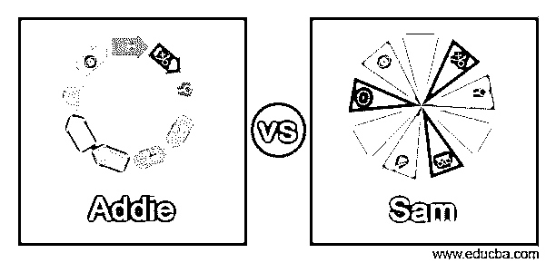
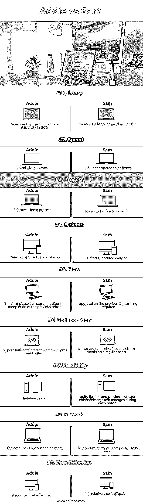

# Addie vs Sam

> 原文：<https://www.educba.com/addie-vs-sam/>

## Addie 和 Sam 的区别

ADDIE 教学设计方法可能是开发学习解决方案最著名的方法。分析、设计、开发、实施和评估是 ADDIE 的缩写。但是现在，艾迪不是唯一可用的东西。SAM 代表逐次逼近模型，是 ADDIE 的流行替代方案。

每个学习系统都有优点和缺点，必须正确考虑。例如，ADDIE 模型是系统的和可重复的，但是不允许回溯。山姆被设计成在几个方面对抗艾迪。让我们看看这些问题的答案，看看哪些可能最适合你，为什么。

<small>网页开发、编程语言、软件测试&其他</small>

### Addie 与 Sam 的面对面比较(信息图表)

以下是 Addie 与 Sam 的主要区别:

### 主要差异

*   在 ADDIE 中，模型变更或缺陷是在后期阶段识别的，而在 SAM 中，缺陷是在过程的早期捕获的。
*   SAM 模型比 ADDIE 更灵活，因为它提供了在每个阶段进行更改的机会。
*   ADDIE 模型遵循线性过程，而 SAM 遵循循环过程。
*   只有在 ADDIE 中完成前一阶段后，才能开始下一阶段。在 SAM 模型中，在进入下一阶段之前，不需要获得上一阶段的批准。
*   萨姆被认为比艾迪跑得快。

### Addie 与 Sam 的对比表

| **基础** | **ADDIE** | **SAM** |
| **历史** | 由佛罗里达州立大学于 1975 年开发 | 由艾伦互动公司于 2012 年创建 |
| **速度** | 它相对较慢 | 山姆被认为更快 |
| **流程** | 它遵循线性过程 | 是一个更加循环的方法 |
| **缺陷** | 在后期阶段捕获的缺陷 | 早期捕获的缺陷 |
| **流量** | 只有在前一阶段完成后，才能开始下一阶段。 | 不需要对前一阶段进行批准 |
| **Collaboration** | 与客户互动的机会有限 | 允许您定期接收客户的反馈 |
| **Flexibility** | 相对刚性 | 相当灵活，并为每个阶段的增强和更改提供了空间 |
| **Rework** | 返工的数量可能会更多 | The amount of rework is expected to be lesser. |
| **性价比** | 不太划算 | 性价比相对较高 |

**Addie model**

*   **分析**:明确问题，明确目标和目的，收集必要的数据。
*   设计:写目标、工艺结构和顺序、项目管理、预算。
*   **开发**:使用文本、故事板、图形、音频和视频创建学习课程。
*   **设计**:设计教学设计课程

**Sam 模型**

*   **开发**:使用文本、故事板、图形、音频和视频创建学习课程。
*   **实施**课程交付。
*   **评估**通过衡量学员的学习和保持能力、项目目标来评估课程的成功。
*   **评估** / **分析**:评估正在开发的学习课程。
*   **重复**:重复上述步骤，直至最终推出。

**流程**

ADDIE 方法是一种“瀑布方法”，因此 ADDIE 模型遵循线性过程，为了构建培训计划、电子学习课程或学习材料，教学设计人员遵循五步 ADDIE 方法。该模型从广泛的分析开始。之后，学习计划被设计、开发、实施和评估。

逐次逼近模型(SAM)与 ADDIE 的五个大型连续步骤不同，它是一种更具循环性的方法，涉及评估/分析、设计和开发等常见教学设计阶段的三次迭代。

**速度**

ADDIE 模型的瀑布方法使其更像是一个缓慢的以截止日期为中心的模型，而 SAM 的敏捷方法被认为在实现过程中比 ADDIE 模型更快。

### 艾迪瀑布模型

然而，由于 ADDIE 模型是线性的，并且在继续之前需要检查每一步，所以它可能会很慢并且不方便。另一个问题是回溯可能很困难，如果不是不可能的话。如果出现问题，您可能需要重新启动它。

**流量**

在 ADDIE 模型中，只有在前一阶段完成后，才能开始下一阶段。在 SAM 模型中，在进入下一阶段之前，不需要上一阶段的批准。

**协作**

在 ADDIE 模型中，与客户互动的机会是有限的。SAM 提供了大量与客户互动的机会。

在整个学习发展过程中，SAM 方法允许您定期接收客户的反馈。这种方法是有利的，因为它通过在开发过程的早期识别问题而节省了重新开发的时间。普遍认为，尽早发现问题可以节省大量资金，同时还可以确保更好的中长期学习成果。

虽然所有这些协作可能会导致延迟，但它确保了消费者在整个过程中都得到通知。如果设计师想出任何不太完美的东西，由于即时反馈，他们可以立即改变路线。

**灵活性**

有些人认为，ADDIE 是另一个时代的技术，它过分强调过程和质量，以及内容呈现的确切顺序，使它无法适应变化和创新。

SAM 模型非常灵活，在其开发的每个阶段都提供了增强和更改的空间。由于模型的灵活性，团队可以在轻松的环境中工作。这个概念在自然界中随处可见，提供了几个交流任何修改或反馈的机会。

**缺陷**

在 SAM 中，缺陷在过程的早期被捕获。但是在 ADDIE 模型中，缺陷只能在过程的后期阶段被捕获。

**返工**

如果在后期阶段识别出变更或缺陷，那么在 ADDIE 模型中返工的数量会更多。而在 SAM 的情况下，由于客户或团队成员在过程的早期看到了发生的事情，返工的数量预计会更少。

**性价比**

由于 ADDIE 模型对返工的控制相对较少，因此不太划算。由于 SAM 控制返工，因此相对来说成本效益较高。

因为 ADDIE 的每个阶段都很长，可能需要许多会议，完成所有阶段可能需要大量的时间和金钱。

### 结论–Addie vs Sam

在决定哪种设计模式最适合你和你的团队时，这完全取决于你想完成什么，以及你的工作环境允许什么。

ADDIE 利用循序渐进的技术，并强调清晰指示的重要性。因此，退回几步去纠正错误可能会很困难。准确地指出问题开始的时间和地点要困难得多。另一方面，SAM 是一个并行工作的系统。它从头脑风暴开始，一旦一切都计划好了，接下来的阶段就会同时发生。

### 推荐文章

这是一个艾迪 vs 山姆的指南。在这里，我们通过信息图和比较表来讨论 Addie 和 Sam 的主要区别。您也可以看看以下文章，了解更多信息–

1.  [QGIS vs ArcGIS](https://www.educba.com/qgis-vs-arcgis/)
2.  [粉笔 vs GIMP](https://www.educba.com/krita-vs-gimp/)
3.  [SCTP vs TCP](https://www.educba.com/sctp-vs-tcp/)
4.  [侏儒 vs KDE](https://www.educba.com/gnome-vs-kde/)

