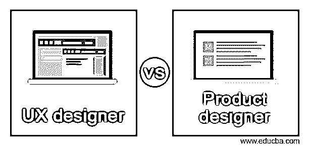
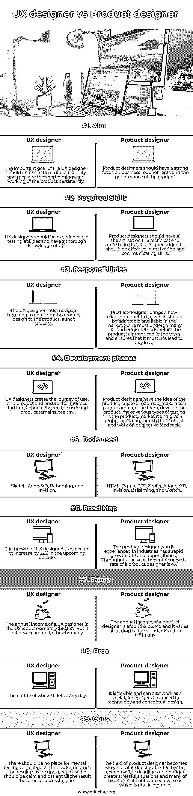

# UX 设计师 vs 产品设计师

> 原文：<https://www.educba.com/ux-designer-vs-product-designer/>

## UX 设计师和产品设计师的区别

UX 设计师的角色涵盖了用户和产品之间交互的整个端到端方面，并探索任何可以通过业务和产品实现的新机会。它旨在开发包括功能、设计、营销和品牌的产品。产品设计师应该对用户和他的产品体验负责。他应该能够修复产品的缺点，并使用户对该产品的体验更加舒适。他的旅程继续为产品提供附加特性和功能。在这个主题中，我们将学习 UX 设计师和产品设计师。

### UX 设计师与产品设计师的面对面比较(信息图)

以下是 UX 设计师和产品设计师的主要区别:

<small>网页开发、编程语言、软件测试&其他</small>

### UX 设计师与产品设计师的主要区别

**定义:**

UX 设计师致力于用户满意度，确保产品满足用户需求。他继续以用户与产品的交互为主要工作进行设计，提高产品的可访问性和可用性。他将负责提供从设计、研究到构思的全部范围，并保持以人为本。他必须了解用户的想法，知道他们对产品提供完全优化的需求。产品设计师通常被称为百事通，因为它涉及到全栈设计师、UX 设计师、UI 设计师、项目管理、编码和解决问题。他解决产品在初始阶段出现的所有问题。为了解决这个问题，他必须与他的团队合作，创建各种测试计划，开发线框，等等，直到产品发布成功。他应该与营销团队保持联系，以验证产品和品牌之间的协同作用。

技能集:

UX 设计师的必备技能是精通 Figma、Adobe XD 和 Sketch 等原型工具，还应该具备行业标准设计方面的专业知识。他应该在进行用户调查、规划竞争对手分析、线框技巧和原型制作方面经验丰富。产品设计师的要求必须具备任何相关的正式资格和正规学士学位。在 UI 或 UX 设计方面，他应该有三年以上的经验，熟练使用 Figma，Adobe XD 和 Sketch 等原型工具。他应该对设计思维的应用、计划和项目工作的范围有很强的理解。他应该有以用户为中心的心态来处理复杂的应用程序。他应该能够在移动设备和桌面上开发功能方案。他应该与工程师合作更新功能、服务和产品。他应该有流利的沟通技巧和很强的视觉技巧。

**职责:**

UX 设计师的主要目标应该是理解商业指标，他应该能够将公司的目标转化为数字体验。他应该在开发信息架构、用户角色、故事板、解释数据、创建站点地图和提供定性反馈方面很健壮。他应该为客户辩护，并定期跟进面向用户的设计原则。他应该在整个设计方案中不断迭代。产品设计师应该对概念上的想法负责，并把有价值和有用的东西转化给数百万用户。他应该与执行团队和产品的其他部分一起为高端战略决策做出贡献。他向其他设计师征求反馈，直到达到质量标准。他应该与工程师、研究员、项目经理、内容策略合作，监督用户和产品的体验，直到产品发布并大获成功。

### UX 设计师和产品设计师对照表

| **特性** | **UX 设计师** | **产品设计师** |
| **瞄准** | UX 设计师的重要目标应该是提高产品的可用性，并持续地度量产品的缺点和工作情况。 | 产品设计师应该重点关注业务需求和产品性能。 |
| **所需技能** | UX 设计师应该是经验丰富的测试能力，并有一个彻底的 UX 知识。 | 产品设计师应该具备技术方面的所有技能，而不仅仅是 UX 设计师所补充的，他还应该具备有效的营销和沟通技能。 |
| **职责** | UX 设计师必须从产品设计到产品上市过程全程导航。 | 产品设计师带来了一种新的可靠的产品，这种产品应该在市场上具有适应性和可靠性。因此，在将产品引入城镇之前，他必须经历许多反复试验的方法，并确保它不会导致任何损失。 |
| **开发阶段** | UX 设计师创造了用户和产品的旅程，并确保用户和产品之间的界面和互动保持健康。 | 产品设计师有产品的想法，创建路线图，制定测试计划，协调团队，开发产品，在产品中进行各种类型的测试，营销产品并给出适当的品牌，推出产品并进行定性反馈。 |
| **使用的工具** | 草图、AdobeXD、轻涂和视觉 | HTML、Figma、CSS、Zeplin、AdoobeXD、Invision、Balsaming 和 Sketch |
| **路线图** | 未来十年，UX 设计师的增长预计将达到 22%。 | 有行业经验的产品设计师成长速度快，机会多。全年来看，产品设计师的整体增长率为 4% |
| **工资** | 在美国，一名 UX 设计师的年收入约为 90，697 美元。但是根据公司的不同而不同 | 产品设计师的年收入大约是 106，745 美元，根据公司的标准而有所不同 |
| **优点** | The nature of works differs every day. | 它是灵活的，也可以作为一个自由职业者。他在技术和概念设计方面取得了进步。 |
| **Cons** | 精神上的感受和负面的批评不应该存在。有时结果可能是意想不到的，所以他应该冷静和耐心，直到结果成为一个成功的。 | 产品设计师的领域变得更慢，因为它直接受到经济的影响。截止日期和预算造成了紧张的局面，他的许多工作被外包到海外，这是不可接受的。 |

### 结论

因此，这是 UX 和产品设计师的各种观点，并希望工作的要求和性质是清楚明白的。

### 推荐文章

这是一个 UX 设计师与产品设计师的指南。在这里，我们通过信息图表和比较表来讨论 UX 设计师和产品设计师的主要区别。您也可以看看以下文章，了解更多信息–

1.  [Nginx vs Tomcat](https://www.educba.com/nginx-vs-tomcat/)
2.  [RxJava vs 反应器](https://www.educba.com/rxjava-vs-reactor/)
3.  [侏儒 vs KDE](https://www.educba.com/gnome-vs-kde/)
4.  [气流 vs 詹金斯](https://www.educba.com/airflow-vs-jenkins/)

