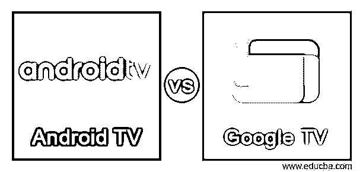
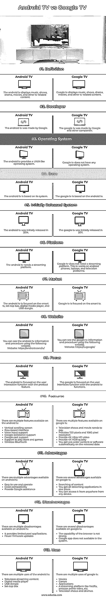

# 安卓电视 vs 谷歌电视

> 原文：<https://www.educba.com/android-tv-vs-google-tv/>

## 安卓电视与谷歌电视的区别

*   谷歌电视和安卓电视都是基于安卓系统来制造更智能的电视。
*   安卓电视和谷歌电视由谷歌公司开发，提供多种新的先进功能。
*   谷歌电视和安卓电视专注于智能电视市场，并提供更好的应用程序、功能和其他组件。
*   Android tv 是谷歌开发的一个操作系统，用于智能电视、媒体棒、机顶盒和其他与电视相关的设备。
*   谷歌电视不是一个操作系统，但它提供了更高级的体验，并试图获得所需的内容。
*   谷歌电视没有单独的流媒体平台，但安卓电视建立在不同品牌的流媒体平台上。
*   Android tv 和 google tv 是独立的流媒体平台，用于显示电视节目、电影和其他电视相关内容。

### 安卓电视和谷歌电视的面对面比较(信息图)

以下是安卓电视与谷歌电视的 13 大区别:

<small>网页开发、编程语言、软件测试&其他</small>

### 安卓电视与谷歌电视对比表

*   谷歌电视在安卓电视上提供先进和用户友好的应用程序。
*   安卓电视和谷歌电视是由同一家公司基于安卓系统打造的。
*   安卓电视和谷歌电视有一些相似和不同的功能。
*   对比表显示了 Android 电视和谷歌电视最相似和不同的功能。

| **特性** | **安卓电视** | **谷歌电视** |
| **定义** | android 电视显示音乐、节目、戏剧、电影和其他电视相关内容。 | 谷歌电视显示音乐、节目、戏剧、电影和其他电视相关内容。 |
| **开发者** | 安卓电视是由谷歌制造的。 | 谷歌电视是由谷歌和其他公司制造的。 |
| **操作系统** | 安卓电视提供了一个类似 UNIX 的操作系统。 | 谷歌电视没有任何操作系统。 |
| **基地** | 安卓电视就是基于它的系统。 | 谷歌电视基于安卓电视。 |
| **最初发布的系统** | 安卓电视最初于 2014 年发布。 | 谷歌电视最初于 2011 年发布。 |
| **平台** | android 电视需要一个流媒体平台。 | 谷歌电视不需要流媒体平台。这款电视可以在安卓手机、笔记本电脑和电视平台上运行。 |
| **市场** | android tv 专注于智能电视、机顶盒、数字媒体播放器和 USB 加密狗。 | 谷歌电视专注于智能电视。 |
| **网站** | You can see the android tv information and procedure using the following website.网站:https://android.com/tv/ | You can see the google tv information and procedure using the following website.

网站:https://tv.google/

 |
| **焦点** | android 电视侧重于产品功能的用户交互功能。 | The google tv focused on the user interfaces function with the android tv functions. |
| **特性** | There are multiple features available on the android tv.垂直滚动屏幕基于行的界面语音输入支持Google 协助支持Google cast 支持支持玩商店和游戏无线蓝牙 | There are multiple features available on google tv.电视节目和电影需要付费。提供 720 像素和 1080 像素分辨率提供 4K 超高清视频提供 4K HDR 质量您可以在发布日期自动获得预购内容或软件。 |
| **优势** | There are multiple advantages available on android tv.易于使用和操作

兼容性好

提供谷歌协助

 | There are several advantages available on google tv.内容搜索你可以在一个地方获得所有的流媒体应用。您可以从任何地方通过任何设备访问它。 |
| **缺点** | There are multiple disadvantages available on android tv.它提供有限的池应用。更少的固件更新 | There are several disadvantages available on google tv.浏览器的能力不强。系统中没有谷歌应用程序。 |
| **用途** | There are multiple uses of the android tv.

电视流媒体内容。

数字媒体播放器

USB 加密狗

机顶盒

 | There are multiple uses of google tv.电影比赛应用程序像网飞、亚马逊 prime video 等流媒体平台。电视节目和戏剧。 |

### 安卓电视与谷歌电视的主要区别

*   安卓电视使用操作系统，但谷歌电视不使用任何操作系统。
*   谷歌电视基于安卓技术，但安卓电视并不基于谷歌电视。
*   谷歌电视没有特定的流媒体平台，但安卓电视有流媒体平台和自己的品牌。
*   谷歌电视可以作为软件或网站在任何流媒体设备上运行，但安卓电视可以在电视平台上运行。
*   谷歌电视专注于用户兴趣，如用户观看兴趣，并显示相关内容。android 电视专注于用户干预，如添加新功能、更新可用功能和使电视更可用。
*   你可以使用智能手机在任何地方使用谷歌电视，但你必须在一个地方使用安卓电视。
*   谷歌电视可以在安卓电视平台上运行。谷歌电视是安卓电视的高级版本。
*   谷歌电视是基于软件相关的内容。它在网飞、youtube、亚马逊 prime video 和其他流媒体频道上提供。但是 android 系统支持基于硬件的智能电视系统。
*   安卓电视提供了比谷歌电视更多的品牌，如飞利浦、索尼。
*   android 电视专注于不止一种数字媒体产品，但谷歌电视专注于智能电视及其应用。
*   安卓电视创造了智能电视及其相关产品，而谷歌电视创造了智能电视应用和高级用户界面系统。
*   安卓电视提供谷歌助手，但谷歌电视不支持谷歌应用程序。

### 结论

android tv 和 google tv 是以用户及其需求为中心的智能电视产品。安卓电视有一个购买产品的实体市场，谷歌电视有一个获取软件的数字市场。android tv 和 google tv 使用户界面友好、简单，并改进了流媒体平台。android tv 和 google tv 致力于用户交互以获取内容和功能。

### 推荐文章

这是安卓电视 vs 谷歌电视的指南。在这里，我们分别通过信息图和对比表来讨论 Android TV 和 Google TV 的主要区别。您也可以看看以下文章，了解更多信息–

1.  [安卓电影应用](https://www.educba.com/movie-apps-for-android/)
2.  [SCTP vs TCP](https://www.educba.com/sctp-vs-tcp/)
3.  [Chrome 远程桌面 vs Teamviewer](https://www.educba.com/chrome-remote-desktop-vs-teamviewer/)
4.  [OpenLayers vs 传单](https://www.educba.com/openlayers-vs-leaflet/)

