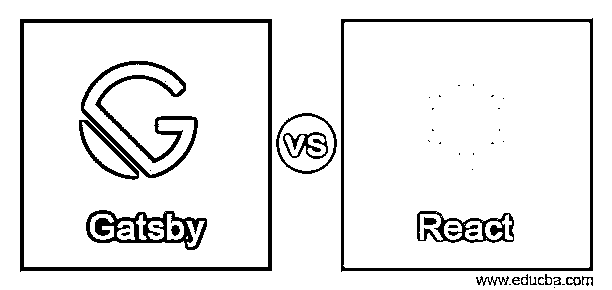
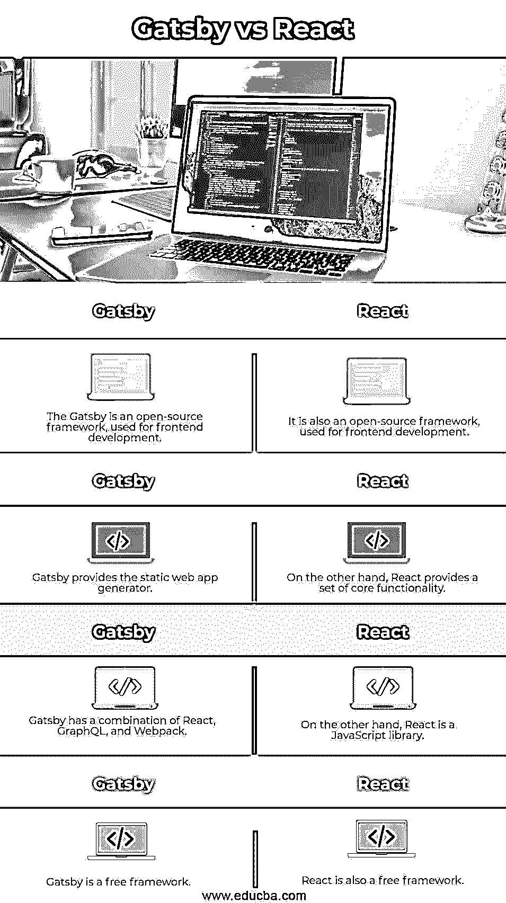

# 盖茨比 vs React

> 原文：<https://www.educba.com/gatsby-vs-react/>

## 盖茨比和 React 的区别

Gatsby 为前端提供了一个开源框架来开发不同类型的功能，如创建一个动态和优化的网站，同时它还提供了开发的云平台。基本上，Gatsby 在单一平台中提供了 React、GraphQL 和 Webpack 等组合功能。另一方面，React 也是一个开源的前端框架，基本上 React 是一个 JavaScript 库，用于开发用户界面，或者我们可以说是不同的 UI 组件。React 由脸书和 Instagram 维护和开发。这两个框架都用于开发前端 UI。

### 盖茨比与 React 的正面比较(信息图)

以下是《盖茨比》和《反应》的四大区别:

<small>网页开发、编程语言、软件测试&其他</small>

### 盖茨比和 React 的主要区别

现在让我们来看看 Gatsby 和 React 框架之间的主要区别，如下所示。首先，让我们如下理解 Gatsby 框架的工作细节。

Gatsby 是一个开源结构，它将 React、GraphQL 和 Webpack 的有用性整合到一个单独的设备中，用于构建静态站点和应用程序。从它所支持的地区的快速呈现、代码分离等惊人的开箱即用的亮点以及友好的设计师体验可以推断，Gatsby 正在迅速成为当前 web 改进的主要内容。

现在让我们看看什么是静态站点生成器，如下所示。

既然 Gatsby 是一个静态的站点生成器，那么在进入其他领域之前，我们先研究一下这个想法怎么样。如果你偶然发现了一个自 20 世纪 90 年代中期就已经存在的普通 HTML 页面，那么你找到了一个静态站点。那么，你会问，什么东西能在网络上创造静态内容，特别有创意？

静态站点生成器给桌面带来的非凡固定是动态物质堆叠。在通常的信息库驱动的实体管理框架中，如 WordPress 或 Drupal，产品层从客户那里获得资产需求，组合合适的布局和内容记录，然后，在这一点上相应地提供一个完整的 HTML 页面。尽管如此，静态的网站生成器还是将实体从展示它们的布局中分离出来。它们在构造时通过将格式与来自外部 API 的内容合并来生成 HTML 页面，然后，在那时，将这些页面传递给 web 工作人员，后者对交付的 HTML 做出反应。

**JAMstack**

静态网站生成器支持一种被称为“JAMstack”的 web 工程，它是“JavaScript、API 和标记”的组合，并且是组织托管和提供 web 内容所需的各种资产(如 JavaScript、API 和标记)的前沿。

现在我们来看看 React 在《盖茨比》中是怎么用的，如下。

Gatsby 应用程序中某个部分的容量取决于它在文件系统中的区域。src/parts 下的部件是基本的页面部件，它们根据文件名在 URL 上创建页面——例如，src/pages/index.js 会生成 mywebsite.com/about.页面格式部件，就像页面部件一样；但是，它们位于 src/layouts 下，适合询问 GraphQL 以恢复减价信息，然后填充到它们生成的页面中。

现在我们来看看 Gatsby 中的 GraphSQL 如下。

像 React 一样，GraphQL 也是由脸书开发的，因此它可能是将信息堆叠到 React 部件中最令人印象深刻和适应性最强的技术。作为一种查询语言(后来的“QL”)，GraphQL 的工作方式类似于 SQL，因为客户端在“查询”中描述基本信息，并在反应中返回。

对于 Gatsby 的安装，我们需要使用如下命令。

`npm install –g gatsby-cli`

安装后，我们需要创建本地目录，并根据需要进行配置。

**现在我们来看看反应如下。**

我们已经讨论过 React 是 JavaScript。

现在让我们看看 React 中的组件，如下所示。

响应部件执行 render()技术，该技术接受输入信息并返回要显示的内容。这个模型使用一种类似 XML 的语法，叫做 JSX。通过 this.props，render()可以获取传递到部件中的信息。

**表示反应中的成分:**

除了获取信息(通过 this.props 获得)之外，一个部件还可以跟上内部状态信息(通过 this.state 获得)。当一个部件的状态信息发生变化时，交付的标记将被一个重新调用的 render()刷新。

现在让我们看看如何创建一个 React 应用程序，如下所示。

脸书制作了一个 Create React 应用程序，提供了组装一个 React 应用程序所需的一切。它是一个利用 Webpack 收集 React、JSX 和 ES6 自动前缀 CSS 文档的改进工人。

利用道具和状态，我们可以组装一些东西来做一个应用程序。这个模型使用状态来跟踪事物的当前概要，就像客户端输入的文本一样。尽管事实上，场合监督员有所有的内联交付的标志，他们将利用场合分配被收集和执行。

**虚拟 DOM:**

另一个突出的组件是虚拟文档对象模型或虚拟 DOM 的利用。Respond 在内存中存储信息结构，注册后续的对比，然后熟练地刷新程序显示的 DOM。这种互动叫做妥协。

对于 React 的安装，我们需要使用如下命令。

`npm i npx`

为了创建 React 应用程序，我们可以使用如下命令。

`npx create-react-app name of application`

### 盖茨比 vs React 对比表

现在我们来看看盖茨比的对比表，反应如下以便更好理解。

| 盖茨比 | **反应** |
| Gatsby 是一个开源框架，用于前端开发。 | 它也是一个开源框架，用于前端开发。 |
| Gatsby 提供了静态 web 应用程序生成器。 | 另一方面，React 提供了一组核心功能。 |
| Gatsby 结合了 React、GraphQL 和 Webpack。 | 另一方面，React 是一个 JavaScript 库。 |
| 盖茨比是一个自由的框架。 | React 也是一个免费框架。 |

### 结论

我们希望从这篇文章中你能更多地了解盖茨比和 React。从上面的文章中，我们了解了盖茨比和 React 之间的基本区别，我们也看到了它们之间的关键区别。从这篇文章中，我们了解了如何以及何时使用 Gatsby vs React。

### 推荐文章

这是盖茨比 vs React 的指南。这里我们分别用信息图和比较表来讨论 Gatsby vs React 的关键区别。您也可以看看以下文章，了解更多信息–

1.  [苗条 vs 反应](https://www.educba.com/svelte-vs-react/)
2.  [角度 5°对反作用力](https://www.educba.com/angular-5-vs-react/)
3.  [角度与反作用](https://www.educba.com/angular-vs-react/)
4.  [RxJava vs 反应器](https://www.educba.com/rxjava-vs-reactor/)

