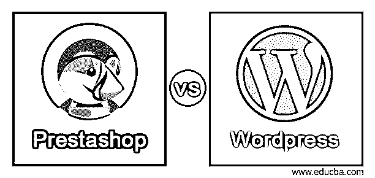
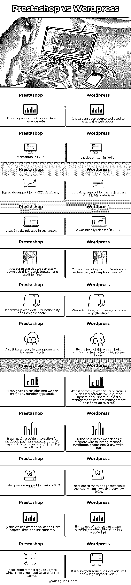

# Prestashop vs WordPress

> 原文：<https://www.educba.com/prestashop-vs-wordpress/>

## Prestashop 和 WordPress 的区别

下面的文章提供了 Prestashop vs WordPress 的概要。2015 年首次发布的 Prestashop 基本上有两种语言版本。但是现在它提供了 13 种语言支持。它基本上是一个开源平台，用于电子商务平台，最初用 PHP 编写，支持 MySQL，主要在全球使用。另一方面，我们有 WordPress，它也是一个开源平台，也是用 PHP 编写的，支持 Maria db 和 MySQL，也用于创建网页。它包含一个前端控制器，用于将所有静态 URL 转移到一个 PHP 文件中。

### Prestashop 和 WordPress 的直接对比(信息图表)

以下是 Prestashop 和 WordPress 的 12 大区别:

<small>网页开发、编程语言、软件测试&其他</small>

### Prestashop 和 WordPress 的主要区别

让我们讨论一下 Prestashop 和 WordPress 之间的一些主要区别。正如我们所看到的，两者都是用来创建网站的，最初都是用 PHP 编写的。两者都有各自的优势和劣势。

**1。平台支持:** WordPress 和 Prestashop 支持不同种类的平台，这意味着我们可以为不同的平台创建应用程序。

WordPress:T1

*   基于网络的
*   iPhone 应用程序
*   Android 应用程序

**预铺:**

*   基于网络的应用

**2。使用它们的定价:**它们都有不同的定价方案，其中还包括免费试用。

WordPress:T1

*   提供免费试用
*   基于订阅
*   免费账户
*   信用卡必填假

**预铺:**

*   免费账户
*   提供免费试用
*   信用卡必填假

我们可以在他们的官方网站上详细查看两者的定价，以便更好地了解。

**3。关键特性:**在这一点上，我们将更详细地讨论两者所提供的特性。

WordPress:T1

*   它为我们提供了内容管理
*   此外，提供协作工具
*   我们可以自动更新
*   自动备份可用
*   文件管理(音频)
*   我们可以创建定制模板
*   数据导出/导入等等

**预铺:**

*   定制类别
*   客户关系管理
*   存货管理
*   SEO 管理工具
*   更多的

**4。通过使用这两者，我们可以进行整合。两者都支持集成列表。**

与 Prestashop 相比，它有更多的集成。

*   它为与脸书集成提供支持
*   Slack 易于集成
*   PayPal(任何支付网关)
*   吱吱叫
*   Instagram
*   云(salesforce 销售)
*   WooCommerce 等等

Prestashop: 与 WordPress 相比，它的集成列表较少，下面列出了其中几个。

*   MailChimp
*   快速图书
*   船舶电台

**5。两者的缺点:**简而言之，让我们看看他们各自的缺点。优点可以被认为是它们都提供的关键特性。

WordPress:T1

*   一些用户抱怨它的功能非常有限
*   此外，对客户的支持也不好
*   一些插件在互联网上也没有很好的支持

**预铺:**

*   它非常局限于它所提供的集成，我们已经在它的关键特性中看到了这一点
*   当用户想要更新一些东西时，它被认为是非常不稳定的。它通常会破解密码
*   不支持许多基于平台的应用程序
*   如果我们想要建立这个计划，我们可能需要编程技能

### Prestashop 与 WordPress 对比表

我们来讨论一下 Prestashop 和 WordPress 的顶级对比:

| **预铺** | **WordPress** |
| 它是一个用于电子商务网站的开源工具。 | 它也是一个用于创建网页的开源工具。 |
| 它是用 PHP 写的。 | 也是用 PHP 写的。 |
| 它为 MySQL 数据库提供支持。 | 它支持 maria 数据库和 MySQL 数据库。 |
| 它最初发布于 2004 年。 | 它最初发布于 2003 年。 |
| 为了使用它，我们可以通过网络浏览器轻松下载并免费使用。 | 提供各种定价方案，如免费试用、订阅等。 |
| 它提供了默认功能和丰富的仪表板。 | 我们可以很容易地进行集成，而且价格非常低廉。 |
| 此外，它非常容易使用，理解和用户友好。 | 有了它的帮助，我们可以在几个小时内从头开始构建应用程序。 |
| 它很容易扩展，我们可以创造任何数量的产品。 | 此外，它提出了各种功能，如自动备份，自动更新，反垃圾邮件，音频文件管理，内容管理，协作工具等。 |
| 它可以轻松地为脸书、支付网关等提供集成。我们可以使用市场上的扩展来添加它。 | 有了它的帮助，我们可以很容易地整合以下:脸书，Instagram，谷歌分析，贝宝等。 |
| 它还提供对各种 SEO 工具的支持。 | 有这么多和数以千计的主题可用，这是一个非常低的价格。 |
| 通过这种方式，我们可以从头开始创建应用程序，即在线商店等。 | 通过使用这一点，我们可以创建一个美丽的网站，没有编码知识。 |
| 这种安装非常简单，这意味着不需要关心服务器。 | 它也是开源的，所以不会限制开发能力。 |

### 结论

正如我们已经详细了解的那样，现在我们可以主要根据需求来决定使用哪一个，浏览一遍教程，然后决定我们必须使用哪一个。易于使用，处理，维护和理解的开发人员。

### 推荐文章

这是 Prestashop vs WordPress 的指南。这里我们分别用信息图和比较表来讨论 Prestashop 和 WordPress 的关键区别。您也可以看看以下文章，了解更多信息–

1.  [WordPress vs Drupal](https://www.educba.com/wordpress-vs-drupal/)
2.  [WordPress vs Blogger](https://www.educba.com/wordpress-vs-blogger/)
3.  [WordPress vs WebFlow](https://www.educba.com/wordpress-vs-webflow/)
4.  [WordPress vs Magento](https://www.educba.com/wordpress-vs-magento/)

