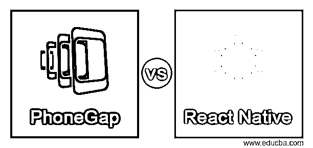
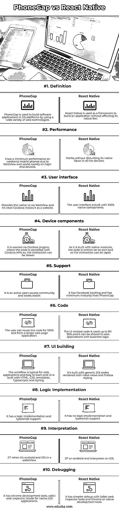

# PhoneGap vs React Native

> 原文：<https://www.educba.com/phonegap-vs-react-native/>

## PhoneGap 和 React Native 的区别

PhoneGap 是一个软件框架，用于构建移动应用程序，并为所有著名的移动平台开发应用程序，如 Android、iOS、Windows、BlackBerry 等。它使用户能够通过忽略每个移动平台的本地开发语言来构建跨平台的移动应用程序。而 React Native 是一个著名的面向 JavaScript 的移动应用程序框架，支持为 Android 和 iOS 开发本地渲染的移动应用程序。这个框架使用户能够在不同的平台上用相同的代码库创建应用程序。下面讨论 PhoneGap 和 React Native 的区别和比较。

### PhoneGap 和 React Native 的主要区别

重要的区别，如概述，属性，应用，优点和缺点在这里讨论。

<small>网页开发、编程语言、软件测试&其他</small>

**概述:**

PhoneGap 简化了移动应用程序开发的生活，因为它让他可以使用任何他熟练和熟悉的框架和 JavaScript 库。但是 React Native 可以确保用户在应用程序上感受到基于本机的性能，从而提供完美的用户体验。

PhoneGap 留下了一点妥协，因为它涉及所有的混合移动应用程序，并且无法提供原始的用户体验。而 React Native 是通过呈现本机组件构建的

**使用的技术:**

PhoneGap 在基于浏览器的 UI 上使用 CSS、JavaScript 或 HTML，这允许开发者使用他想要的 web 技术。它通过 API 导航器访问电话的组件来公开本地移动设备的 API。这是一个 Apache Cordova 的共享，提供定制的包和小调整，他可以通过 WebView 在移动应用程序中巩固网站。PhoneGap 允许用户通过使用 Apache Cordova 来访问本地功能，如日历、联系人、相机。

React Native 是一个 UI 软件，是一个开源的应用程序，内置了 JavaScript 和真实的组件。它通过满足操作系统(如 iOS、macOS、Android TV、Android、tvOS、UWP、Windows 和 Web)的价值观，允许开发人员应用具有本机平台风格的 React 框架，从而根据规则工作。

**优点:**

PhoneGap 为开发者提供了大量可供选择的库或框架。因此，这将是对 web 构建开发人员的一种款待，因为他们可以玩 web 工具，并喜欢用 CSS 和 HTML 开发用户界面。它是开发人员友好的，没有人能打败这个服务，因为它不局限于任何框架。基于 PhoneGap 的应用程序在指向每个平台的包装器中执行，并使用 API 绑定，这些 API 符合所有提供的标准，用于处理每个移动设备数据、传感器和网络状态。它依赖于编写一次，在每个平台上执行，以获得跨平台开发的好处，并且不希望用户受到本地开发的束缚，他可以拥有所有具有相似 UI 的应用程序。React Native 的优势在于其高性能动画具有原生的外观和感觉。它使用真正的本地工具而不是 WebView，并像专家一样呈现本地视图，对浏览器兼容性没有任何挑战。它的可靠性已经在优步、Airbnb 和 Instagram 上得到证实，它遵循“一次学习，随处创作”的原则。因为如果你学习了一次原生语言，你就不需要经常研究 Java 或 C 语言，并且可以将你的技能释放到应用程序功能中。由于其广泛的社区，专家是可以联系到的。

**限制:**

PhoneGap 的性能很慢，给用户带来的体验很差。它是为网页设计的，不能加载动画或复杂的应用程序。由于这是一个混合应用程序，用户容易出现 web 问题。根据浏览器的不同，这些错误是特定于某些奇怪的浏览器风格的。React Native 的缺点是它与本机平台有关，如果有任何 bug 或由于面向平台的组件，每次都需要编译它，并且应该非常熟练地使用 React 来工作。用户不应该在这里使用 HTML 和原生组件，因为他会感觉到杂耍。

### PhoneGap 与 React Native 对比表

| **特性** | **PhoneGap** | **反应原生** |
| **定义** | PhoneGap 用于通过使用各种各样的 web 技术在 OS 平台中构建软件应用程序。 | React Native 用作构建应用程序的框架，而不会影响其本机感觉。 |
| **性能** | 由于 WebView，在周末手机上的性能最低，在高端设备上工作迅速。 | 在所有设备中都能正常工作，不会影响其原有风味。 |
| **用户界面** | 通过 WebView 提供原生用户界面，显然 Cordova 使它成为一个网站。 | 用户界面由 100%原生组件构建而成。 |
| **设备组件** | 它是通过 Cordova 插件工作的，代码是用 Cordova APIs 编译的，所以交互会慢一些。 | 因为它是用本机模块构建的，所以代码是自己编写的，所以交互可以很快。 |
| **支持** | 它是一个活跃的开源社区，工作稳定 | 它有脸书的支持，成熟度比 PhoneGap 低 |
| **代码** | 用户可以 100%重用代码，形成一个单独的网页应用程序。 | 与 UI 相关的代码被使用了 90-95%,它可以与具有业务逻辑的 web 应用程序共享。 |
| **UI 构建** | 该工作流是典型的 web 应用程序，易于学习，用户界面是用 HTML、CSS、模板、类型脚本和样式构建的 | 它是用普通的 JSX 代码构建的，用天真的观点和火箱样式渲染 |
| **逻辑实现** | 它具有逻辑实现和类型脚本支持 | 它没有逻辑实现和类型脚本支持 |
| **解读** | 当 android 和 iOS 在网络视图中时，JIT | android 上的 JIT 和 iOS 上的解释器 |
| **调试** | 它有 chrome 开发工具、safari web inspector、用于原生 iOS 应用程序的 Xcode。 | 使用 Safari web inspector 工具和 chrome 或原生开发工具，它的调试更加简单 |

### 结论

这里我们列出了 PhoneGap 和 React Native 的所有优点和缺点，因此，选择 PhoneGap 还是 React Native 是用户的选择。

### 推荐文章

这是 PhoneGap vs React Native 的指南。这里我们分别用信息图和比较表来讨论 PhoneGap 和 React 本机键的区别。您也可以看看以下文章，了解更多信息–

1.  [React Native vs React](https://www.educba.com/react-native-vs-react/)
2.  [反应自然 vs 颤动](https://www.educba.com/react-native-vs-flutter/)
3.  [反应原生 vs 迅捷](https://www.educba.com/react-native-vs-swift/)
4.  [离子 vs 反应原生](https://www.educba.com/ionic-vs-react-native/)

