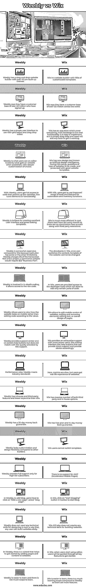

# Weebly vs Wix

> 原文：<https://www.educba.com/weebly-vs-wix/>

## Weebly 与 Wix 的区别

Weebly vs Wix 将给出两个应用程序的比较、差异和相似之处。Weebly 是一款免费的网站构建工具，用于创建网站、在线商店或博客。Wix 是一个用于创建博客或网站的开源软件。这两个工具都是绝对免费的，并且将会无限期免费。Wix 和 Weebly 都是网站建设者，但有一些关键的区别，Weebly 易于使用，但缺乏主题定制，而 Wix 另一方面提供了自由，但偶尔会变得混乱。Wix 和 Weebly 有近 1.5 亿用户，易于使用，有一个拖放网站平台。

### Weebly 与 Wix 的直接对比(信息图表)

以下是 Weebly 与 Wix 的 19 大区别:

<small>网页开发、编程语言、软件测试&其他</small>

### Weebly 与 Wix 的主要区别

让我们来讨论 Weebly 与 Wix 之间的一些主要区别:

*   Weebly 和 Wix 之间最重要的关键区别是编辑器、网站构建器的易用性及其功能。
*   Weebly 和 Wix 都提供了应用商店，让用户在扩展核心网站构建器中安装应用程序。
*   Wix 拥有强大的工具，如 Wix Ascend 和 Wix 的 Corvid 是新产品，它们将使 Wix 从一个页面生成器成为一个重要的商业工具。
*   Weebly 没有将其平台向前推进到几乎相同的速度，提供强大的电子商务产品。
*   Weebly 必须满足最基本的使用情况，模板既时尚又响应迅速。
*   Weebly 有很多电子商务功能来支持网站，但没有向前发展。它仍然是可靠的和经过测试的网站建设平台之一。
*   Wix 在 DIY 网站建设者中名列前茅，拥有小企业主和企业家需要的所有工具。

### Weebly 与 Wix 对比表

让我们来讨论 Weebly 与 Wix 之间的主要比较:

| **Weebly** | **Wix** |
| Weebly 有一个拖放网站建设者超过 40 个预先建立的主题。 | Wix 是一个网站建设者，拥有数百个可定制的模板。 |
| Weebly 说他们有超过 4000 万的注册用户。 | Wix 表示，他们在全球拥有超过 1.25 亿的客户群。 |
| Weebly 有一个简单的用户界面，可以与基于网格和拖放的编辑器一起使用。 | Wix 有一个应用程序商店，涵盖从预订到实时聊天功能的所有内容。它很容易实现，因为它只是一个简单的拖放，不需要添加任何代码就可以工作。 |
| Weebly 是用户在编辑器上看到的正是网站上发布的内容，并有更深层次的定制选择。 | Wix 有一个新的设计工具，被称为人工设计智能。在 Wix 设置期间，要制作的网站类型的问题，并提供良好的网站模板。 |
| 有了 Weebly，用户可以完全访问增强网站功能的代码，微调元素或功能。 | 借助 Wix，用户可以使用范围更广的工具和功能来实现自动化和库存功能。 |
| Weebly 在创建优秀的用户界面和漂亮的模板方面非常出色。 | Wix 在成本上更有效率。计划从每月 14 美元开始，因为没有第三方扩展的佣金。 |
| Weebly 与 Wix 相比有些昂贵，因为每个计划都有一些其他的限制。Weebly 收取 3%的交易费用，一个合适的电子商务网站需要 25 美元的“商业计划书”。 | Wix 中的弊端，用户一旦发布内容，网站的模板就无法更改。 |
| Weebly 参与深度编码，它允许访问原始代码。 | 在 Wix 中，用户可以访问开发人员工具，这些工具只允许编辑代码的某些部分。 |
| Weebly 允许用户在手机上查看网站的外观，而不是根据视图编辑代码。 | Wix 允许编辑网站的移动版本，添加和删除元素，编辑文本或页面的整体设计。 |
| Weebly 提供了支持中心和屏幕帮助按钮，但质量不如 Wix 支持。 | Wix 为更多的高级用户提供全面的支持。站点编辑界面有帮助按钮，可以提供直接支持并相应地提供建议。 |
| 就性能而言，Weebly 符合行业标准。 | 在这里，度量很慢，但用户可以获得网站的真实体验。 |
| Weebly 具有内部和第三方功能，比 Wix 便宜。 | Wix 有大量的第三方和内部选项。 |
| Weebly 有 30 天的退款保证。 | Wix 有免费计划和 14 天退款保证。 |
| 与其他建筑商相比，Weebly 缺乏定制和设计灵活性。 | Wix 用户不能切换模板。 |
| Weebly 只为高层用户提供全面支持。 | 不支持 AMP(加速移动网页)。 |
| 在 Weebly 中，要添加博客，用户必须点击“添加新页面”，选择“博客页面”。 | 在 Wix 中，点击工具栏中的“开始写博客”按钮开始写博客。 |
| Weebly 的设计不需要任何技术技能，任何用户都可以轻松地建立网站。 | Wix ADI 也不需要任何技术技能来构建网站。 |
| 在 Weebly 中，有一个向导可以帮助您开始向网站添加页面和内容。 | 在 Wix 中，当用户开始使用编辑器时，用户将被引导通过所有关键特性来开始使用。 |
| Weebly 更容易学，也没有太大的学习空间。 | Wix 更容易学习，与 Weebly 相比有更多的学习空间，因为它有更多的特性。 |

### 结论

至此，我们将结束“Weebly vs Wix”这个话题。我们已经看到了 Weebly 与 Wix 的比较意味着什么，以及每个网站构建者以各自的方式意味着什么。我们在一个比较表中看到了两个网站建设者的相似之处和不同之处，也列出了 Weebly 和 Wix 网站建设者的一些关键区别或需要注意的地方。基于这里看到的要点，你可以很容易地决定哪个网站建设者将最适合他们的需求。

### 推荐文章

这是 Weebly vs Wix 的指南。这里我们分别用信息图和比较表来讨论 Weebly 和 Wix 的主要区别。您也可以看看以下文章，了解更多信息–

1.  [WordPress vs Weebly](https://www.educba.com/wordpress-vs-weebly/)
2.  [WordPress vs Wix](https://www.educba.com/wordpress-vs-wix/)
3.  [吉姆多 vs 威克斯](https://www.educba.com/jimdo-vs-wix/)
4.  [Laravel vs WordPress](https://www.educba.com/laravel-vs-wordpress/)

