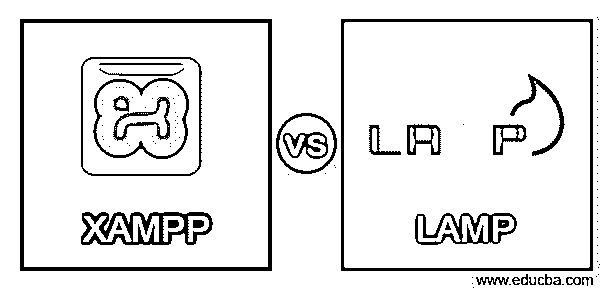
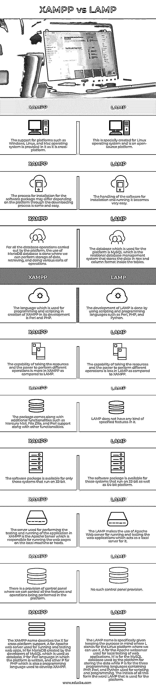

# XAMPP vs 灯

> 原文：<https://www.educba.com/xampp-vs-lamp/>

## XAMPP vs 灯简介

Xampp 和 Lamp 是两种可用的技术，它们被用作开源平台，用于提供在本地机器上执行编码和测试应用程序的环境。这两个平台都非常有用，因为它们都很容易安装。区别在于可以使用它们的操作系统和它们可以工作的数据库。在本文中，我们将简要概述这两种技术，了解它们之间存在的主要差异，并在比较这两种技术的同时，在比较表中进行讨论。

**Xampp**

<small>网页开发、编程语言、软件测试&其他</small>

Xampp 是一个多平台支持平台，可以在 Windows、Linux、Unix、Mac 等操作系统上运行。除此之外，它还可以在不同的数据库上工作，比如 My SQL、Apache、Pearl 和 PHP。由于它是一个开源平台，所以发布的更新版本改进了特性，使其功能更强大、特性更丰富。它可以免费下载，并且很容易获得。Xampp 中包含的属性有 Mercury Mail、Filezilla、Perl 等等。该平台非常健壮，因为它支持报告编解码器。简单和容易的配置和安装过程增加了它的好处。由于控制面板的存在，Xampp 的实现和管理变得更加容易。

**灯**

它有自己的长格式，如 Linux、Apache、MongoDB、MySQL、MariaDB 和 Python/ Perl/ PHP，描述了支持的数据库、编写脚本的编程语言和工作平台。它也是开源的，并且在不断发展。它最常用于网站建设，可以在任何 Linux 发行版上工作。

### XAMPP 与灯的主要区别

XAMPP 的完整版本适用于跨平台、Apache、MySQL 的 MariaDB、Pearl 和 PHP，而 LAMP 的完整版本适用于 Linux、Apache、MySQL 和 PHP。它们都充当本地服务器，我们可以在其中运行我们的应用程序并测试它的工作情况。XAMPP 是一个功能丰富的平台，提供文件 Zilla、pearl 支持和 mercury mail 以及许多关键功能。另一方面，Lamp 提供了以动态方式而不仅仅是静态方式生成网页的特性。最重要的关键区别是 Lamp 只能在 Linux 平台上工作，而 XAMPP 可以在任何给定的平台上工作，因为它是跨平台支持的。LAMP 支持名为 PHP 的面向对象编程语言，而 XAMPP 支持 Pearl 和 PHP。

### XAMPP 与 LAMP 的直接对比(信息图)

### XAMP 与 LAMP 的比较表

XAMPP 和 LAMP 之间的比较表如下所示，该表详细说明了每个平台的所有因素和特性。

| **XAMPP** | **灯** |
| 因为它是跨平台的，所以它提供了对 Windows、Linux 和 Mac 操作系统等平台的支持。 | 这是专门为 Linux 操作系统打造的，是一个开源平台。 |
| 软件包的安装过程可能会因平台而异，但下载过程是相同且简单的。 | 软件的安装和运行变得非常容易。 |
| 对于平台执行的所有数据库操作，使用 MariaDB 数据库是因为我们可以执行数据存储、检索和各种操作。 | 该平台使用的数据库是 MySQL，它是一个关系数据库管理系统，在表中以行和列的格式存储数据。 |
| 在 XAMPP 的创建和发展过程中，用于编程和编写脚本的语言是 Perl 和 PHP。 | LAMP 的开发是通过使用 Perl、PHP 和 Python 等脚本和编程语言来完成的。 |
| 与 LAMP 相比，XAMPP 更有能力利用资源和力量来执行不同的操作。 | 与 XAMPP 相比，LAMP 在获取资源和动力以执行不同操作方面的能力较弱。 |
| 这个包附带了额外的功能，如 Mercury Mail、File Zilla 和 Perl 支持以及其他功能。 | LAMP 没有任何指定的功能。 |
| 该软件包仅适用于运行 32 位的系统。 | 该软件包适用于在 32 位和 64 位平台上运行的系统。 |
| 用于在 XAMPP 执行应用程序测试和运行的服务器是 Apache 服务器，它负责在本地机器或主机上运行网页。 | LAMP 使用 Apache Web 服务器来运行和测试 Web 应用程序，该服务器充当 LAMP 的本地服务器。 |
| 提供了一个控制面板，我们可以在其中控制平台中正在执行的所有功能和操作。 | 没有这样的控制面板规定。 |
| XAMPP 名称描述了 X 代表跨平台支持，A 代表 Apache web 服务器，用于运行和测试 web 应用程序，M 代表由 MySQL 开发人员创建的 MariaDB，它被用作数据库，P 代表编写平台的 Perl 语言，其他 P 代表 PHP，它也是一种用于开发 XAMPP 的编程语言。 | LAMP 的名称是根据用途特别指定的，其中 L 代表我们可以使用它的 Linux 平台，A 代表用于 web 应用程序本地测试的 Apache webserver，M 代表平台用于存储数据的 MySQL 数据库，而 P 代表用于脚本和编程的三种编程语言，包括 PHP、Perl 和 Python。所有这些的首字母构成了平台上使用的单词 LAMP。 |

### 结论

XAMPP 和 LAMP 是两个软件包，它们被用作本地 web 服务器的平台，我们可以在那里运行和测试我们的 web 应用程序。这两个平台之间的区别在于它们可以安装和使用的操作系统、它所支持的特性以及用于编写它们的编程语言。

### 推荐文章

这是一个 XAMPP vs LAMP 的指南。在这里，我们分别通过信息图和比较表来讨论 XAMPP 和 LAMP 的主要区别。您也可以看看以下文章，了解更多信息–

1.  [WiFi vs 热点](https://www.educba.com/wifi-vs-hotspot/)
2.  [ArangoDB vs MongoDB](https://www.educba.com/arangodb-vs-mongodb/)
3.  [Scala 类 vs 对象](https://www.educba.com/scala-class-vs-object/)
4.  [网络钓鱼与域名欺诈](https://www.educba.com/phishing-vs-pharming/)

