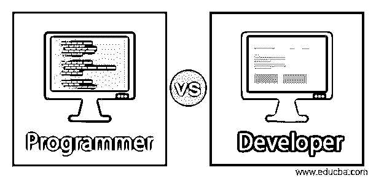
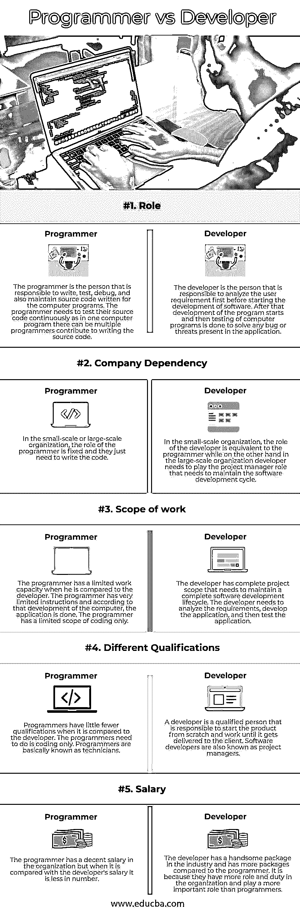

# 程序员与开发人员

> 原文：<https://www.educba.com/programmer-vs-developer/>

## 程序员和开发人员的区别

开发人员是负责在组织可以使用的真实场景的基础上构建应用程序和软件的人。开发人员负责发现完整软件应用程序的源代码中存在的错误和问题。开发者的另一个名字是软件开发者。程序员是负责创建计算机软件的人，他在某个计算机领域有专长，编写可用于创建软件的源代码。在这个主题中，我们将学习程序员和开发人员。

### 程序员与开发人员的面对面比较(信息图表)

下面是程序员和开发人员之间的主要区别

<small>网页开发、编程语言、软件测试&其他</small>

### 程序员与开发人员的主要区别

让我们讨论一下程序员和开发人员之间的一些主要区别:

1.  开发人员和程序员的主要区别之一是工作职责。程序员的工作职责就是写代码。程序员的主要工作职责是创建新代码，然后测试代码，解决小故障，并降低代码中的错误风险。开发人员的工作职责几乎相同，但他们需要分析用户需求，需要开发满足用户需求的计算机。开发人员有责任设计软件，然后将设计交给程序员来编写软件。开发人员和程序员紧密合作，以便最终产品，即软件应用程序，能够交付给用户。
2.  开发人员和程序员的另一个区别是基于角色。计算机程序员的角色是编写赋予软件应用程序生命的代码。程序员使用不同类型的编程语言来编码，然后进行严格的测试，以便如果有任何错误，它可以被解决。另一方面，开发人员充当设计师，根据用户或客户的需求为软件进行设计。开发人员扮演负责人的角色，负责软件应用程序的整个开发阶段，并将其交付给最终用户。
3.  开发人员和程序员的另一个关键区别是工作氛围。这两类人的工作环境几乎相同，但是程序员的灵活性更大，因为他们可以在家工作。另一方面，在大多数情况下，开发人员只需要去办公室工作。
4.  程序员和开发人员之间的另一个关键区别是所需的技能。程序员和开发人员都需要具备一些共同的技能。技能，如编程技能，关于数据库的知识，面向对象的概念，项目管理的知识。但是当在程序员和开发者之间进行比较时，可以注意到程序员需要具有优秀的编码技能，因为他们的主要角色是对软件应用程序进行编码和测试。另一方面，软件开发人员应该具有可转移的技能、计划、团队合作、决策能力，以及成为一名优秀开发人员所需的其他管理技能。开发人员和程序员需要以协作的方式进行编程和开发，并且需要在一个团队中工作来开发一个设计良好的软件应用程序。
5.  程序员和开发人员的另一个主要区别是培训和教育。计算机程序员大多有学士学位。而且在学士学位上，程序员大多有计算机科学学位。程序员需要了解正在发展的技术，并且需要据此更新他们的知识库。另一方面，开发人员需要有学士学位，该学位应在工程的计算机科学分支，并具有编程语言知识，并应具有良好的编码实践。开发人员需要了解行业知识，因为他们需要在大型组织中担任项目经理。

### 程序员与开发人员对照表

为了便于理解，让我们通过一个比较表来看看程序员和开发人员之间的更多差异:

| **因子** | **Programmer** | **开发者** |
| **角色** | 程序员是负责编写、测试、调试以及维护为计算机程序编写的源代码的人。程序员需要像在一个计算机程序中一样不断地测试他们的源代码；可以有多个程序员参与编写源代码。 | 开发人员是在开始软件开发之前首先负责分析用户需求的人。在此之后，程序的开发开始，然后对计算机程序进行测试，以解决应用程序中存在的任何错误或威胁。 |
| **公司依赖关系** | 在小规模或大规模的组织中，程序员的角色是固定的，他们只需要编写代码。 | 在小规模的组织中，开发人员的角色相当于程序员，而另一方面，在大规模的组织中，开发人员需要扮演需要维持软件开发周期的项目经理角色。 |
| **工作范围** | 与开发人员相比，程序员的工作能力是有限的。程序员的指令非常有限，根据计算机的发展，应用程序已经完成。程序员只有有限的编码范围。 | 开发人员拥有完整的项目范围，需要维护完整的软件开发生命周期。开发人员需要分析需求，开发应用程序，然后测试应用程序。 |
| **资质不同** | 与开发人员相比，程序员的资格更少。程序员需要做的只是编码。程序员基本上被称为技术人员。 | 开发人员是一个合格的人，负责从零开始开发产品，并一直工作到交付给客户。软件开发人员也被称为项目经理。 |
| **工资** | 程序员在组织里工资还过得去，但是和开发人员的工资比起来，数量就少了。 | 开发者在业界有一个很帅的包，比程序员有更多的包。是因为他们在组织中有更多的角色和职责，扮演着比程序员更重要的角色。 |

### 结论

程序员和开发人员以协作的方式工作，选择哪种职业取决于个人。计算机程序员和软件开发人员的角色在本质上是重叠的，唯一的要求是对计算机科学概念有很好的了解，并且应该有适当的背景知识。

### 推荐文章

这是程序员和开发者的指南。这里我们用信息图和比较表来讨论程序员和开发人员的主要区别。您也可以看看以下文章，了解更多信息–

1.  [程序员 vs 软件工程](https://www.educba.com/programmers-vs-software-engineering/)
2.  [软件工程师 vs 软件开发人员](https://www.educba.com/software-engineer-vs-software-developer/)
3.  [内联网 vs 外联网](https://www.educba.com/intranet-vs-extranet/)
4.  [Fluentd vs Logstash](https://www.educba.com/fluentd-vs-logstash/)

