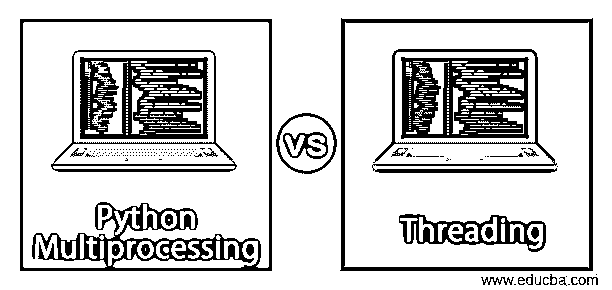
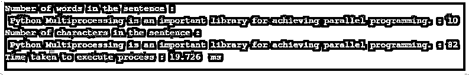
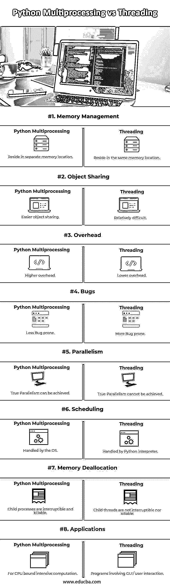
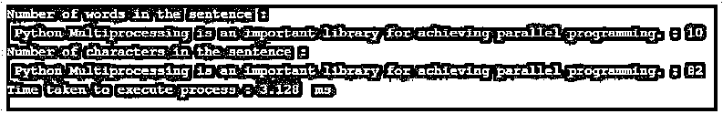

# Python 多重处理与线程

> 原文：<https://www.educba.com/python-multiprocessing-vs-threading/>

## Python 多处理与线程的区别

下面的文章提供了 Python 多处理和线程的概要。随着时间的推移，用于计算的结构化和非结构化数据呈指数级增长。我们已经从在控制台上打印“Hello World”走了很长一段路，并对此感到满意。如今，每个访问台式机、笔记本电脑或手机的人的数字足迹本身就是数据，程序员们正努力处理海量数据。数据量巨大，程序的计算能力受到影响。因此，面对如此庞大的数据，我们的主要目标应该是寻找减少程序计算时间的技术。

和往常一样，Python 有这个问题的解决方案。Python 提供了一种并行化技术，使并行计算成为可能，程序的执行分布在系统的不同 gpu 核心上。

<small>网页开发、编程语言、软件测试&其他</small>

Python 有两个用于实现并行化的内置库:

*   多重处理
*   穿线

在本文中，我们的目标是简要了解多处理和线程技术，然后对这两种技术进行比较研究。

**多重处理:**

在理解多重处理之前，我们应该看一下它的构造块，它是一个进程。

*   **进程:**进程可以定义为正在执行的计算机程序的实例。每个进程都有自己的内存空间，用来存储与正在执行的程序相关的数据和信息。
*   **多处理:**多处理是 Python 中的一个库，它在许多进程的帮助下帮助实现并行编程，这些进程有自己单独的内存分配和 CPU 核心来执行。

**代码:**

`import multiprocessing
from datetime import datetime
def count_number_of_words(sentence):
number_of_words = len(sentence.split())
print("Number of words in the sentence :\n",sentence,": {}".format(number_of_words))
def count_number_of_characters(sentence):
number_of_characters = len(sentence)
print("Number of characters in the sentence :\n",sentence,": {}".format(number_of_characters))
if __name__ == "__main__":
sentence = "Python Multiprocessing is an important library for achieving parallel programming."
start = datetime.now().microsecond
p1 = multiprocessing.Process(target=count_number_of_words,args=(sentence,))
p2 = multiprocessing.Process(target=count_number_of_characters,args=(sentence,))
p1.start()
p2.start()
p1.join()
p2.join()
end = datetime.now().microsecond
print("Time taken to execute process : {}".format((end-start)/1000)," ms")`

**输出:**

### Python 多处理与线程的直接比较(信息图)

以下是 Python 多处理与线程之间的 8 大区别:

### 多重处理的使用案例

当程序是 CPU 密集型的并且不需要任何用户/IO 交互时，多处理通常是首选。任何与加载和处理大量数据相关的程序都可以被认为是多处理的一个很好的用例。

**线程:**

线程是多线程的基本组成部分，所以在了解多线程之前，让我们先了解一下什么是线程。

*   **线程:**线程是可以并行运行的进程的组件。父进程中可以有多个线程。所有线程在父进程中共享要执行的程序以及该程序所需的数据。
*   **线程化:**多线程化是 Python 中的一个库，它通过驻留在父进程中的各种线程来帮助实现并行编程。

**代码:**

`import threading
from datetime import datetime
def count_number_of_words(sentence):
number_of_words = len(sentence.split())
print("Number of words in the sentence :\n",sentence,": {}".format(number_of_words))
def count_number_of_characters(sentence):
number_of_characters = len(sentence)
print("Number of characters in the sentence :\n",sentence,": {}".format(number_of_characters))
if __name__ == "__main__":
sentence = "Python Multiprocessing is an important library for achieving parallel programming."
start = datetime.now().microsecond
t1 = threading.Thread(target=count_number_of_words,args=(sentence,))
t2 = threading.Thread(target=count_number_of_characters,args=(sentence,))
t1.start()
t2.start()
t1.join()
t2.join()
end = datetime.now().microsecond
print("Time taken to execute process : {}".format((end-start)/1000)," ms")`

**输出:**

上面的例子表明，python 线程似乎优于 python 多处理，因为它比另一个线程快大约 9 倍。

### 线程的使用案例

当程序涉及与用户/IO 的交互并且不是 CPU 密集型时，线程化通常是首选。线程用于像 Microsoft Word 这样的应用程序，其中一个线程输入文本，另一个线程在屏幕上显示文本，而另一个线程保存文本。

### 全局解释器锁(GIL)

由于线程在父进程中共享同一个内存位置，所以必须采取特殊的预防措施，以免两个线程写入同一个内存位置。CPython 解释器使用全局解释器锁(GIL)机制来防止多个线程同时执行 Python 字节码。这个锁非常重要，因为 CPython 的内存管理不是线程安全的。

### Python 多处理与线程的主要区别

让我们讨论一下 Python 多处理和线程之间的一些主要区别:

*   当进程驻留在单独的内存位置时，父进程的线程驻留在相同的内存位置。
*   在不同的进程之间共享对象是困难的，并且通过使用进程间通信模型来实现，而在线程之间共享对象是比较容易的。
*   多处理开销较高，而线程开销较低。
*   多处理不太容易出错，而线程更容易出错。
*   真正的并行是在多处理中实现的，而不是在线程中实现的。
*   在多处理中，调度由操作系统处理，而在线程中，调度由 Python 解释器处理。

### 多重处理与线程比较表

让我们讨论一下多处理与线程之间的主要比较:

| **多重处理与线程化的比较基础** | **多重处理** | **穿线** |
| **内存管理** | 驻留在单独的内存位置。 | 驻留在相同的内存位置。 |
| **对象共享** | 更简单的对象共享。 | 相对困难。 |
| **开销** | 开销更高。 | 降低开销。 |
| **bug** | 容易出现的 Bug 更少。 | 更容易出错。 |
| **并行度** | 可以实现真正的并行。 | 无法实现真正的并行。 |
| **调度** | 由操作系统处理。 | 由 Python 解释器处理。 |
| **内存解除分配** | 子进程是可中断和可终止的。 | 子线程既不可中断也不可终止。 |
| **应用程序** | 用于 CPU 密集型计算。 | 涉及图形用户界面/用户交互的程序。 |

### 结论

最后，是时候结束这篇关于 Python 多处理和线程的文章了。在接下来的文章中，我们了解了多处理和线程的概念，查看了各自的示例，讨论了两者的用例。最后，我们对这两种方法进行了对比研究。现在是将这些概念付诸实践的时候了。所以下一次，当你需要的时候，一些编码确实有使用多重处理或者线程的实践。

### 推荐文章

这是 Python 多处理与线程的指南。这里我们讨论信息图和比较表的主要区别。您也可以看看以下文章，了解更多信息–

1.  [Python vs C#](https://www.educba.com/python-vs-c-sharp/)
2.  [Python vs Groovy](https://www.educba.com/python-vs-groovy/)
3.  [Python vs Scala](https://www.educba.com/python-vs-scala/)
4.  [Python vs Ruby 性能](https://www.educba.com/python-vs-ruby-performance/)

