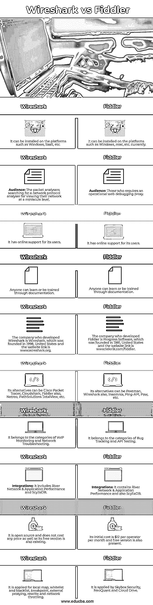

# Wireshark vs Fiddler

> 原文：<https://www.educba.com/wireshark-vs-fiddler/>

## Wireshark 和 Fiddler 的区别

下面的文章提供了 Wireshark vs Fiddler 的概要。Wireshark 被定义为网络协议分析器，可以部署在 Windows、Linux 或 Mac 上。Wireshark 负责捕获大量类型的网络数据包，其中捕获的数据包详细信息位于 TCP/IP 之下(HTTP 位于最顶端)。但是它不包括有助于最小化也被捕获的噪声的滤波器。另一方面，Fiddler 可以被划分为一个 web 调试代理工具，它可以捕获 HTTP(s)流量，并且只能部署或安装在 Windows 上。

因此，Fiddler 作为 HTTP 或 HTTPs 的替代品，捕获计算机系统发出的每个 HTTP 请求，并记录与之相关的所有内容。此外，它允许做一些事情，比如将 post 变量转换成表格形式，然后修改/重放请求。但是默认情况下，Fiddler 在 IE 中不负责捕获本地主机流量。

<small>网页开发、编程语言、软件测试&其他</small>

### Wireshark 与 Fiddler 的正面比较(信息图)

以下是 Wireshark 和 Fiddler 之间的 10 大区别:

### Wireshark 与 Fiddler 的主要区别

让我们来讨论 Wireshark 和 Fiddler 之间的一些主要区别:

*   Wireshark 据说是世界上领先的、广泛实施的网络协议分析器，它有助于在极小的级别上观察网络中发生的事情，同时也被称为标准对角众多盈利和非盈利企业，甚至是政府组织和教育协会。
*   Wireshark 的改进让全球网络专家的志愿援助欢呼雀跃，并被认为是 Gerald Combs 在 1998 年发起的一项计划的延续。
*   Wireshark 是一个非常值得信赖的跨平台应用程序，自 1998 年以来不断创新。它的最新版本支持包含 macOS、Linux 和 Windows 的整个平台，即使用户界面不是最新的。
*   Wireshark 应用程序的渐进式结构很少包含大量低级信息，以满足核心设计师的需求，因此它可能不会受到更多用户的欢迎。
*   可能很难决定哪一个应用程序最适合实践，几个开发人员致力于增强它的最佳特性。但简而言之，如果某人是安全开发人员或黑客，需要一整套代理工具来深入研究网络层，那么他/她可以在两者之间选择任何人，Wireshark 或 Fiddler。
*   Fiddler 最健壮的特性包括设置断点，在断点之后可以修复 httpRequest 中包含主机、数据或 cookie 的任何类型的消息。
*   Fiddler 负责检查流量，欺骗请求和响应，确认有效的 cookies，缓存目录和头在服务器和客户端之间传递。Fiddler 还支持包含 Java、.Net，Ruby 等。，并可以在任何网站上修改或假装响应和请求。
*   因此，fiddler 提供了一种快速而简单的方法来改变测试网站的请求和响应，而不是修改代码程序。实现 Fiddler 是为了记录互联网和计算机系统之间的所有 HTTP/S 流量。
*   Fiddler 通过它的解密 HTTPS 功能拥有捕获流量的功能，因此需要注意的是，必须提前启用它来开始捕获过程。
*   Wireshark 和 Fiddler 都有一些基本功能，如拦截和分析，检测移动模拟器和设备上的请求和响应，重复和编写响应和请求，并将响应和请求导出到通用文件，如格式、HAR、日志。
*   Wireshark 是解决 Sharepoint 连接问题时常用的工具。它不能在同一台机器(即 Windows 上的 localhost)内嗅探流量。因此，如果需要使用嗅探本地流量，我们必须在 Windows 上使用 Fiddler。
*   Wireshark 能够通过编写正则表达式来筛选程序。这是另一种工具，它可以捕获比 Fiddler 更健壮的包以及更多的消息。而在 fiddler 中，一些功能是不可用的，例如反作弊信息和 Pingback 消息的验证，而且它只对单个请求实现；下一个请求需要重置。因此，Wireshark 是比 Fiddler 更强大的工具。

### Wireshark 与 Fiddler 对比表

让我们来讨论 Wireshark 与 Fiddler 之间的顶级比较:

| **Wireshark** | **提琴手** |
| 它可以安装在 Windows、SaaS 等平台上。 | 可以安装在 Windows、Mac 等平台上。，目前。 |
| **受众:**数据包分析器搜索网络协议分析器，以便在极小的级别上查看其网络。 | **受众:**需要可操作的 web 调试代理的人。 |
| 它为用户提供在线支持。 | 它为用户提供在线支持。 |
| 任何人都可以通过文档学习或接受培训。 | 任何人都可以通过文档学习或接受培训。 |
| 开发 Wireshark 的公司是 Wireshark，1998 年成立于美国，网站链接是 www.wireshark.org。 | 开发 Fiddler 的公司是 Progress Software，1981 年成立于美国，网站链接是 www.telerik.com/fiddler. |
| 它的替代品可以是 Cisco Packet Tracer、Cloudshark、Fiddler also、Netreo、PathSolutions TotalView 等。 | 它的替代品可以是邮递员，Wireshark 也，失眠，平-API，爪子等。 |
| 属于 VoIP 监控和网络故障排除的范畴。 | 它属于 Bug 跟踪和 API 测试的范畴。 |
| **集成:**包括河网&应用性能和 ScyllaDB。 | **集成:**它包含河流网络&应用程序性能和 ScyllaDB。 |
| 它是开源的，不需要任何成本，而且它的免费版本也是存在的。 | 它的初始费用是每个运营商每月 12 美元，免费版本也存在。 |
| 它适用于本地映射、白名单和黑名单、断点、外部代理、重写和网络节流。 | 它由 Skybox Security、NeoQuant 和 Cloud Drive 应用。 |

### 结论

Wireshark 和 Fiddler 执行相同的事情，即捕获网络流量。Fiddler 由 Skybox Security、Cloud Drive 和 NeoQuant 实现。Wireshark 是网络数据包的分析器，有助于捕获数据包数据信息。Wireshark 可以安装在 Windows、Mac 和 Linux 等操作系统上，而 Fiddler 只能安装在 Windows 上。Fiddler 是一个用于调试网站的程序，Wireshark 交互式地浏览计算机网络上执行的流量。

### 推荐文章

这是 Wireshark vs Fiddler 的指南。在这里，我们分别用信息图和比较表来讨论 Wireshark 和 Fiddler 的主要区别。您也可以看看以下文章，了解更多信息–

1.  [核心 Java vs Java](https://www.educba.com/core-java-vs-java/)
2.  [CSS vs JavaScript](https://www.educba.com/css-vs-javascript/)
3.  [Java vs PHP](https://www.educba.com/java-vs-php/)
4.  [Java vs Node JS](https://www.educba.com/java-vs-node-js/)

