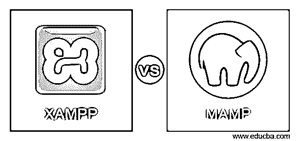
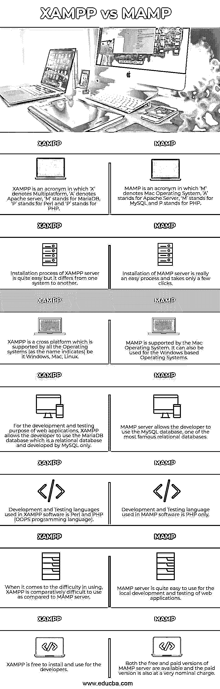

# XAMPP 对 MAMP

> 原文：<https://www.educba.com/xampp-vs-mamp/>

## XAMPP 和 MAMP 的区别

下面这篇文章概述了 XAMPP 对 MAMP 的比赛。XAMPP 是一个缩写词，其中“X”代表多平台，“A”代表 Apache，“M”代表 MariaDB，“P”代表 Pearl，“P”代表 PHP。它是一种软件，用于在将 web 应用程序部署到互联网之前，在本地服务器上开发和测试这些应用程序。它是唯一一个被所有操作系统如 Windows，Mac 和 Linux 支持的网络服务器。对于开发者来说，XAMPP 很容易安装和使用。它是 100%开源的，这意味着它可以完全免费使用，并且没有高级版本。

MAMP 是一个首字母缩写词，其中“M”代表 Mac，“A”代表 Apache，“M”代表 MySQL，“P”代表 PHP。MAMP 专业版现在也可供开发者使用，它方便了其他语言如 Python，Ruby 和 Pearl 的命令行界面。对于开发者来说，MAMP 很容易安装和使用。用户也可以使用免费和高级版本。

<small>网页开发、编程语言、软件测试&其他</small>

### XAMPP 与 MAMP 的对决(信息图)

以下是 XAMPP 和 MAMP 之间的 7 大区别:

### XAMPP 与 MAMP 的主要区别

让我们讨论一下 XAMPP 与 MAMP 之间的一些主要差异:

尽管 XAMPP 和 MAMP 的本地服务器没有太大的区别，它们都是用来在本地桌面上开发和测试 web 应用程序的。用户可以编辑任意次数，并可以在互联网上的实际 web 服务器上托管之前正常运行应用程序。

*   正如两个 web 服务器的完整形式所示，XAMPP 的“X”代表 X 操作系统，这意味着多操作系统。是的，你没听错！几乎所有的操作系统都支持 XAMPP 的网络服务器，无论是 Windows、Mac 还是 Linux，而在 MAMP，“M”代表 Mac，也就是说 MAMP 支持基于 Mac 的操作系统。尽管 MAMP Pro 也支持基于 Windows 的操作系统。
*   谈到两个服务器支持的 web 开发语言，XAMPP 服务器提供对 Pearl 和 PHP 语言的支持，而 MAMP 服务器提供对 PHP、Pearl、Python 和 Ruby 语言的支持(尽管按照完整的形式，只支持 PHP 语言)。它提供了上述语言的内置编辑器以及各种测试工具。
*   XAMPP 和 MAMP 的本地 web 服务器都提供对 Apache 服务器的支持，但是 MAMP Pro 服务器版本也支持 Nginx web 服务器以及对开发者的支持。
*   XAMPP 服务器有一些额外的普通功能，比如支持 FileZilla、pearl、mercury mail 和各种其他脚本，而 MAMP 提供了很多在本地机器上运行 WordPress 所必需的工具。
*   XAMPP 是一个 100%开源的服务器，所以完全免费使用。它没有高级版本，所以对开发人员来说没有隐藏的功能，而 MAMP 服务器的免费和高级版本对开发人员都是可用的。
*   与 XAMPP 服务器相比，使用 MAMP 服务器的最大缺点是 MAMP 不为 WordPress 这样的应用程序提供独立的安装程序。用户需要手动设置网站。
*   使用 MAMP 服务器的一个优点是它为用户提供了各种工具，比如能够设置 Nginx 服务器、移动测试工具和内置编辑器。Mac 用户总是把 MAMP 作为首选；它提供了更多的工具，包括 WordPress 开发工具。
*   谈到易用性，对于开发人员和测试人员来说，两者都很容易安装和使用，但相比之下，MAMP 更容易使用。在 MAMP 软件中，安装只需点击几下鼠标。在 XAMPP，安装和使用因操作系统而异。两个 web 服务器都是各自的最佳位置；这取决于操作系统、数据库服务器和开发人员/测试人员使用的编程语言。

### XAMPP 与 MAMP 对比表

两种环境都确保实现相同的目标，以获得最佳结果。但是它们之间存在一些技术差异。

| **Sr 号** | **XAMPP** | **MAMP** |
| One | XAMPP 是一个首字母缩写词，其中“X”表示多平台，“A”表示 Apache 服务器，“M”表示 MariaDB，“P”表示 Perl，“P”表示 PHP。 | MAMP 是一个首字母缩写词，其中“M”表示 Mac 操作系统，“A”表示 Apache Server，“M”表示 MySQL，P 表示 PHP。 |
| Two | XAMPP 服务器的安装过程非常简单，但是每个系统都不一样。 | 安装 MAMP 服务器是一个非常简单的过程，只需要点击几下鼠标。 |
| Three | XAMPP 是一个跨平台的系统，所有的操作系统(顾名思义)都支持它，无论是 Windows、Mac 还是 Linux。 | Mac 操作系统支持 MAMP。它也可以用于基于 Windows 的操作系统。 |
| Four | 出于开发和测试 web 应用程序的目的，XAMPP 允许开发人员使用 MariaDB 数据库，这是一个关系数据库，仅由 MySQL 开发。 | MAMP 服务器允许开发人员使用 MySQL 数据库，这是最著名的关系数据库之一。 |
| Five | XAMPP 软件使用的开发和测试语言是 Perl 和 PHP (OOPS 编程语言)。 | MAMP 软件使用的开发和测试语言只有 PHP。 |
| Six | 当谈到使用的困难，XAMPP 是比较难使用相比，MAMP 服务器。 | 对于 web 应用程序的本地开发和测试，MAMP 服务器非常容易使用。 |
| Seven | 开发人员可以免费安装和使用 XAMPP。 | MAMP 服务器有免费版和付费版，付费版的收费也很低。 |

### 结论

上面的描述清楚地解释了什么是 XAMPP 和 MAMP 以及两者之间的主要区别。这两个服务器在设置整个 WordPress 环境中扮演着重要的角色，提供网络服务器、数据库和编程语言编辑器支持。作为 web 应用程序的开发人员/测试人员，理解这些服务器之间的技术差异是很重要的。

### 推荐文章

这是 XAMPP 对 MAMP 的比赛指南。在这里，我们分别用信息图和比较表来讨论 XAMPP 和 MAMP 的主要区别。您也可以看看以下文章，了解更多信息–

1.  [Rails vs PHP](https://www.educba.com/rails-vs-php/)
2.  [核心 Java vs Java](https://www.educba.com/core-java-vs-java/)
3.  [Java vs .Net](https://www.educba.com/java-vs-dot-net/)
4.  [Java vs Kotlin](https://www.educba.com/java-vs-kotlin/)

