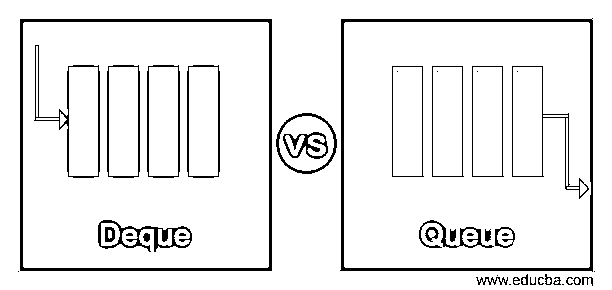
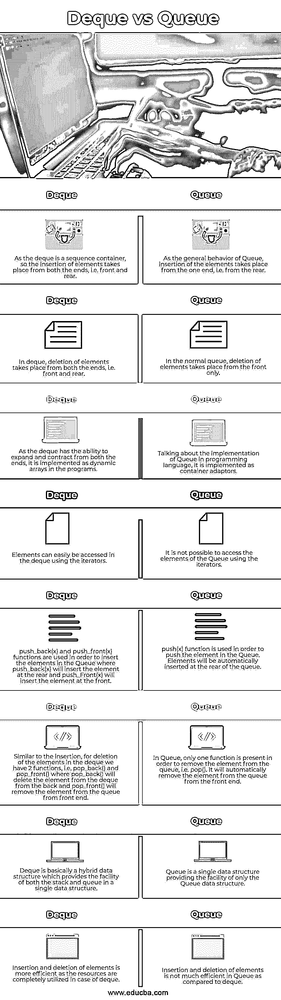

# 队列对队列

> 原文：<https://www.educba.com/deque-vs-queue/>

## 队列与队列的区别

下面的文章提供了一个 Deque vs Queue 的概要。队列是一种遵循 FIFO(先进先出)顺序的数据结构，其中元素的插入从后端开始，删除从前端开始。它可以被认为是简单的铁路队列或邮局队列，在队列中，一旦工作完成，客户从后面加入，从前面一个接一个地移除。它是一种简单的线性数据结构，在计算机科学中经常使用。

Deque 是一种混合数据结构，不遵循任何 FIFO 或 LIFO 方法来插入和删除元素。它基本上是一种混合数据结构，使用动态数组来实现。就时间和资源利用率而言，它比队列更有效。在双队列数据结构的情况下，元素的随机访问是可能的。

<small>网页开发、编程语言、软件测试&其他</small>

### Deque 与 Queue 之间的一对一比较(信息图)

以下是 Deque 与 Queue 之间的 8 大区别:

### 队列与队列的主要区别

让我们讨论一下 Deque 与 Queue 之间的一些主要区别:

*   顾名思义，Deque 是一个双端队列，它是简单队列的实现。尽管如此，元素的插入和删除仍然发生在两端。相比之下，队列是一种数据结构，其中元素的插入和删除分别只发生在后端和前端。
*   由于 Deque 允许从两端插入和删除元素，它基本上比队列更有效，并允许有效地使用资源。
*   程序员可以很容易地使用迭代器访问队列的元素，而在队列的情况下却不可能，因为程序员只能访问第一个和最后一个元素。
*   Deque 是一个容器模板，其中序列的要求可以使用随机访问迭代器来满足，而 Queue 是一个适配器而不是容器，它为用户提供了一个不同的、更具体的接口。
*   由于可以在出列的两端插入和删除元素，所以提供了两者的操作。为了从前面插入元素，使用 push_front(x)操作。为了从后面插入元素，使用了 push_back(x)操作。为了在队列中从前面删除元素，使用了 pop_front()，而为了从后面删除元素，使用了 pop_back()，而在队列中，事情要简单得多，因为元素的插入只发生在队列的后端，所以使用了 push(x)操作，元素的删除发生在队列的前面，所以 pop()操作会自动执行。
*   队列用于商场中有一个收银员处理所有账单，所有顾客排队的场景，其中新顾客可以从后面添加，并且一旦完成账单就可以从前面一个接一个地移除，而 Deque 用于有多个顾客和收银员的场景。一旦排在队伍末尾的顾客从前面的顾客那里获得自由，收银员也可以招待他们。

### 队列与队列对照表

我们来讨论一下 Deque 与 Queue 的顶级对比:

| **Sr 号** | **德克** | **队列** |
| One | 由于 deque 是一个序列容器，所以元素的插入从两端开始，即前端和后端。 | 作为队列的一般行为，元素的插入从一端开始，即从后面开始。 |
| Two | 在 deque 中，元素的删除发生在两端，即前端和后端。 | 在正常队列中，元素的删除只发生在前面。 |
| Three | 由于 deque 具有从两端扩展和收缩的能力，所以它在程序中被实现为动态数组。 | 谈到编程语言中队列的实现，它是作为容器适配器来实现的。 |
| Four | 使用迭代器可以很容易地在队列中访问元素。 | 不可能使用迭代器访问队列的元素。 |
| Five | push_back(x)和 push_front(x)函数用于在队列中插入元素，其中 push_back(x)将在后面插入元素，push_Front(x)将在前面插入元素。 | push(x)函数用于将元素推入队列。元素将自动插入到队列的后面。 |
| Six | 类似于插入，对于删除队列中的元素，我们有两个函数，即 pop_back()和 pop_front()，其中 pop_back()将从后面删除队列中的元素，pop_front()将从前端删除队列中的元素。 | 在队列中，只有一个函数用于从队列中移除元素，即 pop()。它将自动从前端的队列中删除该元素。 |
| Seven | Deque 基本上是一种混合数据结构，它在单个数据结构中提供了堆栈和队列的功能。 | 队列是一种单一的数据结构，只提供队列数据结构的功能。 |
| Eight | 元素的插入和删除更有效，因为在 deque 的情况下资源被完全利用。 | 与 deque 相比，在 Queue 中插入和删除元素的效率并不高。 |

### 结论

上面的描述清楚地解释了什么是队列和队列，以及两者之间的主要区别。队列是一种简单的数据结构，其中元素的插入和删除从一端发生，而 Deque 是一种混合数据结构，用于堆栈和队列的目的，元素的插入和删除可以根据用户的要求从两端发生。

### 推荐文章

这是一个队列 vs 队列的指南。这里我们分别用信息图和比较表来讨论 Deque 和 Queue 键的区别。您也可以看看以下文章，了解更多信息–

1.  [堆栈 vs 队列](https://www.educba.com/stack-vs-queue/)
2.  数组列表与链接列表
3.  [Haskell 诉 OCaml](https://www.educba.com/haskell-vs-ocaml/)
4.  [飞镖 vs 围棋](https://www.educba.com/dart-vs-go/)

