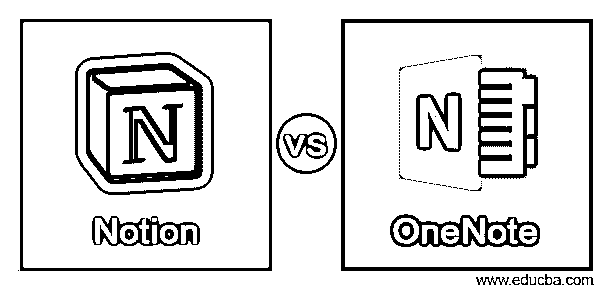
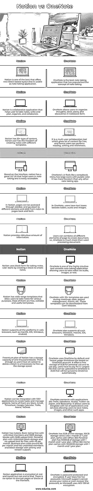

# 概念与 OneNote

> 原文：<https://www.educba.com/notion-vs-onenote/>

## 概念与 OneNote 的区别

概念与 OneNote 将根据各种标准给出概念和 OneNote 之间的差异。两者都是笔记应用程序，但是用于不同的目的。微软的 OneNote 已经存在了近 15 年，被认为是最强大的笔记应用程序。这个概念也充满了功能，是微软生态系统和使用 Office 365 的用户更喜欢的。OneNote 主要面向个人，而 idea 不仅用于做笔记，还用于项目管理。

### idea 与 OneNote 的直接对比(信息图表)

以下是概念与 OneNote 之间的 13 大区别:

<small>网页开发、编程语言、软件测试&其他</small>

### 概念与 OneNote 的主要区别

让我们讨论一下 concept 与 OneNote 之间的一些主要差异:

*   概念简单易学，用户可以为页面设置表情符号和封面。从积极的方面来看，block 系统和 markdown 支持是 idea 中最好的特性。
*   OneNote 在云中可用，因此是物理笔记本的一个很好的替代品。
*   一个概念可以用于无止境的定制，模板可以根据客户需求进行修改和组织。
*   OneNote 在记笔记方面更有效，并且更容易访问笔记。
*   OneNote 只有一个论坛可以提供支持和培训，即电子邮件或帮助台。
*   这个概念有很多方法可以获得支持和培训、知识库、论坛、帮助台、电子邮件、24/7 实时聊天、电话支持等。

### 概念与 OneNote 比较表

让我们来讨论一下 concept 与 OneNote 之间的主要对比:

| **观念** | **OneNote** |
| concept 是最好的一个，它提供了一种新的基于块的布局，可用作笔记应用程序。 | OneNote 是最好的笔记应用程序，它普及了笔记的概念。 |
| 概念是一个协作应用程序，帮助用户记笔记、写作和计划、组织和协作。 | OneNote 允许用户以笔记本的形式组织思想、想法、计划和发现。 |
| 概念有 30 多种类型的内容，因此用户可以自由地用不同的模板创建笔记。 | It is a multi-user collaboration tool which gives a lot of content for free, and hence users can perform

阅读、写作和算术。

 |
| 基于这个界面，这个概念有一个很棒的用户界面/ UX，可以帮助用户做笔记，并且很容易访问。 | OneNote 的用户界面感觉像剪贴簿。菜单有紫色的大图标。它比其他任何笔记应用程序都更自由。 |
| 在 concept 中，页面可以通过侧边栏访问，进入不同的部分，从笔记到页面来回滑动。 | 在 OneNote 中，用户在表格、音频和图像旁边有文本框。 |
| 观念提供了大量荒谬的信息。 | 用户可以组合页面的所有不同元素来创建文档，也就是说，OneNote 不仅仅是一个文字处理文档。 |
| 观念使用方块形式做笔记。用户首先创建一个块来创建注释。 | OneNote 是一种高度直观和多功能的笔记应用程序，允许用户通过音频、图像或文本来做笔记。 |
| 概念有各种各样的模板，允许用户出于各种目的做笔记。大部分都是免费的，可编辑的，有用的模板。 | OneNote 有 20 多个模板，用于会议、课程、项目管理、活动等。这些模板可以从 Gem 网站下载。 |
| opinion 支持 web 浏览器中的所有平台，如 macOS、iOS、Windows、Android。 | OneNote 也支持所有这样的浏览器，Windows，macOS，iOS，Windows。 |
| 概念的免费增值计划有一千块的存储容量。这就足够了，因为用户可以选择删除不必要的块来释放存储空间。 | 默认情况下，OneNote 使用 OneDrive，因此使用限制基于 OneDrive 帐户。它为个人使用提供 5GB 的免费存储空间，要使用付费功能，用户必须付费。可以上载到 OneNote 的最大文件为 2GB，该文件将自动同步到 OneDrive。 |
| 概念可以与 100 多个应用程序集成，以创建任务和管理项目。有一些是 Slack，Gmail，Timesheet，Google Calendar，Trello，Asana，ToDoist。 | OneNote 通过 Zapier 和 Basecamp 连接 Trello、Salesforce、Wufoo、Twitter 等应用程序。它允许用户集成许多应用程序和服务，允许用户保存笔记、图像和其他类似的应用程序。 |
| 概念有 3 个计划，基本是免费的，无限的成员和 1000 个存储块，5MB 的上传限制。个人计划，无限块存储，没有文件上传限制，每月 4 美元。该商业计划的费用约为每月 8 美元，并有无限的成员和块存储优先级和版本支持。 | OneNote 有 5GB 的免费存储空间，50GB 的存储空间因 1 个月或 1 年计划而异，与 Office 365 个人计划相同，1 个月和 1 年计划有 1000GB 的存储空间。Office 365 家庭计划附带 5000GB 存储，包含 1 个月和 1 年计划。 |
| 概念应用在静态和传输时被加密，但不是端到端的。目前没有加密页面或块的选项。 | OneNote 受密码保护并已加密。如果用户丢失了密码，Microsoft 支持将无法访问您的笔记，甚至无法恢复密码，因为 Microsoft 使用 AES 128 位加密。 |

### 结论

至此，我们将结束“概念与 OneNote”这一主题。我们已经了解了什么是概念 vs OneNote，并在上面的比较表中列出了相似之处和不同之处。我们还看到了 idea 和 OneNote 的一些关键功能。每个应用程序都有不同的用途，有不同的属性和侧重点。如果用户想从头开始创建笔记，然后以适当的方式组织它们，我们需要 OneNote。然而，如果用户需要一个全面的应用程序，除了记笔记之外，还有很多其他用途，那么 idea 是更好的选择。

### 推荐文章

这是概念与 OneNote 的指南。在这里，我们分别用信息图和比较表来讨论概念与 OneNote 的主要区别。您也可以看看以下文章，了解更多信息–

1.  [点击与概念](https://www.educba.com/clickup-vs-notion/)
2.  [C++向量 vs 数组](https://www.educba.com/c-plus-plus-vector-vs-array/)
3.  [C#列表与数组](https://www.educba.com/c-sharp-list-vs-array/)
4.  [C 与 C++](https://www.educba.com/c-vs-c-plus-plus/)

