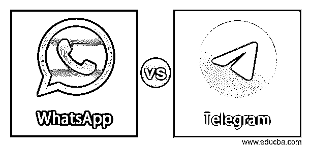
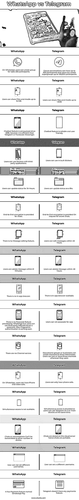

# WhatsApp vs Telegram

> 原文：<https://www.educba.com/whatsapp-vs-telegram/>

## WhatsApp vs Telegram 简介

消息应用和其他事物一样一直在增长。自从它们出现以来，WhatsApp、Telegram、Thread、Signal 等即时通讯应用一直在短兵相接。最近，WhatsApp 修改了主要涵盖用户信息的条款和条件。这一更新引发了一场关于选择 WhatsApp 还是 Telegram 的讨论。

脸书旗下的 WhatsApp 即时通讯应用的最新服务条款规定，所有用户都必须同意或删除他们的账户。WhatsApp 收集用户数据，包括设备 ID、位置、电话号码、电子邮件、联系人、广告数据、购买历史、支付信息等。如果用户选择继续使用该服务，这不会给他们任何选择。电报只收集用户 ID 联系信息，电话号码。如果有人想转移到 Telegram 等其他平台，这里有一个这些消息应用的对比。

<small>网页开发、编程语言、软件测试&其他</small>

### WhatsApp 与 Telegram 的正面对比(信息图)

以下是 WhatsApp 与 Telegram 的 16 大区别:

### WhatsApp 和 Telegram 的主要区别

*   在 WhatsApp 上，用户可以创建一个多达 256 名参与者的群组，Telegram 上的群组对话可以有多达 200 名参与者，用户可以创建多达 100，000 名参与者的超级群组。
*   在 WhatsApp 上，用户可以共享高达 16 MB 的文件和媒体，而在 Telegram 上，用户可以共享高达 1.5GB 的文件和媒体。
*   WhatsApp 允许用户在 24 小时内更新状态，在 TelegramUsers 上用户可以更新个人信息
*   WhatsApp 为聊天提供端到端加密，而 on Telegram 则根据秘密聊天的请求提供端到端加密
*   WhatsApp 没有消息编辑功能，但用户可以在 51 分钟内删除消息。最近还引入了“消失消息”功能。Telegram 允许用户在 48 小时内编辑消息，并在 48 小时内删除消息。
*   WhatsApp 上没有应用内浏览器，而 Telegram 有一个应用内浏览器。
*   WhatsApp 没有提供密码功能，但用户可以使用第三方软件来设置密码。还有，指纹认证也快到了。Telegram 允许用户为应用程序设置密码。
*   在 WhatsApp 上，没有频道服务。在 Telegram 上，教育团体或企业可以创建共享信息的渠道。用户可以随时加入或退出这些频道。
*   在 WhatsApp 上，用户可以进行电话和视频通话。另一方面，在电报上，用户只能打电话
*   在 WhatsApp 上，不能同时访问。用户可以从个人电脑上访问 WhatsApp 和 Telegram。但是 Telegram 有一个高级特性，多设备支持。提供同步访问，因此用户可以同时在 2 个或更多设备上使用它，即使移动设备上有互联网连接。此外，聊天存储在云服务器上，因此聊天是可移植的。相反，在 WhatsApp 上，聊天或对话无法传输到其他号码或设备。
*   在 WhatsApp 上，用户不能设置不同的用户名。而用户可以在 Telegram 上设置不同的用户名。
*   最近，WhatsApp 推出了一项名为 WhatsApp Pay 的支付功能，该功能基于 UPI 支付平台。Telegram 没有任何支付功能。

### WhatsApp 和 Telegram 的对比表

|  | **WhatsApp** | **电报** |
|  | 在 WhatsApp 上，用户可以创建一个多达 256 人的群组 | 群组对话可以有多达 200 个参与者，用户可以创建多达 100，000 个参与者的超级群组 |
|  | 用户可以共享高达 16 MB 的文件和媒体 | 用户可以共享高达 1.5GB 的文件和媒体 |
|  | 聊天机器人功能于 2018 年宣布，然而，它比 Telegram 或 Facebook Messenger 更高效。 | 聊天机器人的功能是可靠的和用户友好的。 |
|  | 用户可以在第三方应用程序中使用贴纸 | 用户可以使用内置贴纸 |
|  | 用户可以 24 小时更新状态 | 用户可以将状态更新为简历 |
|  | 聊天提供端到端加密 | 应秘密聊天的请求，提供端到端加密 |
|  | 没有消息编辑功能 | 用户可以在 48 小时内编辑消息 |
|  | 用户可以在 51 分钟内删除邮件。 | 用户可以在 48 小时内删除邮件 |
|  | 没有应用内浏览器。 | 有一个应用内浏览器可用。 |
|  | WhatsApp 没有提供密码功能，但用户可以使用第三方软件来设置密码。还有，指纹认证也快到了。 | 用户可以为应用程序设置密码。 |
|  | 没有频道服务。 | 教育团体或企业可以创建分享信息的渠道。用户可以随时加入或退出这些频道。 |
|  | 在 WhatsApp 上，用户可以进行电话和视频通话 | 用户只能打电话 |
|  | 不能同时访问。 | 提供同步访问，因此用户可以同时在 2 个或更多设备上使用 Telegram。 |
|  | 聊天或对话不能传输到其他号码或设备。 | 聊天存储在云服务器上，因此聊天是可移植的。 |
|  | 用户不能设置不同的用户名。 | 用户可以设置不同的用户名 |
|  | 它有一个名为 WhatsApp Pay 的支付功能。 | Telegram 没有任何支付功能。 |

### 结论

在这篇文章中，我们看到了 WhatsApp 和 Telegram 基于所有功能的详细对比。您可以根据自己的需求和隐私偏好选择其中任何一个。我们希望这篇文章对您有所帮助。

### 推荐文章

这是 WhatsApp vs Telegram 的指南。在这里，我们将讨论简介、与信息图的直接比较、主要差异和比较表。您也可以看看以下文章，了解更多信息–

1.  [内部与外部](https://www.educba.com/on-premise-vs-off-premise/)
2.  [核心 Java vs Java](https://www.educba.com/core-java-vs-java/)
3.  [多线程 vs 多重处理](https://www.educba.com/multithreading-vs-multiprocessing/)
4.  [内核与处理器](https://www.educba.com/core-vs-processor/)

